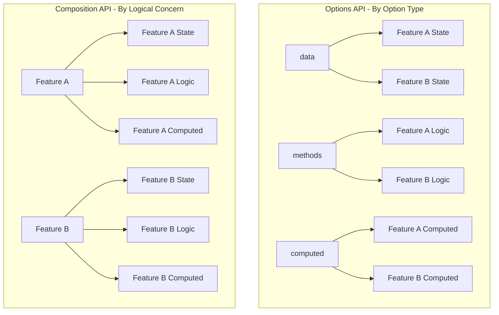
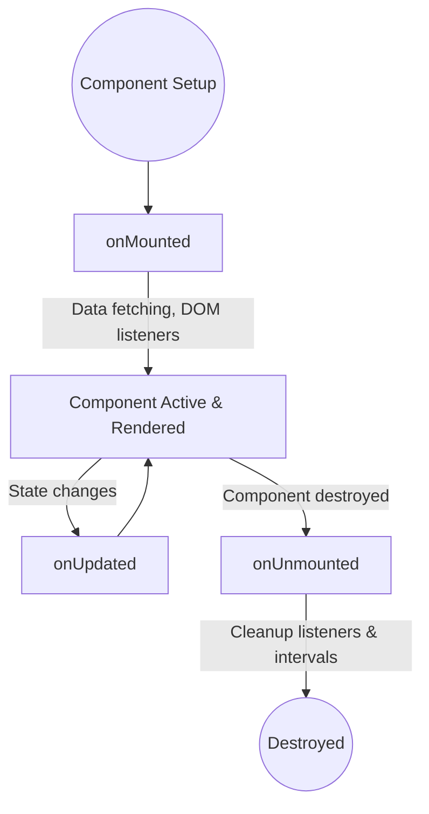
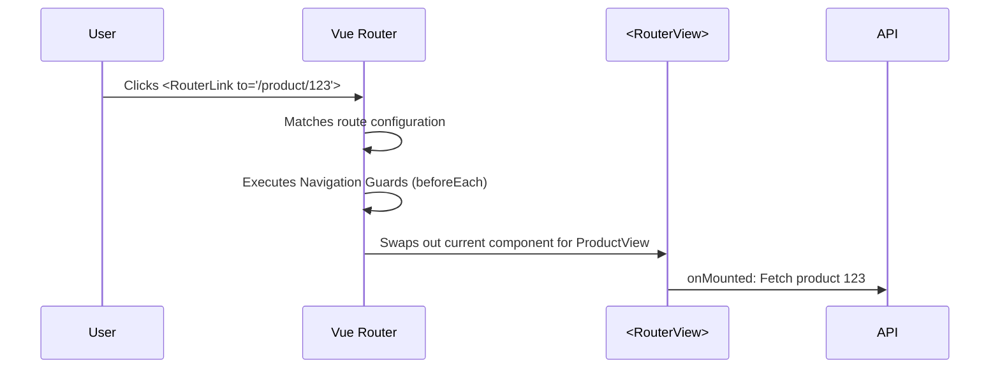
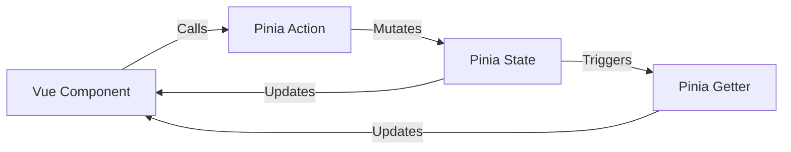
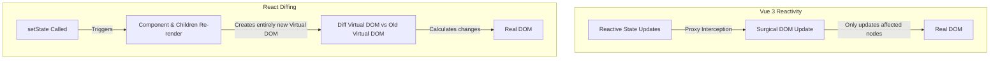

# Vue 3 Interview Prep — Flat Rock Technology
## Cheat Sheet: Composition API, React vs Vue, Pinia, Router, TypeScript

---

## 📋 Table of Contents
1. [Composition API vs Options API](#1-composition-api-vs-options-api)
2. [Vue 3 Composition API — Core Primitives](#2-vue-3-composition-api--core-primitives)
3. [Custom Composables — Reusable Logic](#3-custom-composables--reusable-logic)
4. [Vue Router in Composition API](#4-vue-router-in-composition-api)
5. [Pinia — State Management](#5-pinia--state-management)
6. [TypeScript with Vue](#6-typescript-with-vue)
7. [Vue vs React — Key Differences](#7-vue-vs-react--key-differences)
8. [REST API Integration Patterns](#8-rest-api-integration-patterns)
9. [Performance Optimization in Vue 3](#9-performance-optimization-in-vue-3)
10. [SCSS Architecture & Partials](#10-scss-architecture--partials)
11. [Application Boot Pipeline (`main.ts` & `App.vue`)](#11-application-boot-pipeline-maints--appvue)
12. [Rapid Fire Interview Q&A](#12-rapid-fire-interview-qa)

---

## 1. Composition API vs Options API

### Overview
Vue 3 introduced the Composition API as an alternative to the Options API. While the Options API dictates organizing code by technical option type (`data`, `methods`, `computed`), the Composition API allows developers to organize code by **logical concern**. It is the recommended authoring style for modern Vue applications, particularly when using TypeScript and scaling large codebases.

### Why this feature exists
As Vue 2 applications grew in complexity, developers encountered two major bottlenecks:
1. **Code Fragmentation**: Features were split vertically across `data`, `methods`, and `computed` blocks, requiring constant scrolling to understand a single feature.
2. **Logic Reuse Constraints**: Sharing logic between components relied on Mixins, which caused namespace collisions, unclear property origins, and lacked type safety. The Composition API solves both issues natively.

### Core concepts
- **Reactivity Primitives**: Exposing state via `ref` and `reactive` instead of returning a single `data` object.
- **Functions over Objects**: Instead of declaring an object of options, developers write standard JavaScript/TypeScript execution scopes.
- **`<script setup>`**: A compile-time syntactic sugar that drastically reduces boilerplate, eliminating the need to explicitly `return` variables or components to the template.

### Syntax

#### Options API (Legacy Vue 2 Style)
```vue
<script lang="ts">
import { defineComponent } from 'vue'

export default defineComponent({
  data() {
    return { count: 0 }
  },
  computed: {
    doubled(): number {
      return this.count * 2
    }
  },
  methods: {
    increment() {
      this.count++
    }
  },
  mounted() {
    console.log('Component mounted')
  }
})
</script>
```

#### Composition API (Modern Vue 3.5+ Style)
```vue
<script setup lang="ts">
import { ref, computed, onMounted } from 'vue'

const count = ref(0)
const doubled = computed(() => count.value * 2)

const increment = () => {
  count.value++
}

onMounted(() => {
  console.log('Component mounted')
})
</script>
```

### Logical Organization Comparison



### Real-world examples
Imagine a `ProductCard` component that handles two distinct features: "Adding to Cart" and "Toggling Favorites".
In the Options API, variables and functions for both features are mixed into the same objects.
In the Composition API, you can group all variables, computed properties, and functions for "Cart" together, and all logic for "Favorites" together directly below it. This makes it vastly easier to read, test, or extract into a composable later.

### Composition vs Options

| Feature | Composition API | Options API |
| :--- | :--- | :--- |
| **Logic Organization** | Grouped by logical concern | Grouped by technical option type |
| **Logic Reuse** | Excellent (Composables) | Poor (Mixins / Renderless Components) |
| **TypeScript Support** | Excellent (Native TS inference) | Moderate (Requires complex wrappers) |
| **`this` Keyword** | Not used | Heavily used, context can be easily lost |
| **Bundle Size** | Smaller (Better minification) | Larger |
| **Learning Curve** | Steeper (Requires understanding JS execution context) | Gentler (Familiar object structure) |

### Best practices
- **Always use `<script setup lang="ts">`** for new Vue 3 projects. It provides better runtime performance, less boilerplate, and superior TypeScript support.
- **Group logically**: Write variables and functions that belong to the same feature close to each other visually in the file.
- **Do not mix styles**: Avoid using both Options API and Composition API syntax in the same codebase to maintain consistency.

### Common mistakes
- **Using `this`**: Developers migrating from Vue 2 often instinctively type `this.count`. In the Composition API, everything is a standard JavaScript variable. Use `count.value` instead.
- **Destructuring Reactivity**: Destructuring props or reactive objects directly (e.g., `const { count } = props`) breaks reactivity, unless you are specifically utilizing Vue 3.5's reactive props destructuring feature.

### Performance considerations
The Composition API (specifically via `<script setup>`) yields a smaller bundle size and better performance. Because the code is compiled directly into the component's setup function scope without the overhead of creating an options object or binding `this` contexts, JavaScript minifiers can shorten variable names much more aggressively.

### Production usage
In modern enterprise applications, the Options API is strictly considered a legacy pattern. All major tools in the ecosystem (Pinia, Vue Router 4, VueUse) are designed composition-first. Upgrading to the Composition API is a prerequisite for long-term maintainability.

### Senior interview explanation
> "The Composition API fundamentally shifts Vue component design from organizing by 'technical type' (data, methods) to organizing by 'logical concern' (e.g., cart logic, user logic). In a large production codebase, this allows developers to co-locate related variables and functions, making code infinitely easier to read. Most importantly, it allows us to easily extract that isolated logic into reusable standalone functions called Composables, completely solving the namespace collisions and implicit dependencies that plagued Vue 2 Mixins."

### Interview questions

**Q: Why was the Composition API introduced?**
> **Expected Answer**: To solve the limitations of logic reuse (Mixins) and to improve code organization in large components by grouping code by feature rather than option type. It also provides drastically better TypeScript inference.

**Q: What is `<script setup>`?**
> **Expected Answer**: It is compile-time syntactic sugar for the Composition API. It eliminates the need to explicitly return state or functions to the template, exposing top-level bindings automatically and providing better runtime performance through more efficient minification.

**Q: Can you still use the Options API in Vue 3?**
> **Expected Answer**: Yes, Vue 3 fully supports the Options API under the hood. However, for new enterprise projects, relying on it is considered an anti-pattern. The Composition API is the industry standard moving forward.

### Summary
The Composition API is the modern standard for authoring Vue components. It enables logical grouping, robust reusability via Composables, and superior TypeScript support by moving away from object-based configuration and the `this` context toward standard JavaScript variable scopes.

---

## 2. Vue 3 Composition API — Core Primitives

### Overview
The Vue 3 Composition API relies on a set of core reactivity primitives (`ref`, `reactive`, `computed`, `watch`) and lifecycle hooks. These functions allow developers to define reactive state and side effects in a granular, decoupled manner, entirely outside the bounds of a component's object definition.

### Why this feature exists
In the Options API, reactivity was tightly bound to the component instance via the `data()` object, making it difficult to extract and share state logic. Core primitives exist to decouple reactivity from the component instance. This means you can declare reactive state anywhere (even in plain `.ts` files), unlocking the ability to create reusable Composables and global state management architectures like Pinia.

### Core concepts
- **State**: The source of truth (`ref`, `reactive`).
- **Derived State**: State that automatically computes based on other state (`computed`).
- **Side Effects**: Actions that happen *in response* to state changes (`watch`, `watchEffect`).
- **Lifecycle Hooks**: Functions that execute at specific points in a component's lifetime (`onMounted`, `onUnmounted`).

### Syntax

#### State (`ref` and `reactive`)
```vue
<script setup lang="ts">
import { ref, reactive } from 'vue'

// ref: used for primitives (string, number, boolean) and arrays
const count = ref<number>(0)
const name = ref<string>("Gimhana")

// Accessing ref requires .value inside <script>
count.value++

// reactive: used for objects (like forms or grouped state)
const userProfile = reactive({
  id: 1,
  username: "gimhana",
  isActive: true
})

// Accessing reactive does NOT require .value
userProfile.isActive = false
</script>
```

#### Derived State (`computed`)
```vue
<script setup lang="ts">
import { ref, computed } from 'vue'

const price = ref(100)
const discount = ref(0.2)

// Automatically recalculates only when price or discount changes
const finalPrice = computed(() => price.value * (1 - discount.value))
</script>
```

#### Side Effects (`watch` and `watchEffect`)
```vue
<script setup lang="ts">
import { ref, watch, watchEffect } from 'vue'

const userId = ref(1)

// watch: explicitly state what you are watching
watch(userId, async (newId, oldId) => {
  console.log(`User changed from ${oldId} to ${newId}`)
})

// watchEffect: automatically tracks any reactive variables used inside it
watchEffect(() => {
  console.log(`Current user ID is: ${userId.value}`)
})
</script>
```

### Real-world examples
Consider a product filtering interface:
1. `products` (`ref`) holds the array of API data.
2. `searchQuery` (`ref`) holds the user's text input.
3. `filteredProducts` (`computed`) returns a filtered array based on `searchQuery`.
4. A `watch` on `searchQuery` fires a tracking event to Google Analytics every time the user searches for something.
5. `onMounted` triggers the initial API call to populate `products`.

### Concept Comparisons

#### `ref` vs `reactive`
| Feature | `ref` | `reactive` |
| :--- | :--- | :--- |
| **Supports Primitives** | Yes (String, Number, Boolean) | No (Objects, Maps, Sets only) |
| **Reassignment** | Can be completely reassigned (`data.value = {}`) | Cannot be completely reassigned (loses reactivity) |
| **`.value` syntax** | Required in `<script>`, omitted in `<template>` | Not required |
| **Destructuring** | Safe | Loses reactivity unless `toRefs` is used |

#### `computed` vs `methods`
| Feature | `computed` | `methods` (Functions) |
| :--- | :--- | :--- |
| **Caching** | Yes. Only recalculates if dependencies change | No. Re-runs on every render |
| **Usage** | For deriving data (e.g., filtering a list, formatting text) | For event handling (e.g., button clicks, API calls) |
| **Side Effects** | Should be pure (No side effects like API calls) | Side effects are expected |

#### `watch` vs `watchEffect`
| Feature | `watch` | `watchEffect` |
| :--- | :--- | :--- |
| **Execution** | Lazy by default (only runs when value changes) | Immediate by default (runs immediately on mount) |
| **Dependencies** | Explicitly declared in the first argument | Automatically tracked inside the callback |
| **Old/New Values** | Provides access to both `newValue` and `oldValue` | Does not provide old/new values |

### Lifecycle Flow


### Best practices
- **Prefer `ref` over `reactive`**: While `reactive` feels more like Vue 2's `data()`, it has destructuring edge cases and cannot be completely reassigned. `ref` is universally applicable and the explicit `.value` makes reactive state easily identifiable in your code.
- **Keep `computed` pure**: Never mutate state or trigger asynchronous API calls inside a `computed` property.
- **Always clean up**: If you add an event listener (`window.addEventListener`) in `onMounted`, you must remove it in `onUnmounted` to prevent memory leaks.

### Common mistakes
- **Mutating props directly**: Vue enforces one-way data flow. Never mutate a prop using `ref` or `reactive`. Emitting an event is the correct approach.
- **Forgetting `.value`**: A classic Vue 3 mistake is passing a `ref` into a standard JavaScript function without `.value`, passing the Proxy object instead of the actual data.
- **Using `watch` for everything**: If you are using a `watch` to update another reactive variable, you should almost always be using a `computed` property instead.

### Performance considerations
Because `computed` properties cache their results, they are highly performant for expensive operations like array sorting and filtering. A method used in a template (`{{ getFilteredProducts() }}`) will execute on *every single DOM update*, which can cause severe UI stuttering on large datasets. Always use `computed` for derived data.

### Production usage
In enterprise applications, raw primitives are rarely used loosely directly inside heavy components. Instead, they are abstracted into reusable Composables (e.g., `useUserSession()`). This keeps Vue components strictly focused on UI rendering, while the reactivity primitives handle the business logic in separate, testable TypeScript files.

### Senior interview explanation
> "Vue 3's reactivity system is powered by JavaScript Proxies. When you declare a `ref` or `reactive` object, Vue wraps it in a Proxy that intercepts 'get' and 'set' operations. This allows Vue to track exactly which `computed` properties or `watch` effects rely on that specific piece of state (during the 'get' phase), and trigger re-renders or side effects only when that specific state changes (during the 'set' phase). This fine-grained reactivity makes Vue exceptionally performant compared to React's Virtual DOM diffing approach, as Vue knows precisely which DOM nodes need updating without re-rendering the entire component tree."

### Interview questions

**Q: What is the difference between `ref` and `reactive`?**
> **Expected Answer**: `ref` can hold any value (primitives or objects) and requires `.value` for access. `reactive` can only hold objects and does not require `.value`. However, `reactive` loses its reactivity if you destructure it or try to completely reassign the object, which is why `ref` is generally safer and more widely adopted in the enterprise ecosystem.

**Q: Why shouldn't you make API calls inside a `computed` property?**
> **Expected Answer**: `computed` properties must be synchronous and pure. Their purpose is strictly to derive new state from existing reactive state. API calls have side effects and are asynchronous, meaning they should be placed in methods or `watch` handlers instead.

**Q: When would you use `watchEffect` over `watch`?**
> **Expected Answer**: You use `watchEffect` when you want the effect to run immediately upon component mount, and you want Vue to automatically track dependencies instead of declaring them explicitly. It's excellent for tasks like re-fetching data when a URL parameter changes, without having to manually specify the parameter in a `watch` array.

### Summary
Understanding `ref`, `reactive`, `computed`, and `watch` is the foundation of mastering Vue 3. By combining these core primitives, you can build highly reactive, performant, and decoupled business logic that scales infinitely better than the legacy Options API approach.

---

## 3. Custom Composables — Reusable Logic

### Overview
A Composable is a standard JavaScript/TypeScript function that leverages Vue's Composition API to encapsulate and reuse **stateful logic**. By convention, composables always start with the word `use` (e.g., `useMouse`, `useFetch`, `useCart`). They are the primary mechanism for logic reuse in modern Vue applications.

### Why this feature exists
In Vue 2, developers relied on **Mixins** to share logic between components. Mixins were notoriously problematic:
- **Namespace collisions**: Variables and methods from different mixins could overwrite each other silently.
- **Implicit dependencies**: It was impossible to trace where a specific variable injected by a mixin came from just by looking at the component.
- **Poor TypeScript support**: Mixins fundamentally obscured type inference.

Composables solve all these issues by using standard JavaScript functions that explicitly return their reactive state, ensuring transparent origins, easy renaming (via destructuring), and perfect type safety.

### Core concepts
- **Stateful Logic**: Unlike standard utility functions that are stateless (e.g., a function that formats a date string), composables manage internal reactive state (`ref`, `reactive`) and side effects (`watch`, `onMounted`).
- **Encapsulation**: Composables hide complex implementation details, exposing only the reactive data and methods the component actually needs.
- **Lifecycle Integration**: Composables can tap directly into the consuming component's lifecycle hooks (e.g., attaching an event listener `onMounted` and removing it `onUnmounted`).

### Syntax

#### Defining a Composable
```ts
// composables/useProducts.ts
import { ref } from 'vue'
import { api } from '@/services/api'
import type { Product } from '@/types'

export function useProducts() {
  // 1. Encapsulated Reactive State
  const products = ref<Product[]>([])
  const isLoading = ref(false)
  const error = ref<string | null>(null)

  // 2. Encapsulated Logic
  const fetchProducts = async () => {
    isLoading.value = true
    error.value = null
    try {
      products.value = await api.getProducts()
    } catch (e) {
      error.value = "Failed to load products"
    } finally {
      isLoading.value = false
    }
  }

  // 3. Expose state and methods explicitly
  return { products, isLoading, error, fetchProducts }
}
```

#### Using a Composable
```vue
<script setup lang="ts">
import { onMounted } from 'vue'
import { useProducts } from '@/composables/useProducts'

// Destructure the exposed state and methods
// Note: We can easily rename variables here to avoid collisions!
const { 
  products: featuredProducts, 
  isLoading: isFeaturedLoading, 
  fetchProducts 
} = useProducts()

onMounted(() => {
  fetchProducts()
})
</script>
```

### Composable Execution Flow
```mermaid
flowchart LR
    Component[Vue Component] -->|Calls| Composable[useProducts()]
    Composable -->|Creates fresh instance of| State[ref, reactive]
    Composable -->|Hooks into| Lifecycle[onMounted]
    State -->|Returned explicitly to| Component
```

### Concept Comparisons

#### Composables vs Mixins vs Utility Functions
| Feature | Composables | Vue 2 Mixins | Utility Functions |
| :--- | :--- | :--- | :--- |
| **Manages Reactive State?** | Yes | Yes | No (Pure functions) |
| **Origin of Variables** | Explicit (Destructured) | Implicit (Injected via magic) | Explicit (Returned) |
| **Namespace Collisions** | Impossible (Rename on destructure) | High risk | Impossible |
| **TypeScript Support** | Excellent | Poor | Excellent |

### Real-world examples
Composables are ideal for features that require managing state and side effects across multiple components. Common examples include:
- `useMouse()`: Tracking the x/y coordinates of the user's cursor.
- `useFetch(url)`: Managing the loading, data, and error states of an HTTP request.
- `useIntersectionObserver()`: Tracking whether an element is visible on screen for lazy loading images.
- `useBreakpoints()`: Tracking the current window width to conditionally render mobile/desktop UI.

### Best practices
- **Naming convention**: Always start the function name with `use` (e.g., `useAuth`). This signals to other developers that the function uses Vue reactivity internally.
- **Return Refs, not Reactive Objects**: Always return a plain object containing `ref` properties from a composable. If you return a `reactive` object and the consumer destructures it, it loses reactivity entirely. 
- **Accept Refs as Arguments**: If your composable takes arguments (like a URL for `useFetch`), accept both raw values and `ref` values, and use `unref()` internally to unwrap them. This makes the composable highly flexible and reactive to prop changes.

### Common mistakes
- **Creating global state by accident**: If you declare a `ref` *outside* the composable function, that state becomes shared globally across every component that imports it (like a pseudo-Pinia store). While sometimes intended, this is usually an accident. Always declare `ref`s *inside* the function to ensure each component gets a fresh, isolated copy of the state.
- **Forgetting cleanup**: If your composable attaches global event listeners (like `window.addEventListener('resize')`), you must implement an `onUnmounted` hook *inside* the composable to cleanly remove them and prevent severe memory leaks.

### Performance considerations
Composables are highly performant because they are just standard JavaScript functions. They do not add extra component instances to the Vue Virtual DOM tree (unlike Renderless Components in Vue 2 or Higher-Order Components in React), meaning complex logic reuse has virtually zero rendering overhead.

### Production usage
In enterprise applications, the vast majority of complex business logic is extracted into Composables. Open-source ecosystem libraries like **VueUse** provide hundreds of robust, production-ready composables for common tasks (e.g., local storage synchronization, clipboard access, debounce/throttle wrappers). It is standard industry practice to rely heavily on VueUse before writing custom utility composables from scratch.

### Senior interview explanation
> "Composables are the defining feature of the Composition API. They solve the inherent flaws of Vue 2 Mixins by utilizing standard JavaScript execution contexts. By returning state explicitly, they guarantee type safety and prevent namespace collisions. From an architectural standpoint, they allow us to cleanly separate our UI rendering concerns (inside `.vue` files) from our business logic and state management (inside `.ts` files), leading to a highly testable and maintainable codebase with zero Virtual DOM overhead."

### Interview questions

**Q: What is a Composable in Vue 3?**
> **Expected Answer**: A composable is a standard function that utilizes Vue's reactivity system (`ref`, `computed`, lifecycle hooks) to encapsulate and reuse stateful logic across multiple components. It is the modern, type-safe replacement for Vue 2 Mixins.

**Q: How do Composables prevent namespace collisions compared to Mixins?**
> **Expected Answer**: Mixins injected variables directly into the component's `this` context implicitly, meaning if two mixins used a variable named `isLoading`, they would silently overwrite each other. Composables return an object, meaning the developer must explicitly destructure the variables and can trivially rename them using standard JavaScript syntax (e.g., `const { isLoading: isProductLoading } = useProducts()`).

**Q: Should a composable return a `reactive` object or an object containing `ref`s?**
> **Expected Answer**: It should always return a plain object containing `ref`s. If a composable returns a `reactive` object, the consuming component cannot destructure it without immediately losing reactivity (unless they manually wrap it in `toRefs`). Returning an object of `ref`s allows developers to destructure safely out-of-the-box.

### Summary
Composables are the ultimate tool for logic reuse in Vue 3. By encapsulating reactive state and side effects into testable, isolated JavaScript functions, developers can build modular, collision-free architectures that scale effortlessly in enterprise environments.

---

## 4. Vue Router in Composition API

### Overview
Vue Router 4 is the official routing library for Vue 3. It deeply integrates with Vue's core, allowing developers to build Single Page Applications (SPAs) by mapping URL paths to Vue components. It fully embraces the Composition API via the `useRouter()` and `useRoute()` composables.

### Why this feature exists
Core Vue strictly focuses on the view layer (rendering UI from state). However, modern web applications require multiple pages and distinct URLs for bookmarking, sharing, and SEO. Including a router in the core Vue package would unnecessarily bloat the bundle size for users who only want to drop Vue into a small part of a legacy app. Therefore, routing is abstracted into an official companion library, guaranteeing a standardized ecosystem pattern without forcing overhead on every project.

### Core concepts
- **Router (`useRouter`)**: The global router instance. Used for *performing actions* like navigating to a new page (`router.push()`).
- **Route (`useRoute`)**: The current active route object. Used for *reading data* like URL parameters (`route.params.id`) or query strings (`route.query.page`).
- **RouterView**: The structural component (`<RouterView />`) that acts as a placeholder where the matched route's component will be injected.
- **RouterLink**: The declarative component (`<RouterLink to="/">`) used instead of standard `<a>` tags to prevent full-page browser reloads.

### Syntax

#### Router Initialization
```ts
// router/index.ts
import { createRouter, createWebHistory } from 'vue-router'
import HomeView from '@/views/HomeView.vue'

export const router = createRouter({
  history: createWebHistory(),
  routes: [
    { 
      path: '/', 
      name: 'home',
      component: HomeView 
    },
    { 
      path: '/product/:id', 
      name: 'product-details',
      // Lazy loading (Performance best practice)
      component: () => import('@/views/ProductDetails.vue') 
    }
  ]
})
```

#### Inside a Component
```vue
<script setup lang="ts">
import { useRouter, useRoute } from 'vue-router'
import { watch } from 'vue'

const router = useRouter()
const route = useRoute()

// 1. Reading route parameters
console.log(`Currently viewing product ID: ${route.params.id}`)

// 2. Programmatic Navigation
const goToCheckout = () => {
  // Navigate by name (Preferred over navigating by raw path)
  router.push({ name: 'checkout' })
}

// 3. Reacting to route changes on the same component
watch(
  () => route.params.id, 
  async (newId) => {
    // Re-fetch data if the user navigates from /product/1 to /product/2
    console.log(`Fetching data for ${newId}`)
  }
)
</script>
```

### SPA Routing Flow


### Concept Comparisons

#### Vue Router vs React Router Approach
| Feature | Vue Ecosystem | React Ecosystem |
| :--- | :--- | :--- |
| **Governance** | Maintained by Vue Core Team | Third-party community driven |
| **Standardization** | Single universally accepted standard | Highly fragmented (react-router, tanstack) |
| **Definition Style** | Centralized configuration array | Highly declarative (JSX-based) |

#### `useRouter` vs `useRoute`
| Feature | `useRouter()` | `useRoute()` |
| :--- | :--- | :--- |
| **Purpose**| Control navigation | Read current state |
| **Key Methods**| `.push()`, `.replace()`, `.go()` | None (It's a reactive data object) |
| **Key Properties** | `.currentRoute` | `.params`, `.query`, `.path`, `.meta` |

### Real-world examples
**Navigation Guards for Authentication:**
In real-world applications, you must prevent unauthenticated users from accessing specific routes (like a dashboard or checkout).
```ts
router.beforeEach((to, from) => {
  const authStore = useAuthStore()
  
  // If the route requires auth and the user is NOT logged in
  if (to.meta.requiresAuth && !authStore.isAuthenticated) {
    // Redirect to login, preserving the intended destination
    return { name: 'login', query: { redirect: to.fullPath } }
  }
})
```

### Best practices
- **Navigate by Name**: Always use `router.push({ name: 'product' })` instead of `router.push('/product')`. If the URL path changes in the future, named routes won't break your underlying application code.
- **Lazy Load Routes**: Use dynamic imports (`() => import('./View.vue')`) for routes that aren't needed on initial load to reduce the main bundle size.
- **Use Route Meta Fields**: Use the `meta` object in route definitions to attach custom data like `requiresAuth: true` or `pageTitle: 'Checkout'`.

### Common mistakes
- **Using `<a href="/...">`**: Using standard anchor tags causes the browser to execute a hard refresh, completely destroying the Vue application instance and resetting all Pinia state. Always use `<RouterLink>`.
- **Forgetting that components are reused**: If you navigate from `/product/1` to `/product/2`, Vue reuses the exact same component instance. `onMounted` will **not** fire again. You must `watch` the `route.params.id` to detect this change and trigger new data fetches.

### Performance considerations
Route-level code splitting is the single most effective performance optimization in a Vue application. By defining component imports as functions returning Promises (`() => import()`), Vite will automatically bundle each page into a separate `.js` file, ensuring the user only downloads the JavaScript required for the exact page they are currently viewing.

### Production usage
In enterprise scenarios, the router configuration is rarely a single flat array. Routes are often defined in modular files and imported into a central index. Furthermore, navigation guards are heavily utilized to manage global loading bars (e.g., NProgress), trigger analytics pageviews, and validate user permissions dynamically against global state stores.

### Senior interview explanation
> "Vue Router 4 aligns perfectly with Vue 3's reactivity system. By exposing `useRouter` and `useRoute`, it allows us to handle programmatic navigation and route observation elegantly within setup blocks. Crucially, Vue Router relies on the HTML5 History API, which allows us to manipulate the browser's URL and history stack via JavaScript without triggering a server request. This is the fundamental mechanism that enables Single Page Applications (SPAs) to feel entirely seamless and responsive like native desktop applications."

### Interview questions

**Q: Is routing built into the Vue core package?**
> **Expected Answer**: No, to keep the core library small, routing is maintained as a separate official package (`vue-router`). Unlike React, which relies heavily on third-party community routers, Vue provides a first-party, universally standardized solution.

**Q: If a user navigates from `/user/1` to `/user/2`, does the component unmount and remount?**
> **Expected Answer**: No, for performance reasons, Vue Router reuses the component instance because the underlying component structure hasn't changed. Therefore, lifecycle hooks like `onMounted` will not execute again. You must set up a `watch` on `route.params` (or use the `onBeforeRouteUpdate` guard) to react to the parameter change and update the data.

**Q: What is the difference between `router.push()` and `router.replace()`?**
> **Expected Answer**: `push()` adds a new entry to the browser's history stack, allowing the user to click the browser's 'Back' button to return to the previous page. `replace()` overwrites the current history entry, meaning the user cannot navigate back to the state immediately preceding the replace action.

### Summary
Vue Router is a powerful, official companion library that transforms Vue from a simple view layer into a robust framework for building SPAs. By mastering navigation guards, dynamic route matching, and programmatic navigation via the Composition API, you can orchestrate complex, secure, and highly performant user flows.

---

## 5. Pinia — State Management

### Overview
Pinia is the officially recommended global state management library for Vue 3. It serves as a centralized store for components to share and react to data, replacing the legacy Vuex library. Pinia embraces the Composition API deeply, allowing developers to define stores using standard `ref`, `computed`, and `function` syntax.

### Why this feature exists
As applications grow, sharing state between deeply nested or sibling components via "prop drilling" or custom events becomes unmaintainable. Global state management libraries exist to hold data outside of the component tree, ensuring that any component can instantly read or update the data. Pinia was built specifically to solve Vuex's major flaws: complex boilerplate syntax, lack of native TypeScript support, and rigid module architecture.

### Core concepts
Unlike Vuex, which had four concepts (State, Getters, Mutations, Actions), Pinia simplifies this to three:
1. **State** (`ref` or `reactive`): The central data source.
2. **Getters** (`computed`): Derived state that automatically recalculates.
3. **Actions** (`function` or `async function`): Methods that modify the state or perform asynchronous tasks like API calls. Pinia entirely eliminates the need for separate `mutations`.

### Syntax

#### The Setup Store Pattern
Pinia offers two syntaxes (Options API style and Setup style). The "Setup Store" is the modern enterprise standard.

```vue
<script setup lang="ts">
import { defineStore } from 'pinia'
import { ref, computed } from 'vue'

export const useCartStore = defineStore('cart', () => {
  // 1. State
  const items = ref<CartItem[]>([])

  // 2. Getters
  const totalItems = computed(() => items.value.length)

  // 3. Actions
  const addItem = (item: CartItem) => {
    items.value.push(item)
  }

  // Expose to components
  return { items, totalItems, addItem }
})
</script>
```

### State Management Flow


### Real-world examples

#### Mastering `Promise.all` for Parallel Fetching
A very common real-world pattern is needing to fetch multiple independent datasets on application load (e.g., Products, Categories, and Brands). 
If you use sequential `await` calls, your application will be unnecessarily slow because it waits for one request to finish before starting the next. We use `Promise.all()` to fire all requests concurrently, managing a single `isLoading` state.

**The Golden Pattern for Pinia Actions:**
```ts
import { defineStore } from 'pinia'
import { ref } from 'vue'
import { api } from '@/services/api'
import type { Product, Category, Brand } from '@/types'

export const useProductsStore = defineStore('products', () => {
  const products = ref<Product[]>([])
  const categories = ref<Category[]>([])
  const brands = ref<Brand[]>([])
  const isLoading = ref(false)

  // 1. Define individual fetch actions (so they can be called separately if needed)
  const fetchProducts = async () => {
    products.value = await api.getProducts()
  }
  const fetchCategories = async () => {
    categories.value = await api.getCategories()
  }
  const fetchBrands = async () => {
    brands.value = await api.getBrands()
  }

  // 2. Define a master action that orchestrates them using Promise.all
  const fetchAll = async () => {
    isLoading.value = true // Start loading spinner
    error.value = null     // Reset previous errors before new fetch
    
    try {
      // Execute all promises in parallel
      await Promise.all([
        fetchProducts(),
        fetchCategories(),
        fetchBrands()
      ])
    } catch (err: unknown) {
      error.value = err instanceof Error ? err.message : "Failed to fetch initial data"
      console.error(err)
    } finally {
      // Always stop the spinner, even if a request fails
      isLoading.value = false 
    }
  }

  return { 
    products, categories, brands, isLoading, 
    fetchProducts, fetchCategories, fetchBrands, fetchAll 
  }
})
```

**🚨 Common Syntax Mistake to Avoid:**
Do **not** try to use `Promise.all` as a return type or define it directly in the function signature. `Promise.all` is an executable JavaScript method, not a TypeScript type.

❌ **Wrong:** `const fetchAll = async (): Promise.all([...]) => {}`
✅ **Correct:** `const fetchAll = async () => { await Promise.all([...]) }`
### Concept Comparisons

#### Pinia vs Vuex
| Feature | Pinia | Vuex 4 |
| :--- | :--- | :--- |
| **Architecture** | Flat architecture (stores are independent) | Nested modules (single state tree) |
| **Mutations** | Abolished (Actions mutate state directly) | Required (Actions commit Mutations) |
| **TypeScript Support** | Native, excellent type inference | Extremely poor, requires complex wrappers |
| **Syntax** | Composition API (`ref`, `computed`) | Options API (custom object structures) |
| **DevTools** | Native Vue DevTools integration | Native Vue DevTools integration |

#### Pinia vs `provide/inject`
| Feature | Pinia | `provide` / `inject` |
| :--- | :--- | :--- |
| **Scope** | Global (accessible anywhere, even outside Vue) | Component Tree (only children can inject) |
| **DevTools Support** | Excellent (Time travel, state inspection) | Non-existent |
| **Performance** | Optimized (Only updates relying components) | Can cause unnecessary re-renders in large trees |
| **Best For** | User sessions, shopping carts, global API data | Theme toggles, highly coupled composite components |

### Best practices
- **Use Setup Stores**: Always write stores using the Setup syntax (passing a callback function to `defineStore`). It perfectly mirrors component `<script setup>` logic.
- **Keep stores focused**: Do not create one massive "GlobalStore". Create focused, independent stores (e.g., `useUserStore`, `useCartStore`, `useProductStore`).
- **Use `storeToRefs` for destructuring**: If you must destructure state or getters from a store in a component, use `storeToRefs` to maintain reactivity. Actions can be destructured normally.

### Common mistakes
- **Directly destructuring state**: Doing `const { items } = useCartStore()` breaks reactivity. The UI will not update when `items` changes. Use `const { items } = storeToRefs(useCartStore())` or access it directly via `cartStore.items`.
- **Overusing Pinia**: Not every piece of state belongs in Pinia. If a dropdown menu's `isOpen` state is only used in one specific view, keep it as a local `ref`.

### Performance considerations
Pinia stores are instantiated lazily. A store is only created the first time `useMyStore()` is called in a component. This ensures that memory is not wasted on stores that are never accessed during a user's specific session or route. Furthermore, because stores are independent modules, modern bundlers like Vite can easily code-split them.

### Production usage
In production, Pinia is the de-facto standard. Enterprise applications rely on it not just for Vue components, but for accessing state *outside* of Vue entirely. For example, a Vue Router navigation guard can access the `useAuthStore()` to check if a user is authenticated before allowing access to a protected route, or an Axios interceptor can read the user's JWT token directly from the store.

### Senior interview explanation
> "Pinia revolutionizes Vue state management by eliminating the verbose, string-based architecture of Vuex. By leveraging the exact same Composition API primitives (`ref`, `computed`) we use in components, it flattens the learning curve and provides out-of-the-box TypeScript inference without any custom typing wrappers. It abolishes `mutations`, embracing a simpler flow where actions directly mutate state. Furthermore, its flat architectural design means stores are imported only when needed, supporting automatic code-splitting in tools like Vite."

### Interview questions

**Q: Why did Vue deprecate Vuex in favor of Pinia?**
> **Expected Answer**: Vuex's reliance on `mutations` and nested modules made it verbose and extremely difficult to type with TypeScript. Pinia offers a modular, flat architecture, removes the need for mutations, integrates perfectly with the Composition API, and provides seamless TypeScript support natively.

**Q: How do you destructure properties from a Pinia store without losing reactivity?**
> **Expected Answer**: You must use the `storeToRefs()` utility provided by Pinia for state and getters. Actions, however, are standard functions and can be destructured directly without `storeToRefs`.

**Q: Can you access a Pinia store outside of a Vue component (e.g., in a router file)?**
> **Expected Answer**: Yes, you can import and instantiate a Pinia store in standard `.ts` files (like an axios config or router config), provided the Pinia instance has already been installed on the root Vue app instance. This is highly common for handling authentication logic.

### Summary
Pinia provides a clean, strongly-typed, and highly performant global state management solution for Vue 3. By discarding the complexities of Vuex and aligning entirely with the Composition API primitives, it allows developers to build robust, scalable architectures with minimal boilerplate.

---

## 6. TypeScript with Vue

### Overview
Vue 3 was rewritten entirely in TypeScript, providing world-class, out-of-the-box type inference for developers. Using TypeScript in Vue components (via `<script setup lang="ts">`) allows for strict typing of reactive state, component props, emitted events, and template refs, significantly reducing runtime errors.

### Why this feature exists
In Vue 2, adopting TypeScript was famously painful due to the dynamic nature of the `this` context and object-based component definitions. Developers had to use complex decorators (like `vue-class-component`) to enforce types. With the Composition API in Vue 3, type inference flows naturally through standard JavaScript functions, making TypeScript integration seamless. Types prevent data mismatches across component boundaries (e.g., passing a string to a prop expecting a number) during development rather than at runtime.

### Core concepts
- **Type Inference**: Vue automatically infers the types of simple reactive primitives (`ref(0)` becomes `Ref<number>`).
- **Prop Typing**: Defining the exact structure of data passed into a component using TypeScript interfaces (`defineProps<{...}>()`).
- **Emit Typing**: Defining the exact events and payload structures a component can emit (`defineEmits<{...}>()`).
- **Path Aliases (`@/`)**: Using TypeScript configurations to create absolute import paths, preventing deeply nested relative imports.

### Syntax

#### Typing State (`ref` and `reactive`)
```vue
<script setup lang="ts">
import { ref, reactive } from 'vue'
import type { Product, User } from '@/types'

// 1. Implicit Inference (Preferred)
const count = ref(0) // Inferred as Ref<number>

// 2. Explicit Generic Typing (Required for complex or union types)
const selectedProduct = ref<Product | null>(null)
const products = ref<Product[]>([])

// 3. Typing Reactive Objects
const user = reactive<User>({
  id: 1,
  name: "Gimhana"
})
</script>
```

#### Typing Props and Default Values
```vue
<script setup lang="ts">
import type { Product } from '@/types'

// Define the interface for props
interface Props {
  product: Product
  isLoading?: boolean // Optional prop
}

// 1. Standard Props definition
const props = defineProps<Props>()

// 2. Props with default values (Using withDefaults macro)
const propsWithDefaults = withDefaults(defineProps<Props>(), {
  isLoading: false
})
</script>
```

#### Typing Emitted Events
```vue
<script setup lang="ts">
// Define exactly what events can be emitted, and what payloads they carry
const emit = defineEmits<{
  addToCart: [productId: number, quantity: number]
  closeModal: []
}>()

// Usage
const handleCartClick = () => {
  emit("addToCart", 123, 1) // Type-safe! Hovering will show expected arguments.
}
</script>
```

### Path Alias Resolution Flow
When using the `@/` path alias, the application relies on two distinct configurations working together:
```mermaid
flowchart TD
    Import[import { api } from '@/services/api']
    
    Import --> IDE[VS Code / Volar]
    IDE --> TSConfig[tsconfig.app.json]
    TSConfig -->|Validates types & provides autocomplete| Success1(Developer Experience)
    
    Import --> Build[Vite Bundler]
    Build --> ViteConfig[vite.config.ts]
    ViteConfig -->|Resolves physical file path for bundling| Success2(Application Build)
```

### Concept Comparisons

#### Implicit Type Inference vs Explicit Generics
| Feature | Implicit Inference (`ref(0)`) | Explicit Generic (`ref<number>(0)`) |
| :--- | :--- | :--- |
| **When to use** | Primitives (strings, numbers, booleans) | Complex objects, Arrays, Union types (e.g., `Product \| null`) |
| **Readability** | High (Less boilerplate) | Moderate (More verbose) |
| **Safety** | High (TS infers the correct type automatically) | High (Forces adherence to a strict interface) |

### Real-world examples
**Configuring Path Aliases (`@/`):**
Deep relative imports (`../../../components/Button.vue`) are fragile and hard to read. We configure the `@/` alias to map directly to the `src/` directory.

**1. `vite.config.ts` (Runtime & Bundling)**
Tells Vite how to resolve `@/` when running the dev server or building for production.
```ts
import { fileURLToPath, URL } from 'node:url'
export default defineConfig({
  resolve: {
    alias: {
      '@': fileURLToPath(new URL('./src', import.meta.url))
    }
  }
})
```

**2. `tsconfig.app.json` (IDE & Type Checking)**
Tells the TypeScript compiler (and VS Code) where `@/*` points, enabling autocomplete and suppressing false-positive red squiggly lines.
```json
{
  "compilerOptions": {
    "baseUrl": ".",
    "paths": {
      "@/*": ["src/*"]
    }
  }
}
```

### Best practices
- **Extract Complex Types**: Do not define massive interfaces directly inside your `.vue` files. Extract them to a `src/types/index.ts` file and import them using `import type { ... }`.
- **Use `withDefaults` for primitive props**: While Vue 3.5 introduced reactive props destructuring (which allows default values natively), `withDefaults` remains the standard and most explicit way to assign default values to strongly-typed props in enterprise codebases.
- **Always type emits**: Never use the array syntax `defineEmits(['update'])`. Always use the object/tuple syntax to enforce strict payload typing.

### Common mistakes
- **Forgetting `type` on imports**: Always use `import type { Product } from '@/types'`. This tells Vite that the import is strictly for type-checking and can be completely stripped out during the build process, reducing bundle size.
- **Over-typing Refs**: Typing `const count = ref<number>(0)` is redundant. Let TypeScript infer primitive types automatically (`const count = ref(0)`).

### Performance considerations
TypeScript is entirely stripped away during the build process by Vite (specifically via `esbuild`). Therefore, writing highly detailed and complex TypeScript interfaces has **zero impact** on your final JavaScript bundle size or application runtime performance. It is a pure developer-experience (DX) tool.

### Production usage
Enterprise Vue 3 applications require strict mode TypeScript. Vue components rely heavily on Volar (the official Vue VS Code extension) to provide template type-checking. This means if you pass a string to a child component that expects a number, Volar will highlight the error directly in the HTML-like `<template>`, preventing the bug from ever reaching production.

### Senior interview explanation
> "Vue 3's integration with TypeScript is transformative because of how the Composition API inherently relies on standard JavaScript functions. By utilizing generic types with compiler macros like `defineProps` and `defineEmits`, we achieve complete type safety across component boundaries without any runtime overhead. Furthermore, proper configuration of path aliases across both `tsconfig.app.json` (for the TS Language Server) and `vite.config.ts` (for the esbuild bundler) ensures a seamless, error-free developer experience at scale."

### Interview questions

**Q: How do you provide default values for props when using TypeScript in `<script setup>`?**
> **Expected Answer**: You wrap the `defineProps` macro inside the `withDefaults` compiler macro, passing an object as the second argument that maps prop names to their default values. (Alternatively, in Vue 3.5+, you can use reactive props destructuring to assign defaults directly).

**Q: Why do we need to define path aliases (like `@/`) in both `vite.config.ts` and `tsconfig.json`?**
> **Expected Answer**: They serve two entirely different systems. `vite.config.ts` instructs the bundler (Vite/Rollup) on how to physically locate the files on disk during the build process. `tsconfig.json` instructs the TypeScript Language Server (running in VS Code) on how to resolve the types to provide autocomplete and prevent false-positive compilation errors.

**Q: When should you explicitly type a `ref` versus letting TypeScript infer it?**
> **Expected Answer**: You rely on implicit inference for simple primitives, like `const isActive = ref(false)`. You must use explicit generic typing for complex objects, arrays, or when the initial value is null, such as `const user = ref<User | null>(null)`.

### Summary
TypeScript is a non-negotiable standard for modern Vue 3 development. By strictly typing props, emits, and reactive state, teams can scale complex applications with confidence, catching data mismatches and structural errors directly in the IDE before the code ever compiles.

---

## 7. Vue vs React — Key Differences

### Overview
Vue and React are the two dominant frontend frameworks in the modern web ecosystem. While both utilize a component-based architecture and a Virtual DOM to build Single Page Applications (SPAs), their underlying philosophies, rendering mechanics, and state management paradigms differ significantly.

### Why compare them?
Understanding the differences between Vue and React is a hallmark of a senior engineer. In interviews, you will almost certainly be asked to compare the two, especially if you have experience in both or if the company is transitioning between them. Articulating *why* a team might choose one over the other demonstrates mature architectural thinking.

### Core concepts
- **Separation of Concerns (Vue)**: Vue favors keeping HTML (`<template>`), JavaScript (`<script>`), and CSS (`<style>`) structurally separated within Single File Components (`.vue`).
- **All-in-JavaScript (React)**: React heavily relies on JSX, bringing HTML-like syntax directly into JavaScript files (`.jsx`/`.tsx`), embracing the philosophy that UI rendering logic is inherently tied to UI state logic.
- **Compiler-Informed Reactivity (Vue)**: Vue 3's compiler analyzes templates at build-time to identify static vs. dynamic nodes, allowing for ultra-fast, surgically precise DOM updates.
- **Manual Dependency Tracking (React)**: React relies heavily on developers manually declaring dependencies in arrays (`useEffect`, `useMemo`, `useCallback`) to prevent excessive re-renders during its Virtual DOM diffing process.

### Syntax Comparison

#### A Simple Counter Component
**Vue 3 (Composition API):**
```vue
<script setup lang="ts">
import { ref } from 'vue'

const count = ref(0)
const increment = () => count.value++
</script>

<template>
  <button @click="increment">Count: {{ count }}</button>
</template>

<style scoped>
button { font-weight: bold; }
</style>
```

**React (Functional Components):**
```tsx
import React, { useState } from 'react'
import styles from './Button.module.css'

export default function Counter() {
  const [count, setCount] = useState(0)
  
  return (
    <button 
      className={styles.button} 
      onClick={() => setCount(count + 1)}
    >
      Count: {count}
    </button>
  )
}
```

### Rendering Mechanics Flow


### Concept Comparisons

#### High-Level Ecosystem Differences
| Feature | Vue 3 | React |
| :--- | :--- | :--- |
| **Reactivity** | Built-in via Proxies (`ref`, `reactive`) | Manual via hooks (`useState`, `useEffect`) |
| **Template Syntax** | HTML-like templates with directives (`v-if`, `v-for`) | JSX (JavaScript XML) |
| **Two-way binding** | Built-in via `v-model` | Manual via Controlled Components |
| **State management** | Official companion library (Pinia) | Fragmented community (Redux, Zustand, Context) |
| **Routing** | Official companion library (Vue Router) | Fragmented community (React Router, TanStack) |
| **Learning Curve** | Gentler (Familiar HTML/CSS/JS model) | Steeper (Requires strong grasp of closures/JSX) |

#### Concept Mapping (React to Vue)
| React Concept | Vue Equivalent |
| :--- | :--- |
| `useState` | `ref()` or `reactive()` |
| `useEffect` | `watch()`, `watchEffect()`, or `onMounted()` |
| `useMemo` | `computed()` |
| Custom Hook | Composable (`useSomething`) |
| Context API | `provide()` / `inject()` or Pinia |
| Props drilling | `defineProps()` |
| `children` prop | `<slot>` |
| `className` | `class` |

### Best practices (Transitioning from React to Vue)
- **Don't bring React baggage**: Do not try to force JSX into Vue, even though Vue supports it. Embrace Single File Components (`.vue`) and standard `<template>` syntax—it is what the Vue compiler optimizes best.
- **Trust the reactivity system**: In React, you spend considerable time managing `useCallback` and `useMemo` to prevent expensive child re-renders. In Vue, child components *never* re-render unnecessarily unless their specific props change. You do not need to manually memoize functions passed as props.

### Common mistakes
- **Treating `ref` like `useState`**: In React, `setState` replaces the value and queues a re-render asynchronously. In Vue, modifying `myRef.value` mutates the Proxy synchronously, and Vue automatically schedules a highly optimized batched DOM update. Do not try to destructure `ref` like `const [val, setVal] = ref(0)`.
- **Manually tracking dependencies**: Coming from React, developers often try to create deep dependency arrays. Vue's `computed` and `watchEffect` automatically track dependencies via Proxy getters. Let Vue do the heavy lifting.

### Performance considerations
React's primary performance bottleneck is excessive re-rendering. When a parent state changes, all child components re-render by default (unless wrapped in `React.memo`). Vue's dependency-tracking reactivity system ensures that a component *only* re-renders when a reactive piece of state it explicitly uses inside its template is modified. This makes Vue applications highly performant by default without requiring manual memoization strategies.

### Production usage
While React has a larger enterprise footprint and ecosystem overall (especially backed by Meta and Next.js), Vue is heavily utilized in enterprise environments that require rapid onboarding, high performance, and less boilerplate (e.g., GitLab, Alibaba, Nintendo). The Nuxt.js framework provides the Vue ecosystem with a robust, enterprise-ready SSR solution directly comparable to Next.js.

### Senior interview explanation
> "The fundamental difference between Vue and React lies in how they handle state updates and rendering. React operates on a 'pull' model using manual dependency arrays and Virtual DOM diffing. Whenever state changes, React re-renders the component and its entire subtree, diffing the old VDOM against the new one. Vue operates on a 'push' model utilizing ES6 Proxies. Vue inherently *knows* exactly which dependencies a template uses. When state mutates, Vue triggers a surgically precise update only to the specific components affected. This results in Vue having a gentler learning curve and being heavily optimized for performance out-of-the-box, whereas React requires rigorous manual memoization to achieve the same performance."

### Interview questions

**Q: Why does Vue have a gentler learning curve than React?**
> **Expected Answer**: Vue retains the classic separation of concerns (HTML, CSS, JS) within a single file, making it immediately familiar to developers with standard web backgrounds. React requires mastering JSX, JavaScript closures, and complex rules around hooks and dependency arrays.

**Q: Does Vue have an equivalent to React's `useEffect` dependency array?**
> **Expected Answer**: Yes and no. `watch` allows you to explicitly define which state to track, similar to an array. However, Vue also offers `watchEffect` and `computed`, which *automatically* track dependencies. Because Vue uses Proxies, it knows exactly which reactive properties were accessed during execution, eliminating the need for manual dependency arrays in most cases.

**Q: How do Vue and React handle two-way data binding?**
> **Expected Answer**: React strictly enforces one-way data flow. To achieve two-way binding on an input, you must create a Controlled Component by passing `value` and an `onChange` handler. Vue supports two-way data binding natively via the `v-model` directive, which compiles down to a prop and an emit event under the hood, significantly reducing boilerplate.

### Summary
While both Vue and React are capable of building massive, high-performance SPAs, Vue distinguishes itself through its intuitive reactivity system, compiler-optimized templates, and highly standardized ecosystem. By understanding how Vue's Proxy-based state differs from React's manual dependency tracking, you can write cleaner, more performant code regardless of the framework you choose.

---

## 8. REST API Integration Patterns

### Overview
Integrating with REST APIs is a fundamental requirement for modern web applications. In Vue 3 architectures, we heavily emphasize separating the data-fetching logic (the "Services Layer") from the UI rendering logic (the components). This separation of concerns ensures that our code remains testable, scalable, and highly readable.

### Why this architecture exists
Beginner developers often write `fetch()` or `axios.get()` calls directly inside their Vue components' `onMounted` hooks. This creates massive problems at scale:
- **Duplication**: If two components need the same data, the API logic is duplicated.
- **Refactoring Nightmare**: If the API endpoint changes from `/v1/users` to `/v2/users`, you have to hunt down every single component that hardcoded that string.
- **Testing**: Testing components becomes incredibly difficult because you cannot easily mock the network request without mocking global `window.fetch`.

By abstracting API calls into a dedicated "Services Layer", we create a single source of truth for all network communication.

### Core concepts
- **Services Layer**: Pure TypeScript/JavaScript files that handle raw HTTP communication (headers, endpoints, response parsing). They have zero knowledge of Vue or reactivity.
- **Data Composables / Pinia**: The middle layer. These functions import the services and wrap them in Vue's reactivity (`ref` for loading states, error messages, and the parsed data).
- **Vue Components**: The presentation layer. They strictly import the composables/stores to display the reactive data and trigger fetches on user interaction.

### Syntax

#### 1. The Services Layer (Strictly Typed)
```ts
// src/services/api.ts
import type { Product } from '@/types'

const BASE_URL = import.meta.env.VITE_API_URL || "http://localhost:3010"

export const api = {
  getProducts: async (): Promise<Product[]> => {
    const response = await fetch(`${BASE_URL}/products`)
    if (!response.ok) {
      // Native fetch doesn't throw on 404/500, we must throw manually
      throw new Error(`HTTP error: ${response.status}`)
    }
    return response.json()
  },
  
  getProductById: async (id: number): Promise<Product> => {
    const response = await fetch(`${BASE_URL}/products/${id}`)
    if (!response.ok) {
      throw new Error(`HTTP error: ${response.status}`)
    }
    return response.json()
  }
}
```

#### 2. The Composable Layer (Adding Reactivity)
```ts
// src/composables/useProducts.ts
import { ref } from 'vue'
import { api } from '@/services/api'
import type { Product } from '@/types'

export function useProducts() {
  const products = ref<Product[]>([])
  const isLoading = ref(false)
  const error = ref<string | null>(null)

  const fetchProducts = async () => {
    isLoading.value = true
    error.value = null
    
    try {
      products.value = await api.getProducts()
    } catch (e: unknown) {
      // TypeScript safety: 'e' is unknown by default in catch blocks
      error.value = e instanceof Error ? e.message : "An unknown error occurred"
    } finally {
      // Always executes, guaranteeing the loading spinner stops
      isLoading.value = false
    }
  }

  return { products, isLoading, error, fetchProducts }
}
```

#### 3. The Component Layer (Pure Presentation)
```vue
<script setup lang="ts">
import { onMounted } from 'vue'
import { useProducts } from '@/composables/useProducts'

const { products, isLoading, error, fetchProducts } = useProducts()

onMounted(fetchProducts)
</script>

<template>
  <div v-if="isLoading">Loading products...</div>
  <div v-else-if="error" class="error">{{ error }}</div>
  <ul v-else>
    <li v-for="product in products" :key="product.id">
      {{ product.name }}
    </li>
  </ul>
</template>
```

### Architectural Flow
```mermaid
flowchart TD
    Component[Vue Component] -->|Calls fetchProducts()| Composable[Composable / Pinia Store]
    Composable -->|Calls api.getProducts()| Service[API Service Layer]
    Service -->|Executes HTTP GET| Backend[REST Backend]
    
    Backend -.->|Returns JSON| Service
    Service -.->|Returns Promise<Product[]>| Composable
    Composable -.->|Updates refs| Component
```

### Concept Comparisons

#### Axios vs Native Fetch
| Feature | Axios | Native `fetch` |
| :--- | :--- | :--- |
| **Parsing** | Automatically parses JSON | Requires `.then(r => r.json())` |
| **Error Handling** | Throws error on 4xx/5xx status codes | Only throws on network failure; requires manual `!response.ok` check |
| **Interceptors** | Built-in (easy to attach Auth tokens globally) | Requires manual wrapper functions |
| **Bundle Size** | Adds small overhead | Zero overhead (built into browser) |

### Best practices
- **Centralize API Endpoints**: Never write raw URLs inside components. Always define a `BASE_URL` in your services layer, ideally pulling from environment variables (`import.meta.env`).
- **Use `finally` for Loading States**: Always reset `isLoading.value = false` inside a `finally` block to guarantee the loading spinner disappears, even if the API request throws a fatal error.
- **Type the Catch Block**: In modern TypeScript, the error `e` in a `catch(e)` block is of type `unknown`. Always use a type guard (`e instanceof Error`) before accessing `e.message`.

### Common mistakes
- **Silently swallowing errors**: Catching an error and just using `console.log(e)` without updating an `error.value` ref means the user is left staring at a broken UI with no feedback.
- **Calling API on every render**: Overusing `watchEffect` or placing fetch calls directly in the script setup body (without wrapping in a function or `onMounted`) can lead to infinite render-fetch loops.

### Performance considerations
When a page requires data from multiple unrelated endpoints (e.g., fetching a User Profile and fetching a list of Products), do not `await` them sequentially. Use `Promise.all` to trigger them concurrently, significantly reducing total network wait time.
```ts
// Good (Parallel)
const [user, products] = await Promise.all([
  api.getUser(), 
  api.getProducts()
])
```

### Production usage
In enterprise applications, the native `fetch` API is often replaced by **Axios**. Axios provides robust "interceptors", which are middleware functions that run before every request or after every response. Interceptors are standard industry practice for automatically attaching JWT Authorization headers to outgoing requests, and globally intercepting `401 Unauthorized` responses to automatically log the user out and redirect them to the login screen.

### Senior interview explanation
> "A robust API architecture strictly enforces the Separation of Concerns. By abstracting raw HTTP requests into a dedicated Services layer, we decouple our business logic from our presentation layer. This allows us to easily swap underlying HTTP clients (like moving from `fetch` to `axios`) without ever touching a `.vue` file. We then bridge the gap using Composables or Pinia stores to handle the reactivity—managing the loading booleans, error strings, and data hydration. This architectural pattern makes our components pure, our API calls highly testable, and our state easily manageable."

### Interview questions

**Q: Why shouldn't you call `fetch()` directly inside a Vue component?**
> **Expected Answer**: Calling `fetch` directly couples the UI to the network implementation. It creates duplicated code, makes refactoring endpoint URLs tedious, and makes unit testing the component extremely difficult because you have to intercept actual network traffic rather than simply mocking an API service module.

**Q: In native `fetch`, does a 404 Not Found error trigger the `catch` block?**
> **Expected Answer**: No. Native `fetch` only rejects the Promise on a complete network failure (like the user losing internet connection or a CORS error). A 404 or 500 response from the server resolves the Promise successfully. You must manually check `if (!response.ok)` and throw a custom error to trigger your `catch` block. (Note: Axios handles this automatically by throwing on all 4xx/5xx responses).

**Q: How do you guarantee a loading spinner stops spinning, even if the API call fails?**
> **Expected Answer**: You place the `isLoading.value = false` statement inside a `finally` block attached to your `try/catch`. The `finally` block is guaranteed to execute regardless of whether the Promise resolved successfully or threw an error.

### Summary
Integrating REST APIs elegantly requires discipline. By isolating network requests in a Service layer and managing state via Composables or Pinia, you ensure your application remains modular, testable, and resilient to backend architectural changes.

---

## 9. Performance Optimization in Vue 3

### Overview
Vue 3 is inherently fast due to its Proxy-based reactivity and compiler optimizations. However, enterprise applications can still suffer from performance bottlenecks if large datasets or complex component trees are mismanaged. Knowing how to leverage Vue's built-in performance APIs is critical for senior roles.

### Core concepts
- **Reactivity Overhead**: Making large, deeply nested objects reactive (via `ref` or `reactive`) consumes memory and CPU.
- **Render Overhead**: Re-rendering complex DOM subtrees unnecessarily.
- **Bundle Size**: Sending too much JavaScript to the client on initial load.

### Syntax & Examples

#### 1. Bypassing Deep Reactivity (`shallowRef`)
If you are fetching a massive array of 10,000 products from an API and you only intend to overwrite the entire array (never mutating individual product properties like `product[0].price = 10`), use `shallowRef` to bypass the deep Proxy conversion.
```ts
import { shallowRef } from 'vue'

// Highly performant for massive, immutable datasets
const massiveList = shallowRef<Product[]>([])

const fetchList = async () => {
  massiveList.value = await api.getMassiveList()
}
```

#### 2. Memoizing Subtrees (`v-memo`)
If you have a complex `v-for` list, you can use `v-memo` to tell Vue to skip diffing that specific DOM node unless specific dependencies change.
```vue
<div v-for="item in items" :key="item.id" v-memo="[item.id === selectedId]">
  <!-- This entire div is skipped during re-renders unless its selection state changes -->
  <HeavyComponent :data="item" />
</div>
```

#### 3. Static Content (`v-once`)
If a block of HTML will *never* change after the initial render (like a static SVG icon or terms of service text), use `v-once` to render it once and skip all future Virtual DOM diffing.
```vue
<div v-once>
  <h1>Welcome to our Application</h1>
  <p>This text never changes.</p>
</div>
```

#### 4. Lazy Loading Components (`defineAsyncComponent`)
Do not import heavy components (like a massive Chart.js modal) on the initial load if they are hidden behind a button click.
```ts
import { defineAsyncComponent } from 'vue'

// Only fetched from the server when <HeavyModal /> is actually rendered in the template
const HeavyModal = defineAsyncComponent(() => import('./HeavyModal.vue'))
```

### Senior interview explanation
> "To optimize a Vue 3 application, we attack the problem on three fronts: Bundle size, Reactivity overhead, and Render overhead. For bundle size, we enforce route-level code splitting and lazy load heavy components via `defineAsyncComponent`. For reactivity, we use `shallowRef` when dealing with massive datasets that don't require deep property observation. For rendering, we utilize `v-once` for static nodes and `v-memo` to aggressively cull Virtual DOM diffing on complex lists."

---

## 10. SCSS Architecture & Partials

### Overview
Enterprise Vue applications rarely rely entirely on raw CSS or isolated `<style scoped>` blocks. They utilize SCSS Partials to construct a scalable, centralized design system that dictates the visual language of the entire application.

### Modular Folder Setup
A standard enterprise SCSS architecture looks like this:
- **`_variables.scss`**: The central source of truth for design tokens (hex colors, typography scales, z-index hierarchies, breakpoints).
- **`_mixins.scss`**: Reusable CSS functions (e.g., `@mixin flex-center`, `@mixin media-mobile`). Reduces CSS duplication.
- **`_reset.scss`**: Normalizes default browser margins, paddings, and font behaviors for cross-browser consistency.
- **`main.scss`**: The root entry point compiled by Vite that imports all partials and applies global body styles.

### Using in Vue Components
```vue
<style lang="scss" scoped>
/* Import the toolset */
@use '@/assets/styles/mixins' as *;
@use '@/assets/styles/variables' as *;

.card {
  @include flex-center; /* From mixins */
  padding: $space-md;   /* From variables */
  background-color: $color-surface;
}
</style>
```

> **Interview Answer**: *"We organize global styling using SCSS partials (`_variables`, `_mixins`, `_reset`). `_variables` manages central design tokens, `_mixins` encapsulates reusable layout utility functions, and `_reset` ensures cross-browser consistency. This architecture prevents hardcoded magic values inside individual `.vue` files."*

---

## 11. Application Boot Pipeline (`main.ts` & `App.vue`)

### Role of `src/main.ts` (Entry Point)
`main.ts` is the very first TypeScript file executed by the browser. It instantiates the Vue application instance, registers global plugins, and mounts the framework to the physical HTML document.

```ts
import { createApp } from 'vue'
import { createPinia } from 'pinia'
import router from './router'
import App from './App.vue'
import './assets/styles/main.scss' // Global CSS / SCSS entry point

const app = createApp(App)
app.use(createPinia()) // Register State Management
app.use(router)        // Register Routing
app.mount('#app')      // Mount to <div id="app"> in index.html
```

### Role of `src/App.vue` (Root Shell Component)
`App.vue` acts as the root layout shell. The `<RouterView />` component acts as a dynamic portal, swapping out view components based on the current URL.

```vue
<script setup lang="ts">
// Global layout logic (e.g. checking auth session on boot) goes here
</script>

<template>
  <GlobalNavbar />
  <main class="layout-content">
    <RouterView /> <!-- Injected by Vue Router -->
  </main>
  <GlobalFooter />
</template>
```

### Boot Pipeline Flow


> **Interview Answer**: *"The boot pipeline starts at `index.html`, which loads `main.ts`. Here, we initialize the Vue application instance, register global plugins like Pinia and Vue Router, and mount to the DOM. `App.vue` acts as the root layout shell hosting global UI (like Navbars) and the `<RouterView />`, which dynamically swaps out page components based on the URL."*

---

## 12. Rapid Fire Interview Q&A

**Q: What is the Composition API?**
> **Expected Answer**: "It is an architectural pattern in Vue 3 that allows us to author components using imported functions rather than a rigid options object. By defining `ref`, `computed`, and lifecycle hooks directly in a setup block, related business logic stays co-located, and we can easily extract that logic into highly reusable 'Composables'."

**Q: What is a Composable?**
> **Expected Answer**: "A composable is a standard JavaScript function that starts with 'use' and encapsulates stateful, reactive logic to be shared across multiple components (e.g., `useCart`, `useAuth`). It is Vue's answer to React's custom hooks, providing perfect type safety and completely eliminating the namespace collision issues of legacy Vue 2 Mixins."

**Q: Why choose Pinia over Vuex?**
> **Expected Answer**: "Pinia is the officially recommended global state manager for Vue 3. It provides a vastly simplified API by abolishing 'mutations'. You define state, getters, and actions in a flat architectural structure. Crucially, it provides flawless out-of-the-box TypeScript inference without the complex typing wrappers Vuex required."

**Q: How do you handle asynchronous data fetching?**
> **Expected Answer**: "I strictly enforce a Separation of Concerns. I centralize all raw `fetch` or `axios` calls in a dedicated Services layer. Inside my Composables or Pinia stores, I manage the reactive `isLoading` and `error` states using `try/catch` blocks, ensuring I always reset loading indicators in the `finally` block. I also use `Promise.all` to fetch parallel requests concurrently to maximize performance."
