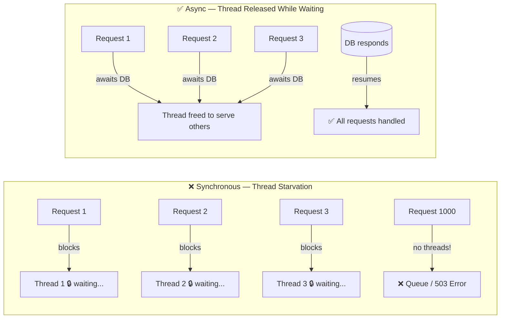
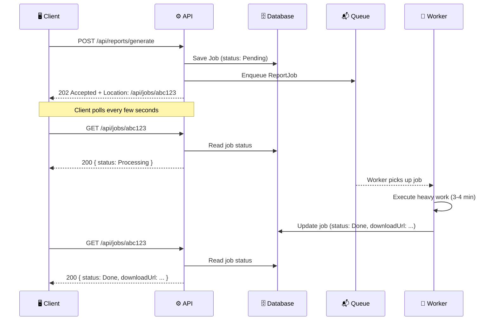
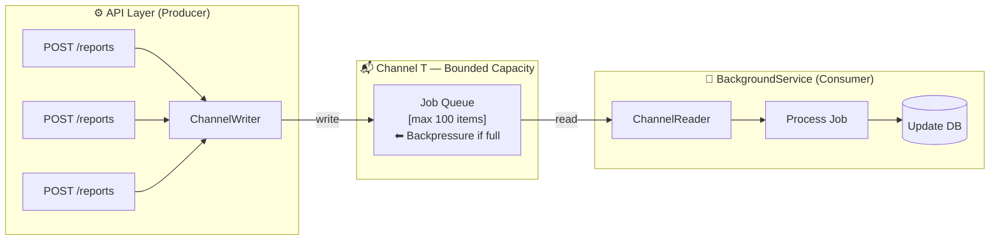
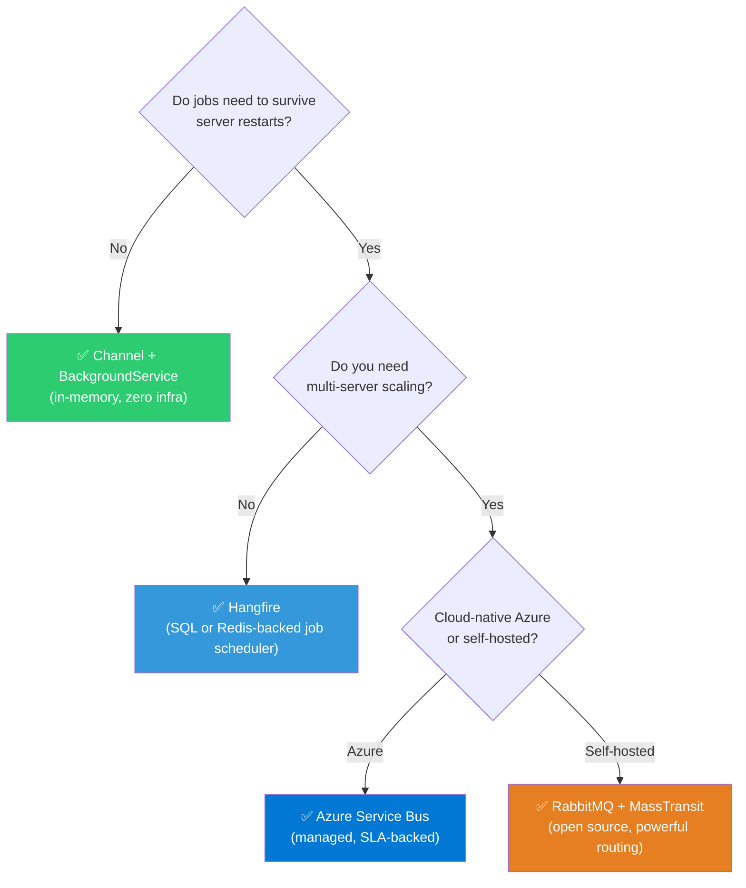
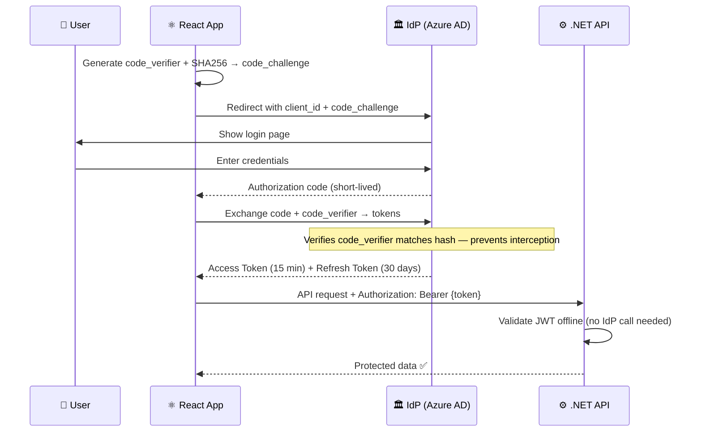
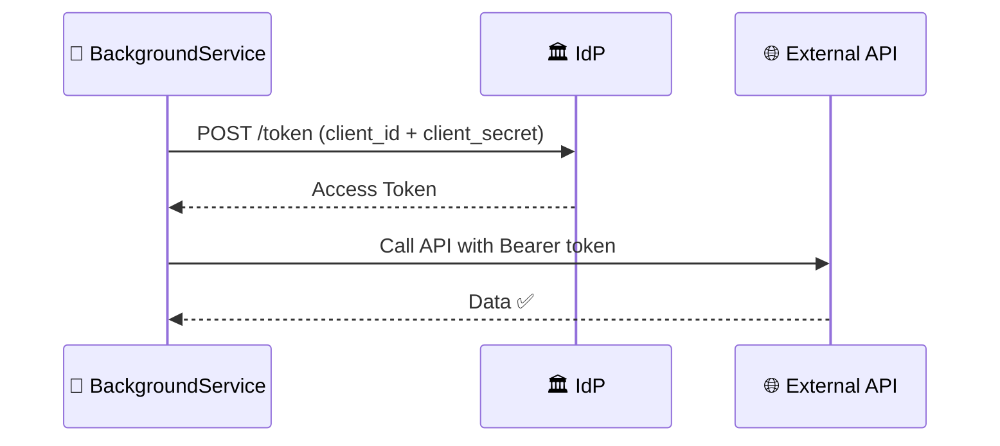
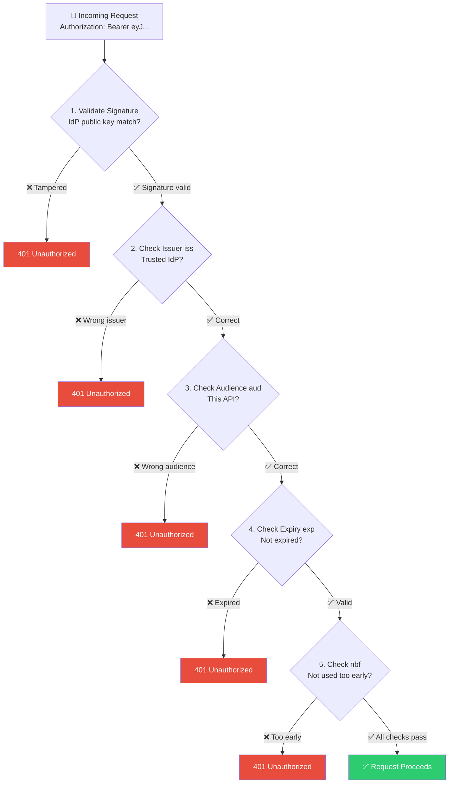
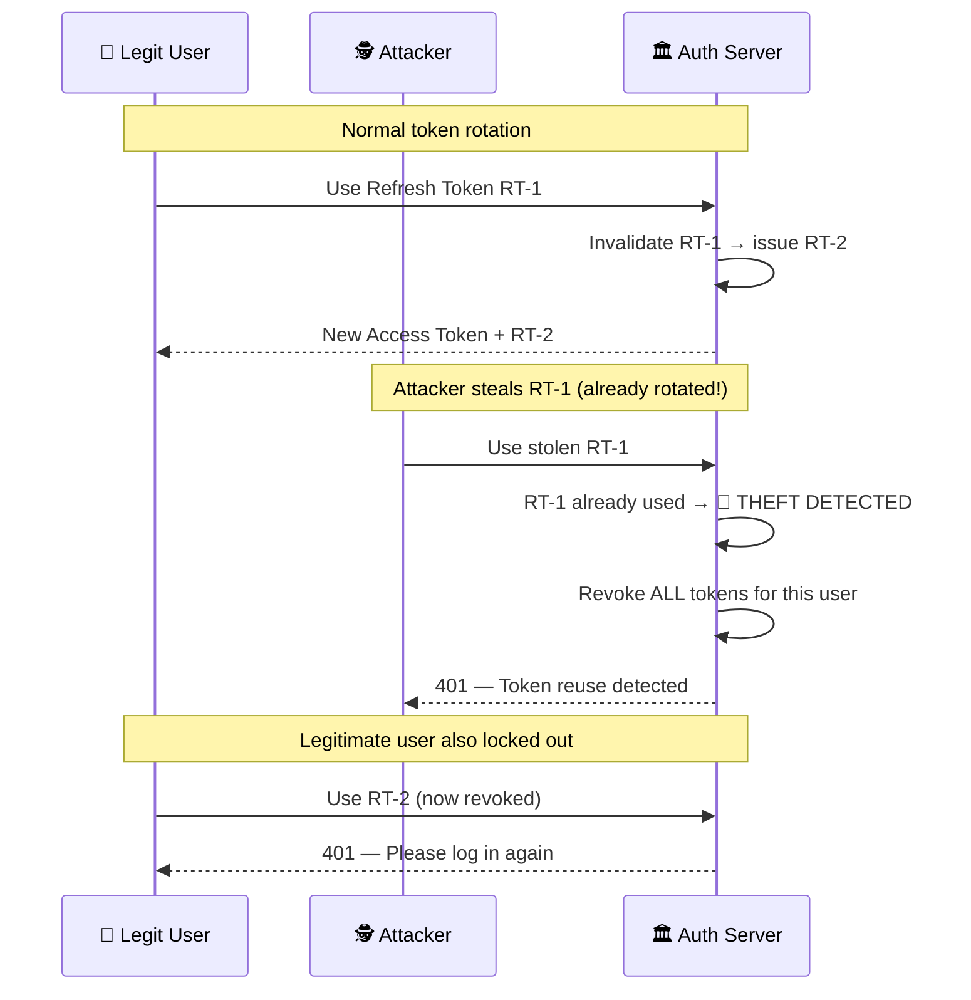

# File 3: Enterprise Async Architecture & Security

> **Framing for the interview**: This is where senior engineers are separated from juniors. Knowing *that* `async/await` exists is junior-level. Knowing *why* thread pool starvation occurs, *what* the Asynchronous Request-Reply pattern solves architecturally, and *how* OAuth 2.0 token flows secure a distributed system — that is what Verdentra is hiring for.

---

## 1. The Problem: Why Synchronous APIs Break Under Load

Every web server has a **thread pool** — a finite set of threads available to handle incoming HTTP requests. In the Kestrel web server (ASP.NET Core), these are typically ThreadPool threads.

**The Synchronous Anti-Pattern:**
1. 1,000 users send requests simultaneously.
2. Each request hits a synchronous database call — the thread is **blocked**, doing nothing but waiting.
3. 1,000 threads are now blocked. The thread pool is exhausted.
4. Request #1,001 arrives. No threads are available. It queues.
5. New threads spin up slowly (expensive). Latency spikes. The server crashes or returns 503.



**The async solution:** With `async/await` on I/O calls, blocked threads are returned to the thread pool. A single thread can handle thousands of concurrent I/O-bound waits, serving other requests while waiting for database responses.

**The rule**: Any call to a database, external HTTP service, or file system must be `await`-ed using the async variant (`ToListAsync()`, `FindAsync()`, `HttpClient.GetAsync()`). "Async all the way down" — from the controller to the repository.

---

## 2. Heavy Data & Async Reporting Architecture

Report generation is the canonical example of work that cannot be completed within an HTTP request's timeout window (typically 30–60 seconds for load balancers and API gateways).

**The naive, broken approach**: `POST /api/reports/generate` → the API generates a 500-page PDF inline → after 90 seconds, the gateway returns `504 Gateway Timeout`. The user sees an error, the report was lost, and the server thread was held hostage for 90 seconds.

---

### Pattern 1: The Asynchronous Request-Reply Pattern

This is the standard architectural blueprint for long-running operations. It decouples **accepting work** from **doing work**.

**The flow — step by step:**



**The `202 Accepted` response contract:**
- Returns immediately (milliseconds, not minutes).
- The `Location` header tells the client where to poll for status.
- Optionally, include a `Retry-After` header suggesting polling interval.

**Client strategies for receiving completion:**
1. **Polling**: Client periodically polls `GET /api/jobs/{id}`. Simple. Works everywhere. Slight latency.
2. **WebSocket / SignalR push**: API pushes a notification to the client the instant the job is done. Real-time. Requires WebSocket support.
3. **Webhook**: For server-to-server scenarios, the API calls back to the client's endpoint when done. No persistent connection required.

---

### Pattern 2: The Producer-Consumer Pattern with .NET Channels

For single-server, in-process async processing, `System.Threading.Channels` is the purpose-built .NET primitive.



**Key architectural properties of `Channel<T>`:**
- **Thread-safe by design**: Multiple producers (API threads) and multiple consumers can read/write safely without locks.
- **Backpressure (Bounded Capacity)**: You configure a maximum channel size. If the channel is full (too many pending jobs), `ChannelWriter.TryWrite()` returns `false` or `WriteAsync()` will await until space opens. This prevents the server from accepting more work than it can handle — the channel itself becomes the rate limiter.
- **`IHostedService` / `BackgroundService`**: The consumer is an `IHostedService` registered at startup. It runs as a long-lived background loop for the application's lifetime, perpetually reading from the `ChannelReader` and processing jobs.

**This pattern is exactly what your FlowForge project uses** for its workflow step execution pipeline. Reference it confidently in the interview.

---

### Pattern 3: Scaling Out with External Message Brokers

**The single-server limitation**: In-memory `Channel<T>` is non-durable. If the server restarts — crash, deployment, or scaling event — all pending jobs in the channel are **lost**. Additionally, you cannot scale horizontally (multiple server instances) because the channel lives only in one process's memory.

**When to graduate to a message broker:**
- Jobs must survive server restarts (durability)
- Multiple API server instances share one job queue (horizontal scaling)
- Consumer microservices are separate deployed services
- You need dead-letter queuing (failed jobs are captured, not silently dropped)

**Azure Service Bus (Enterprise Grade):**
- Fully managed, cloud-native, SLA-backed message broker.
- **Queues**: One message, one consumer. Competing consumers pattern — 10 worker instances all read from the same queue, scaling throughput linearly.
- **Topics + Subscriptions**: One message, many consumers (pub/sub fan-out).
- **Dead-Letter Queue (DLQ)**: Messages that fail processing N times are moved here for investigation, not deleted.
- **Sessions**: Guarantee FIFO ordering for grouped messages.

**RabbitMQ (Open Source, Self-Hosted):**
- Powerful routing with Exchanges (Direct, Fanout, Topic, Headers).
- Requires infrastructure management (or use CloudAMQP as managed).
- **MassTransit**: The .NET library that abstracts over RabbitMQ and Azure Service Bus. Provides Saga state machines (distributed transaction orchestration) — the exact pattern in your FlowForge architecture.

**Hangfire (Simplest Step Up from In-Memory):**
- Background job processing backed by a SQL database or Redis.
- Fire-and-forget, delayed, and recurring jobs.
- Includes a built-in dashboard UI.
- Not a full message broker — a job scheduler. Best for simpler scenarios.

**Architectural Decision Tree:**



---

## 3. Enterprise Auth Deep Dive: OAuth 2.0 & JWT

### The Problem OAuth 2.0 Solves

Before OAuth, delegating access meant sharing passwords. OAuth 2.0 allows an application to obtain limited access to a user's resources on another system **without ever seeing the user's credentials**.

**The four roles:**
- **Resource Owner**: The user.
- **Client**: Your React application.
- **Authorization Server** (IdP): Azure AD / Entra ID, Auth0, Okta — the system that authenticates users and issues tokens.
- **Resource Server**: Your .NET API — the protected backend.

---

### Grant Types — The Authentication Flows

**1. Authorization Code Flow + PKCE (For SPAs & Mobile Apps)**

PKCE (Proof Key for Code Exchange) solves the problem that a browser-based React app cannot safely store a client secret (the source code is public).



**Why PKCE protects against code interception**: If an attacker intercepts the authorization code, they cannot exchange it for tokens because they don't have the `code_verifier` — it never leaves the legitimate client.

**2. Client Credentials Flow (Machine-to-Machine)**

No user is involved. A backend service (e.g., your reporting microservice) authenticates directly to the IdP using its own `client_id` and `client_secret` to obtain an Access Token, then calls other APIs.



---

### JWT Anatomy and Security Boundaries

A JWT is three Base64Url-encoded JSON segments joined by dots: `header.payload.signature`

**The header** declares the algorithm: `{ "alg": "RS256", "typ": "JWT" }`

**The payload (claims)** contains assertions about the user:
```json
{
  "sub": "user-123",
  "iss": "https://login.microsoftonline.com/{tenant}",
  "aud": "api://your-backend-api",
  "exp": 1751400000,
  "roles": ["Manager", "ReportViewer"],
  "name": "Gimhana Mithuranga"
}
```

**The signature** is a cryptographic hash: `RS256(base64(header) + "." + base64(payload), privateKey)`

**CRITICAL SECURITY BOUNDARY — Base64 vs. Encryption:**

> ❗ JWTs are **encoded**, NOT **encrypted**. Anyone who has a JWT can decode the header and payload instantly — no key required. The signature only proves the token wasn't *tampered with*, it does NOT hide the content.

Go to `jwt.io`, paste any JWT, and all claims are immediately visible.

**Consequences:**
- ❌ Never put: passwords, PII (full SSN, credit card numbers), sensitive business data.
- ✅ Safe to put: user ID (sub), roles, permissions, tenant ID, token expiry.

If you need to convey truly sensitive data in a token, use **JWE** (JSON Web Encryption) — a separately specified standard where the payload is actually encrypted, not just encoded.

---

### Stateless Backend Verification — How Your .NET API Validates a JWT

The elegance of JWT is that **your API never needs to call the IdP to validate a token**. It validates the token entirely offline using the IdP's public key.

**The validation chain (every field matters):**



**Asymmetric cryptography (RS256)**: The IdP signs with its **private key** (kept secret). Your API verifies with the IdP's **public key** (published openly at a JWKS endpoint). You can't forge a token without the private key. Your API only needs the public key — it never sees the private key.

---

### Token Lifecycle & Mitigation Strategies

**The core tension**: JWTs are stateless, which means a stolen token cannot be immediately revoked — there's no database entry to delete. The token is valid until `exp`.

**Strategy 1 — Short-Lived Access Tokens**
Keep access token lifetime very short: **5–15 minutes**. This limits the damage window if a token is stolen. An attacker who steals your token can only abuse it for 15 minutes maximum before it expires.

**Strategy 2 — Stateful Refresh Tokens**
Issue a long-lived Refresh Token alongside the short-lived Access Token. The Refresh Token is **opaque** (a random string, not a JWT) and is stored in your database — this is the stateful component that enables revocation.

```
Access Token:  JWT, 15 minutes, stored in memory/sessionStorage
Refresh Token: opaque random string, 30 days, stored in HttpOnly cookie
```

The `HttpOnly` cookie attribute means JavaScript cannot access the Refresh Token — it's immune to XSS attacks.

**Strategy 3 — Token Rotation (Detecting Theft)**
When the client uses the Refresh Token to get a new Access Token, the server **simultaneously invalidates the old Refresh Token and issues a new one**. This is called Refresh Token Rotation.



**Strategy 4 — Token Revocation Endpoint / Short Polling**
For applications requiring immediate revocation (e.g., "log out all devices", account suspension), maintain a short-lived **revocation list** (Redis, with TTL matching access token lifetime). API checks this list on each request. Lightweight because the list only needs to hold tokens issued in the last 15 minutes.
