# Hard Topics — Simply Explained (Deep Edition)

> **How to use this file:** Read the analogy first. Then read the step-by-step. Don't try to memorise the code — understand *why* it works that way. The code will make sense on its own.

---

## 1. Component Lifecycle — Vue & React

### The Analogy: A Lightbulb

A component is like a **lightbulb**.

- It gets **screwed in** (mounted to the screen — this is Mount)
- It **lights up and can flicker** when electricity changes (Updates when data changes)
- It gets **unscrewed** (removed from the screen — this is Unmount)

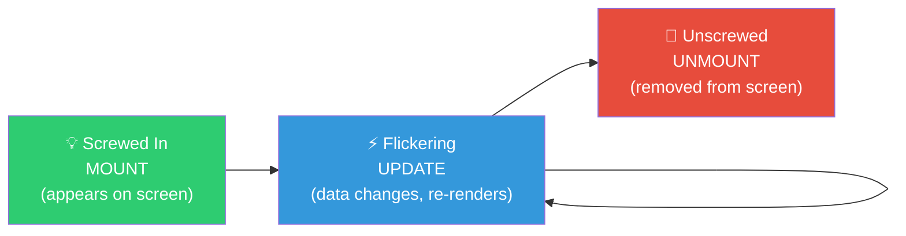

---

### Vue — What Happens Step by Step

```
Step 1: You write <script setup> with ref(), reactive()
        Vue wraps your data in a Proxy (spy system — more on this in Section 2)

Step 2: Vue runs all the code inside <script setup> top to bottom
        (like reading a recipe before cooking)

Step 3: Vue takes your <template> and paints the HTML onto the screen
        The user can now SEE the component

Step 4: onMounted() fires — the lightbulb is now fully screwed in
        ✅ SAFE to: fetch data from API, access DOM elements, start timers HERE

Step 5: User interacts → reactive data changes
        Vue's Proxy detects the change → re-renders ONLY affected parts
        onUpdated() fires

Step 6: Component is removed (user navigates away, v-if becomes false)
        onUnmounted() fires
        ✅ YOU MUST: cancel timers, close WebSocket connections, remove event listeners
        If you don't, the old code keeps running in the background = memory leak
```

```javascript
// Vue lifecycle in practice
import { ref, onMounted, onUnmounted } from 'vue'

const users = ref([])
let timer = null

onMounted(async () => {
  // Safe to fetch here — component is on screen
  users.value = await fetchUsers()
  timer = setInterval(() => console.log('tick'), 1000)
})

onUnmounted(() => {
  // ALWAYS clean up timers and subscriptions
  clearInterval(timer) // if you skip this, timer runs forever even after component is gone
})
```

---

### React — What Happens Step by Step

```
Step 1: React calls your component FUNCTION (top to bottom)
        It reads all your useState, useMemo, etc.

Step 2: React takes the JSX return value and paints the HTML to screen
        The user can now SEE the component

Step 3: useEffect fires AFTER the painting is done
        (NOT during, not before — AFTER the screen is updated)

Step 4: State changes (setCount(5) called)
        React re-runs the ENTIRE function from scratch
        ALL JSX is recalculated, ALL children re-render by default

Step 5: React creates a new "photo" of what the screen should look like (Virtual DOM)
        Compares it to the old photo (diffing)
        Only updates the parts that actually changed in the real DOM

Step 6: Component is removed (navigation, conditional render)
        The cleanup function you RETURN from useEffect runs
```

```javascript
// React lifecycle in practice
import { useState, useEffect } from 'react'

function UserList() {
  const [users, setUsers] = useState([])

  useEffect(() => {
    // ← This runs AFTER the component appears on screen
    fetchUsers().then(data => setUsers(data))

    // Return a cleanup function (runs when component is removed)
    return () => {
      console.log('Component removed — clean up here')
    }
  }, []) // [] = "only run this once, when component first appears"

  return <ul>{users.map(u => <li key={u.id}>{u.name}</li>)}</ul>
}
```

---

### Key Difference in One Line

> **Vue** knows *what* changed (Proxy spy told it). **React** re-runs everything and figures out *what* changed by comparing before and after.

### Interview Answer
> *"Both Vue and React components have a Mount → Update → Unmount lifecycle. The key difference is that Vue uses a Proxy to detect changes surgically, so only affected components re-render. React re-runs the entire component function and uses Virtual DOM diffing to find the minimum set of DOM changes. In React, cleanup happens by returning a function from useEffect — if you don't clean up subscriptions and timers, they keep running after the component is gone, causing memory leaks."*

---

---

## 2. Vue Proxy vs React Rendering — Step by Step

### The Analogy: Spy System vs Photocopier

**Vue** is like a **spy system** in a library.

Imagine students (components) reading books (reactive data). A spy stands by each book. When a student reads from a book, the spy writes that student's name on a list. When the book content changes, the spy ONLY notifies students on the list.

**React** is like a **photocopier**.

Every time any data changes, React photocopies the entire component tree (Virtual DOM). Then compares the new photocopy to the old one. Only updates what's different.

---

### Vue Proxy — Step by Step

```
Step 1: You write: const count = ref(0)
        Vue wraps count in a JavaScript Proxy object
        The Proxy sits between your code and the actual value

Step 2: Component A renders and reads count.value
        The Proxy intercepts this READ
        Proxy writes down: "Component A is watching count"

Step 3: Component B renders but never reads count
        Proxy has no record of Component B

Step 4: You write: count.value = 5
        The Proxy intercepts this WRITE
        Proxy checks its list: "Who was watching count?"
        Answer: only Component A
        Vue re-renders ONLY Component A

Step 5: Component B is completely untouched
        Zero wasted work
```

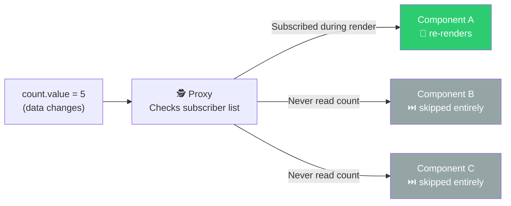

---

### React Top-Down — Step by Step

```
Step 1: You call: setCount(5)
        React schedules a re-render of THIS component

Step 2: React calls your component FUNCTION again from scratch
        Every line of code runs again

Step 3: ALL child components re-render by default
        Even if their props didn't change

Step 4: React builds a new Virtual DOM (an in-memory description of the UI)

Step 5: React compares new Virtual DOM to previous Virtual DOM (diffing)
        "What actually changed?"

Step 6: React updates ONLY those specific real DOM nodes
        The actual screen changes are minimal — but the CALCULATION wasn't
```

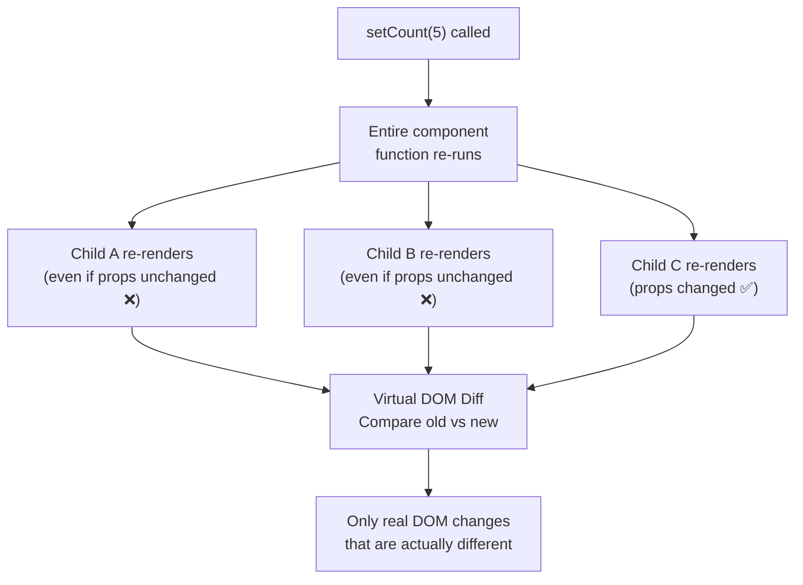

---

### What This Means for You as a Developer

| Problem | Vue | React |
|:---|:---|:---|
| Unnecessary re-renders | Rarely — Vue prevents them automatically | You must use `React.memo`, `useMemo`, `useCallback` |
| Forgetting a dependency | Impossible — Vue auto-tracks | Very possible — causes stale data bugs |
| Performance tuning | Less needed | More manual work required |

### Interview Answer
> *"Vue wraps reactive data in a JavaScript Proxy. The Proxy intercepts reads during render to build a dependency map, and intercepts writes to trigger targeted re-renders — only components that actually read the changed data update. React has no Proxy. setState triggers a full re-run of the component function and all its children. React then diffs the Virtual DOM to compute the minimum set of real DOM changes. This is why React requires manual memoisation with React.memo, useMemo, and useCallback — without them, every state change re-renders the entire subtree."*

---

---

## 3. useEffect, useMemo, useRef — One by One

### `useEffect` — "Do something AFTER the screen updates"

#### The Analogy: A Kitchen Timer

You're cooking. You DON'T set the timer while gathering ingredients (before render). You DON'T set it while chopping vegetables (during render). You set it **AFTER** you put the dish in the oven (after render). That's useEffect.

#### Step by Step

```
Step 1: React renders the component (function runs, JSX returned, DOM updated)

Step 2: useEffect fires — the oven timer starts

Step 3: Inside useEffect, you do:
        - Fetch data from an API
        - Set up a WebSocket connection
        - Start an interval timer
        - Read a DOM element's size

Step 4: The dependency array controls WHEN the timer resets and fires again:
        []         → "Only set the timer once, when the oven first turns on"
        [userId]   → "Reset and re-fire the timer every time userId changes"
        no array   → "Re-fire the timer after EVERY single render" (almost always wrong)

Step 5: The cleanup function runs BEFORE the effect re-runs or when unmounting:
        → Cancel old fetch requests
        → Close old WebSocket connections
        → Clear old timers
```

#### The Stale Closure Trap — Most Common Bug

```javascript
// ❌ THE BUG
const [count, setCount] = useState(0)

useEffect(() => {
  const timer = setInterval(() => {
    console.log('count is:', count) // Always prints 0!
    // WHY? This function "remembered" count = 0 when it was created
    // Even after count becomes 5, 10, 20... this function sees 0
    // It has a STALE version of count — a snapshot from the past
  }, 1000)

  return () => clearInterval(timer)
}, []) // [] means this effect only runs ONCE — count is permanently captured as 0
```

```javascript
// ✅ THE FIX — add count to the dependency array
useEffect(() => {
  const timer = setInterval(() => {
    console.log('count is:', count) // Now sees the current value
  }, 1000)

  return () => clearInterval(timer) // cleanup old timer before creating new one
}, [count]) // Now re-runs whenever count changes — always fresh value
```

**Rule**: Every variable used inside useEffect that could change must be in the dependency array.

---

### `useMemo` — "Remember this result, don't recalculate every time"

#### The Analogy: A Chef's Notebook

A chef makes a complex sauce (expensive calculation). Instead of making it from scratch every time a customer orders, they write the final result in a notebook. When a customer orders, chef checks: *"Did the ingredients change since I wrote this down?"*

- **No** → Serve from the notebook. Instant.
- **Yes** → Make fresh sauce, update the notebook.

#### Step by Step

```
Step 1: Component renders
Step 2: useMemo checks: "Did any value in my [dependencies] array change?"
Step 3: If NO → return the cached result immediately. No work done.
Step 4: If YES → run the calculation, cache the new result, return it
```

```javascript
const [orders, setOrders] = useState([...])
const [filter, setFilter] = useState('all')

// ❌ Without useMemo — recalculates on EVERY render, even unrelated ones
const filteredOrders = orders.filter(o => o.status === filter)

// ✅ With useMemo — only recalculates when orders or filter actually changes
const filteredOrders = useMemo(() => {
  return orders.filter(o => o.status === filter)
}, [orders, filter]) // "Only remake the sauce if ingredients changed"
```

**When to use**: Filtering/sorting large arrays, complex math, creating derived data.
**When NOT to use**: Simple values — `useMemo` has its own overhead. Don't wrap `2 + 2` in useMemo.

---

### `useRef` — "A sticky note that survives renders but doesn't cause them"

#### The Analogy: A Sticky Note on the Fridge

You write something on a sticky note and put it on the fridge. You can read it whenever you want. You can change what's written on it. **But changing the note doesn't call a family meeting (re-render).** The note just sits there, quietly persisting.

#### The Two Uses

**Use 1: Directly control a real DOM element**
```javascript
const inputRef = useRef(null)

// In JSX:
<input ref={inputRef} />

// Anywhere in your code:
inputRef.current.focus()    // focuses the input
inputRef.current.value = '' // clears it
// Neither of these causes a re-render
```

**Use 2: Store a value that shouldn't cause re-renders**
```javascript
const renderCount = useRef(0)

// Every render:
renderCount.current++ // doesn't cause another render
console.log('Rendered', renderCount.current, 'times') // always accurate

// Compare to useState:
const [count, setCount] = useState(0)
// setCount(count + 1) WOULD cause a re-render → infinite loop if done during render
```

**The Critical Difference:**

| | `useState` | `useRef` |
|:---|:---|:---|
| Changing value causes re-render? | ✅ Yes | ❌ No |
| Persists between renders? | ✅ Yes | ✅ Yes |
| Use for | UI state (what user sees) | Timers, DOM elements, counters that don't need to show in UI |

### Interview Answer (all three)
> *"useEffect runs after the component renders, not during. The dependency array controls when it re-runs — empty array means once on mount, no array means every render. The most common bug is a stale closure where a variable inside useEffect has an outdated value because it wasn't listed as a dependency. useMemo caches a computed value and only recalculates when its dependencies change — useful for expensive array operations. useRef is a mutable box that survives re-renders but never triggers them — used for DOM access and storing non-UI values like timer IDs."*

---

## 4. SOLID Principles — Restaurant Kitchen Analogy

Think of your codebase as a **professional restaurant kitchen**. Each SOLID principle is a kitchen rule that keeps everything running smoothly.

---

### S — Single Responsibility: "One chef, one job"

**The Rule**: Every class should have ONE reason to change.

**The Kitchen Rule**: The saucier makes sauces. The pastry chef makes desserts. They don't cross over. If the dessert recipe changes, only the pastry chef is affected.

---

#### Step by Step — Why It Breaks Without SRP

Imagine you have a single class `TasksController` that does four things:
handles HTTP → queries the database → sends emails → generates PDFs.

```
Step 1: Product manager says "change the email subject line"
Step 2: A developer opens TasksController.cs to find the email code
Step 3: The file has 500 lines. Email logic is buried inside the HTTP handler.
Step 4: Developer edits the email part
Step 5: Accidentally nudges the HTTP routing code next to it
Step 6: Controller now returns wrong status codes
Step 7: Tests fail. Production breaks. The bug is hard to trace.

WHY? Because changing the email format should only affect email code.
But everything was in one class — so a change in one area risks ALL areas.
```

```csharp
// ❌ Fat Controller — doing 4 different jobs
public class TasksController
{
    public IActionResult CreateTask(TaskDto dto)
    {
        // Job 1: HTTP handling (controller's ONLY real job)
        if (dto == null) return BadRequest();

        // Job 2: Database access (NOT the controller's job)
        var task = new Task { Title = dto.Title };
        _db.Tasks.Add(task);
        _db.SaveChanges();

        // Job 3: Sending emails (DEFINITELY not the controller's job)
        _emailService.Send("task-created@company.com", "New task: " + dto.Title);

        // Job 4: PDF generation (seriously?)
        _pdfService.GenerateTaskReport(task.Id);

        return Ok();
    }
}
```

```csharp
// ✅ Each class has ONE job — changes are isolated
public class TasksController          // Job: ONLY handle HTTP (parse request, return response)
{
    public async Task<IActionResult> CreateTask(TaskDto dto)
    {
        var result = await _taskService.CreateAsync(dto);
        return CreatedAtAction(nameof(GetTask), new { id = result.Id }, result);
        // Controller doesn't know about emails, PDFs, or databases
    }
}

public class TaskService              // Job: ONLY business logic (rules, orchestration)
{
    public async Task<TaskDto> CreateAsync(TaskDto dto)
    {
        var task = await _repo.SaveAsync(new Task { Title = dto.Title });
        await _notifier.NotifyAsync(task); // delegates — doesn't DO it itself
        return task.ToDto();
    }
}

public class TaskRepository           // Job: ONLY database queries
{
    public async Task<Task> SaveAsync(Task task)
    {
        _db.Tasks.Add(task);
        await _db.SaveChangesAsync();
        return task;
    }
}

public class EmailNotifier            // Job: ONLY send notifications
{
    public async Task NotifyAsync(Task task) { /* send email */ }
}
```

**How to spot SRP violations — ask yourself:**
- Does this class have MORE than one reason to change?
- Do I need to open this file when I change the database AND when I change the email template?
- Is this class hard to unit test because it needs multiple real services?

**Rule to Remember**: Say "this class is responsible for ___". If you can't fill in that blank with ONE thing — split it.

---

### O — Open/Closed: "Add a new dish without rebuilding the kitchen"

**The Rule**: Classes should be **open for extension** (you can add new behaviour) but **closed for modification** (you don't edit working, tested code to do it).

**The Kitchen Rule**: When the restaurant adds a new dish, the chef writes a NEW recipe card. They don't cross out and rewrite the existing ones.

---

#### Step by Step — Why It Breaks Without OCP

```
Scenario: You have a NotificationService that sends emails.
          The business now wants SMS notifications too.

WITHOUT OCP:
Step 1: Open NotificationService.cs (working, tested, in production)
Step 2: Find the Send() method — 80 lines of working email logic
Step 3: Add an if/else block for SMS
Step 4: While editing, you accidentally rename a variable used in the email block
Step 5: Email notifications break in production
Step 6: You were only supposed to ADD sms — you broke something you didn't touch intentionally

WITH OCP:
Step 1: Create a new file SmsNotification.cs
Step 2: Implement INotificationChannel (the shared contract)
Step 3: Register it in Program.cs
Step 4: Email code? NEVER TOUCHED. Can't break.
```

```csharp
// ❌ Every time you add a new notification type, you edit this working class
public class NotificationService
{
    public void Send(string type, string message)
    {
        if (type == "email")
        {
            // 50 lines of email logic...
        }
        else if (type == "sms")
        {
            // 30 lines of SMS logic...
        }
        // Adding "push notification" means opening this 80-line method
        // and adding another else if
        // You might break email or SMS while editing
    }
}
```

```csharp
// ✅ Add a new notification by creating a NEW class — never touch the existing ones
public interface INotificationChannel
{
    Task SendAsync(string message);
}

public class EmailNotification : INotificationChannel
{
    public async Task SendAsync(string message) { /* email logic */ }
}

public class SmsNotification : INotificationChannel
{
    public async Task SendAsync(string message) { /* SMS logic */ }
}

// Adding WhatsApp? Create WhatsAppNotification : INotificationChannel
// Zero risk to email or SMS code
public class WhatsAppNotification : INotificationChannel
{
    public async Task SendAsync(string message) { /* WhatsApp logic */ }
}
```

**Rule to Remember**: If adding a new feature requires editing an existing, working class — you've violated OCP. Instead, create a new class.

---

### L — Liskov Substitution: "Any chef can fill any role"

**The Rule**: If you replace a class with a subclass, **nothing should break**. The subclass must honour ALL the promises the parent made.

**The Kitchen Rule**: If you replace the head saucier with a new saucier, the rest of the kitchen can't even tell. The sauces still come out the same.

---

#### Step by Step — Why It Breaks

```
The Promise: Rectangle says "Width and Height are independent. Area = Width × Height."
The Violation: Square inherits Rectangle but forces Width = Height always.

Step 1: Code is written that uses Rectangle:
        rect.Width = 5;
        rect.Height = 3;
        assert rect.Area() == 15 ← passes ✅

Step 2: Someone swaps in Square (which IS-A Rectangle by inheritance):
        rect.Width = 5;   // Square silently sets Height to 5 too
        rect.Height = 3;  // Square silently sets Width to 3 too
        assert rect.Area() == 15 ← FAILS — area is 9 ❌

WHY? Square broke the promise Rectangle made.
Rectangle said: "Set Width and Height independently."
Square says: "No — I keep them equal."
This is a broken contract.
```

```csharp
// ❌ LSP Violation — Square breaks Rectangle's contract
public class Rectangle
{
    public virtual int Width { get; set; }
    public virtual int Height { get; set; }
    public int Area() => Width * Height;
}

public class Square : Rectangle
{
    // Overrides to keep both dimensions equal — but BREAKS the expected behaviour
    public override int Width  { set { base.Width = value; base.Height = value; } }
    public override int Height { set { base.Width = value; base.Height = value; } }
}

// Code that USED to work with Rectangle silently gives wrong results with Square:
void ResizeAndCheck(Rectangle r)
{
    r.Width = 5;
    r.Height = 3;
    Console.WriteLine(r.Area()); // Expected 15, gets 9 if r is actually a Square 💥
}
```

```csharp
// ✅ Fix — don't force inheritance if the behaviour would break.
// Use a shared interface — each class makes its OWN honest promise.
public interface IShape { int Area(); }

public class Rectangle : IShape
{
    public int Width { get; set; }
    public int Height { get; set; }
    public int Area() => Width * Height; // independent — as expected
}

public class Square : IShape
{
    public int Side { get; set; }
    public int Area() => Side * Side; // its own honest contract
}
```

#### The Practical Version — Your Task Tracker

```csharp
// ITaskRepository is the contract. Two implementations:
public class SqlTaskRepository : ITaskRepository
{
    public async Task<List<Task>> GetAllAsync() { /* queries SQL */ }
    public async Task SaveAsync(Task task)      { /* saves to SQL */ }
}

public class InMemoryTaskRepository : ITaskRepository
{
    private List<Task> _store = new();
    public async Task<List<Task>> GetAllAsync() => _store;
    public async Task SaveAsync(Task task) { _store.Add(task); }
}

// The controller accepts ITaskRepository — it doesn't know which implementation it gets
// In production: SqlTaskRepository
// In tests:      InMemoryTaskRepository
// The controller behaves IDENTICALLY either way — that's LSP working correctly
```

**Rule to Remember**: Before inheriting, ask: "Can I use this subclass EVERYWHERE the parent is expected, without any surprise?" If no → don't inherit. Use an interface instead.

---

### I — Interface Segregation: "Don't give the pastry chef a meat grinder"

**The Rule**: Don't force a class to implement methods it doesn't need.

**The Kitchen Rule**: The pastry chef's toolkit: piping bag, rolling pin, moulds. NOT: meat cleaver, blowtorch, fish scaler. Give each role ONLY what it needs.

---

#### Step by Step — Why It Breaks Without ISP

```
Scenario: You create one big IWorker interface with 4 methods.
          You apply it to both Human AND Robot.

Step 1: Robot implements IWorker
Step 2: Robot.Work() → fine, robots can work
Step 3: Robot.Eat()  → robots don't eat. Developer writes: throw new NotImplementedException()
Step 4: Some code calls worker.Eat() on a Robot → crashes at RUNTIME 💥
Step 5: The COMPILER was silent — Robot.Eat() compiled fine because it "implements" the interface
Step 6: This runtime bomb reaches production before anyone notices

The core problem: ISP violations are invisible at compile time.
                  They only explode at runtime.
```

```csharp
// ❌ Fat interface — Robot is forced to pretend it eats and sleeps
public interface IWorker
{
    void Work();
    void Eat();       // meaningless for Robot
    void Sleep();     // meaningless for Robot
    void TakeBreak(); // meaningless for Robot
}

public class Robot : IWorker
{
    public void Work()      { /* actually works */ }
    public void Eat()       { throw new NotImplementedException(); } // 💥 runtime bomb
    public void Sleep()     { throw new NotImplementedException(); } // 💥 runtime bomb
    public void TakeBreak() { throw new NotImplementedException(); } // 💥 runtime bomb
}
```

```csharp
// ✅ Split into small, focused interfaces — each class only implements what it truly does
public interface IWorkable  { void Work(); }
public interface IFeedable  { void Eat(); }
public interface ISleepable { void Sleep(); }

public class Human : IWorkable, IFeedable, ISleepable
{
    public void Work()  { /* works */ }
    public void Eat()   { /* eats */ }
    public void Sleep() { /* sleeps */ }
}

public class Robot : IWorkable // Only implements what it actually does
{
    public void Work() { /* works */ }
    // Not forced to implement Eat or Sleep
}

// Code that needs a worker asks for IWorkable — both Robot and Human qualify
public class Factory
{
    private readonly IWorkable _worker;
    public Factory(IWorkable worker) { _worker = worker; }
    public void Produce() { _worker.Work(); } // works with Robot AND Human
}
```

#### Real-World ASP.NET Core Example

```csharp
// ❌ One big repository — reporting service is forced to have Delete + BulkImport methods
public interface ITaskRepository
{
    Task<List<Task>> GetAllAsync();
    Task<Task>       FindAsync(int id);
    Task             SaveAsync(Task task);      // ← read-only services don't need this
    Task             DeleteAsync(int id);       // ← read-only services don't need this
    Task             BulkImportAsync(List<Task> tasks); // ← most services don't need this
}

// ✅ Split by purpose — each service gets only what it uses
public interface ITaskReader
{
    Task<List<Task>> GetAllAsync();
    Task<Task>       FindAsync(int id);
}

public interface ITaskWriter
{
    Task SaveAsync(Task task);
    Task DeleteAsync(int id);
}

// ReportingService only reads → inject ITaskReader only → no Delete/BulkImport in scope
// AdminService needs both   → inject ITaskReader AND ITaskWriter
```

**Rule to Remember**: If a class throws `NotImplementedException` or leaves methods empty — the interface is too fat. Split it into smaller, focused interfaces.

---

### D — Dependency Inversion: "Kitchen depends on recipe cards, not specific chefs"

**The Rule**: High-level code should depend on **interfaces** (abstractions), NOT on **concrete classes** (specific implementations).

**The Kitchen Rule**: The restaurant's ordering system says "we need a saucier who follows THIS recipe card". Not "we need Giovanni". Any qualified saucier who can follow the card works — the system doesn't care who.

---

#### Step by Step — Why It Breaks Without DIP

```
Scenario: TasksController creates its own SqlTaskRepository using `new`.

Problem 1 — TESTING:
Step 1: Developer wants to unit test the controller logic
Step 2: TasksController has `new SqlTaskRepository("Server=prod-db;...")` inside it
Step 3: Test environment has no database → exception thrown before test even starts
Step 4: Developer must spin up a real SQL database just to test controller code
Step 5: Tests are slow, fragile, require a running database server at all times

Problem 2 — FLEXIBILITY:
Step 1: Business switches from SQL Server to PostgreSQL
Step 2: Every class with `new SqlTaskRepository()` must be opened and edited
Step 3: 20 classes changed → higher chance of introducing a bug
Step 4: One miss → runtime crash in production

Root cause: the controller is HARDWIRED to one specific database library.
            Change the library = change the controller.
```

```csharp
// ❌ Hardwired — controller glued to SqlTaskRepository
public class TasksController
{
    // 'new' = this class owns + creates the dependency
    private readonly SqlTaskRepository _repo = new SqlTaskRepository("Server=prod-db;...");

    // To test:         need a real SQL Server database running
    // To change to PG: open THIS file and every other file using SqlTaskRepository
    // This class knows too much about how data is stored
}
```

```csharp
// ✅ With DIP — controller only knows the interface, not the implementation
public class TasksController
{
    private readonly ITaskRepository _repo;

    // Controller RECEIVES the dependency — it doesn't create it
    // Could be SqlTaskRepository, PostgresTaskRepository, InMemoryTaskRepository...
    // Controller doesn't know and doesn't care
    public TasksController(ITaskRepository repo)
    {
        _repo = repo;
    }
}

// Program.cs — the ONE place that chooses the implementation
builder.Services.AddScoped<ITaskRepository, SqlTaskRepository>();
// Switch to PostgreSQL? Change just this ONE line. Controller never touched.

// In unit tests — inject a fake, no database needed
var fakeRepo = new Mock<ITaskRepository>();
fakeRepo.Setup(r => r.GetAllAsync()).ReturnsAsync(testTasks);
var controller = new TasksController(fakeRepo.Object);
// Full test coverage. No database. Runs in milliseconds.
```

#### The Three Benefits — Spelled Out

```
Benefit 1: TESTABILITY
  ❌ Without DIP: need a real SQL Server to test the controller
  ✅ With DIP:    inject a mock → test instantly, no database

Benefit 2: FLEXIBILITY  
  ❌ Without DIP: switching database = edit 20 files
  ✅ With DIP:    switching database = change 1 line in Program.cs

Benefit 3: ISOLATION
  ❌ Without DIP: database is down → ALL tests fail (even pure logic tests)
  ✅ With DIP:    inject a fake → tests pass regardless of database status
```

#### DIP vs DI — The Distinction

```
DIP = the PRINCIPLE
      "Depend on abstractions, not concretions"
      "Receive your dependencies — don't create them with new"

DI  = the MECHANISM
      .NET's built-in container that IMPLEMENTS the DIP principle
      It creates the right concrete class and injects it for you

DIP is the WHY.  DI is the HOW.
```

**Rule to Remember**: Spot `new ConcreteClass()` inside a business class → DIP violation. It should arrive via constructor injection, not be created on the spot.

---

### SOLID — Full Picture

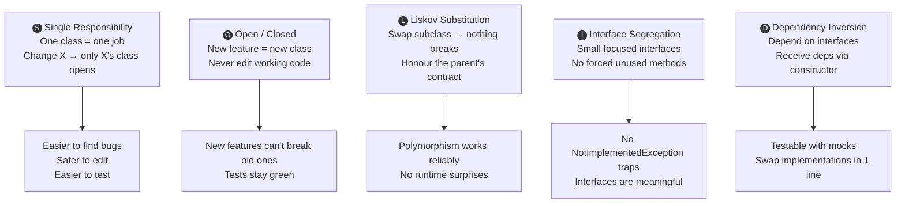

---

### How They Connect

```
SRP  → makes classes small enough that OCP and DIP are easy to apply
OCP  → uses interfaces (from DIP) to add new behaviour without editing old code
LSP  → guarantees your OCP polymorphism strategy actually works at runtime
ISP  → keeps interfaces small so DIP doesn't force irrelevant dependencies
DIP  → the glue: enables OCP, makes LSP testable, combines with ISP for clean injection
```

---

### One Sentence for Each — Say These Out Loud

| Principle | Your sentence |
|:---|:---|
| **S** | "Every class has one job — if you're changing it for two different reasons, split it." |
| **O** | "Add new behaviour by creating new classes, not by editing working ones." |
| **L** | "A subclass must be fully replaceable for its parent — no surprises, no broken contracts." |
| **I** | "Interfaces should be small and focused — never force a class to implement methods it doesn't use." |
| **D** | "Depend on the interface, not the class — inject dependencies via constructor, never new them inside a class." |

---

### Interview Answer

> *"SOLID is five principles that keep OO codebases maintainable as they grow.*
>
> *SRP — one class, one reason to change. My task tracker separates Controller, Service, and Repository so changing database logic never risks breaking HTTP handling.*
>
> *OCP — add new features with new classes, not by editing existing ones. Adding WhatsApp notifications means a new class implementing INotificationChannel — the email code is never touched.*
>
> *LSP — subclasses must honour the parent's contract. SqlTaskRepository and InMemoryTaskRepository both implement ITaskRepository identically — swapping them for tests works without any code changes in the controller.*
>
> *ISP — small, focused interfaces. A read-only reporting service shouldn't be forced to implement Delete and BulkImport just because they share the same interface.*
>
> *DIP — depend on abstractions, not concretions. Controllers receive ITaskRepository through constructor injection — the DI container decides the implementation. This is what makes unit testing without a real database possible."*

---

## 5. .NET Garbage Collector — Simply Explained

### The Analogy: A Bedroom with a Cleaner

Your RAM is like a **bedroom**. Every time you create an object (`new Task()`, `new List<string>()`), you're putting something on the floor. As your program runs, stuff piles up. Eventually the bedroom is full.

You hire a **cleaner** (the Garbage Collector). But the cleaner is smart — they don't throw everything away. They check: **"Is anyone still using this?"**

---

### Step by Step — What the GC Does

```
Step 1: You write: var task = new Task { Title = "Budget report" }
        .NET allocates memory on the HEAP for this Task object
        Your variable 'task' is a REFERENCE pointing to it

Step 2: As long as 'task' exists and points to the object, it's ALIVE
        The GC will not touch it

Step 3: The function ends. 'task' goes out of scope.
        Now NOTHING points to the Task object in memory
        It's "orphaned" — floating in memory, unreachable

Step 4: The GC runs in the background (periodically, not constantly)
        It traces every object: "Can ANY code path reach this object?"

Step 5: If YES → keep it (it's still reachable)
        If NO  → mark it as garbage, free the memory
```

---

### The Three Generations — Why They Exist

**Insight**: Most objects are short-lived — a temporary string, a loop variable, a DTO in a controller. It would be wasteful to scan the entire heap every time.

**Solution**: Sort objects by age. Check young objects often. Check old objects rarely.

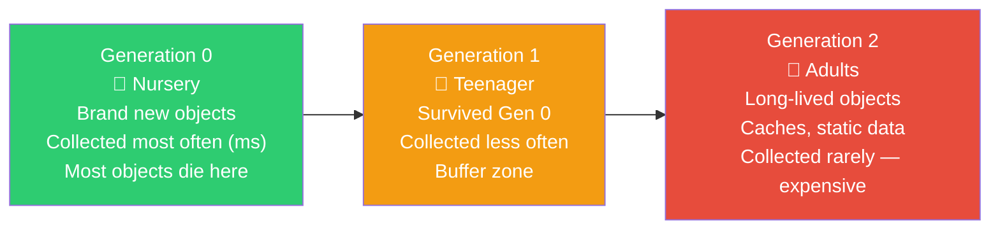

```
Example lifecycle:
var dto = new TaskDto()    → created in Gen 0
Function ends              → dto becomes unreachable
Next Gen 0 collection      → dto is freed ✅ (died young — normal and efficient)

vs.

var cache = new MemoryCache() → created in Gen 0
Survives Gen 0 collection     → promoted to Gen 1
Survives Gen 1 collection     → promoted to Gen 2
Lives for the whole app       → only collected when app shuts down
```

---

### IDisposable — When GC Is NOT Enough

The GC handles **memory**. But some objects hold resources that are NOT memory:
- Database connections
- File handles
- Network sockets
- Streams

The GC doesn't know about these. You must release them manually using `Dispose()`.

```csharp
// ❌ Without using — connection stays open until GC eventually runs
var connection = new SqlConnection(connectionString);
connection.Open();
// ... do work ...
// connection never explicitly closed — lives until GC collects it
// Meanwhile, the database has a limited pool of connections → pool exhausted → errors

// ✅ With using — connection closed immediately when block ends
using (var connection = new SqlConnection(connectionString))
{
    connection.Open();
    // ... do work ...
} // ← Dispose() called automatically here. Connection returned to pool immediately.

// Modern C# shorthand:
using var connection = new SqlConnection(connectionString); // disposed when variable goes out of scope
```

> **EF Core's DbContext is IDisposable**. ASP.NET Core's DI container automatically disposes Scoped services (including DbContext) at the end of each HTTP request — you don't need to manually dispose it in controllers.

### Interview Answer
> *"The .NET Garbage Collector automatically manages memory by tracking which objects are still reachable through references. It uses a generational model — Gen 0 for short-lived objects collected frequently, Gen 2 for long-lived objects collected rarely. But the GC only manages memory, not other resources like database connections or file handles. For those, you implement IDisposable and use the 'using' statement, which guarantees Dispose is called even if an exception occurs. EF Core's DbContext is a key example — it's IDisposable and should be Scoped so ASP.NET disposes it after each request."*

---

---

## 6. Race Conditions — Mutable vs Immutable

### The Analogy: A Shared Bank Account

You and a friend both have access to a bank account with **£100**. You both try to withdraw £80 at the exact same moment from different ATMs.

```
ATM 1 reads balance:  £100
ATM 2 reads balance:  £100   ← reads BEFORE ATM 1 has written the new balance

ATM 1 calculates: £100 - £80 = £20, writes £20 to account
ATM 2 calculates: £100 - £80 = £20, writes £20 to account ← OVERWRITES ATM 1!

Final balance: £20
But £160 was withdrawn!  ❌ Bank lost £60.
```

**This is a race condition** — two threads "race" to read/write shared data, and the result depends on who finishes first.

---

### Why `count++` Is Not Safe

`count++` looks like one operation. It's secretly **three**:

```
Step 1: READ  _count from memory      → Thread 1 gets value 10
        (Thread 2 sneaks in HERE)
Step 1: READ  _count from memory      → Thread 2 ALSO gets value 10

Step 2: Thread 1 calculates: 10 + 1 = 11, WRITES 11
Step 2: Thread 2 calculates: 10 + 1 = 11, WRITES 11

Result: 11
Should be: 12  ❌ One increment was lost
```

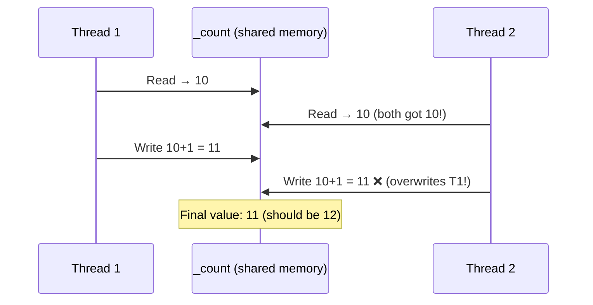

---

### Mutable vs Immutable — The Core Concept

**Mutable** = the value CAN be changed after creation.

```csharp
// Mutable — the list itself is modified
var items = new List<string> { "Alice" };
items.Add("Bob");    // same list, mutated
items.Remove("Alice"); // same list, mutated
// Two threads mutating the same list simultaneously = corruption
```

**Immutable** = the value CANNOT be changed. A "change" creates a NEW copy.

```csharp
// Immutable — strings in C# are immutable
string name = "Alice";
string newName = name + " Smith"; // 'name' is UNCHANGED. newName is a completely new string.
// Safe to share across threads — nobody can mutate it
```

---

### Why React Requires Immutable State Updates

React detects changes by **reference** — it checks "is this the exact same object in memory?"

```javascript
// ❌ WRONG — mutating the array directly
const [tasks, setTasks] = useState(['task1', 'task2'])

tasks.push('task3')      // ← modifying the SAME array object in memory
setTasks(tasks)          // ← React says "same reference as before" → no re-render!
                         // Your UI doesn't update even though data changed

// ✅ CORRECT — create a NEW array
setTasks([...tasks, 'task3']) // new array = new reference = React detects change = re-render
setTasks(prev => [...prev, 'task3']) // safer version using the callback form
```

---

### How to Fix Race Conditions in .NET

```csharp
// ❌ DANGEROUS — race condition
public class RequestCounter
{
    private int _count = 0;
    public void Increment() { _count++; } // NOT thread-safe
}

// ✅ FIX 1: lock — only one thread at a time
private readonly object _lock = new object();
public void Increment() {
    lock (_lock) { _count++; } // Thread 2 waits outside until Thread 1 finishes
}

// ✅ FIX 2: Interlocked — atomic operation (best for counters)
public void Increment() {
    Interlocked.Increment(ref _count); // READ + ADD + WRITE as one uninterruptible step
}

// ✅ FIX 3: Thread-safe collections
private List<string> _items = new List<string>();         // ❌ not thread-safe
private ConcurrentQueue<string> _items = new ConcurrentQueue<string>(); // ✅ thread-safe
```

### Interview Answer
> *"A race condition occurs when two threads read and write shared mutable state simultaneously, and the result depends on which thread executes first. The classic example is count++ — it's secretly three operations: read, add, write. If two threads interleave between these steps, one write overwrites the other. In .NET, fixes include lock for mutual exclusion, Interlocked.Increment for atomic operations, and ConcurrentDictionary or ConcurrentQueue for thread-safe collections. In React, immutability matters because React uses reference equality to detect changes — mutating an array in place means React sees the same reference and skips re-rendering."*

---

---

## 7. Dependency Injection Lifetimes — Coffee Shop Analogy

### The Setup

Imagine a coffee shop. The DI container is the **barista**. When a class asks for a service, the barista provides it. But HOW they provide it depends on the registered lifetime.

---

### Transient — "A new paper cup every single time"

Every customer gets a **brand new disposable cup**. Even two people at the same table, ordering at the same time, get separate cups.

```
Class A needs IEmailFormatter → barista creates NEW EmailFormatter #1
Class B needs IEmailFormatter → barista creates NEW EmailFormatter #2
These are completely separate objects, no shared state
```

```csharp
services.AddTransient<IEmailFormatter, EmailFormatter>();

// What happens in practice:
public class OrderController
{
    private readonly IEmailFormatter _fmt1; // gets EmailFormatter #1

    public OrderController(IEmailFormatter fmt) { _fmt1 = fmt; }
}

public class ReportService
{
    private readonly IEmailFormatter _fmt2; // gets EmailFormatter #2 — different instance!

    public ReportService(IEmailFormatter fmt) { _fmt2 = fmt; }
}
```

**Use for**: Lightweight, stateless services — validators, formatters, mappers.

**Risk**: If the class is expensive to create (opens connections, loads large data) — creating a new one constantly is wasteful.

---

### Scoped — "One tray per table order"

A table places ONE order. Everyone sharing that order uses **one tray**. When the order is fulfilled (request ends), the tray is cleared away.

In ASP.NET Core, "one order" = **one HTTP request**.

```
HTTP Request arrives:
    Controller needs AppDbContext → barista creates DbContext #1
    TaskService needs AppDbContext → barista returns SAME DbContext #1
    AuditService needs AppDbContext → barista returns SAME DbContext #1

HTTP Request ends:
    DbContext #1 is Disposed ✅

Next HTTP Request arrives:
    Controller needs AppDbContext → barista creates DbContext #2 (fresh)
```

```csharp
services.AddScoped<AppDbContext>(); // one DbContext per HTTP request

// In a single request, all three of these get the SAME DbContext:
public class TasksController  { public TasksController(AppDbContext db) { } }
public class TaskService      { public TaskService(AppDbContext db) { } }
public class AuditService     { public AuditService(AppDbContext db) { } }
```

**Why DbContext MUST be Scoped**: EF Core's DbContext is a "Unit of Work" — it tracks all changes made during ONE logical operation (one request). If two requests shared one DbContext, their changes would interfere. Making it Transient means changes tracked in TaskService would be lost by the time AuditService tries to use them.

**Use for**: DbContext, repositories, business services — almost everything should be Scoped.

---

### Singleton — "The one coffee machine"

The entire coffee shop has **ONE coffee machine**. Every customer, every day, for as long as the shop is open — everyone uses the same machine.

```
App starts → DI creates MemoryCache #1
Request 1  → gets MemoryCache #1
Request 2  → gets MemoryCache #1 (same)
Request 1000 → gets MemoryCache #1 (same)
App shuts down → MemoryCache #1 Disposed
```

```csharp
services.AddSingleton<IMemoryCache, MemoryCache>();
// Created once. Every request shares this exact same instance.
```

**Use for**: Caches, configuration, `Channel<T>`, `HttpClientFactory`, app-wide counters.

**The danger**: Singletons are shared by ALL threads simultaneously. If they have mutable state (a list, a counter, a variable that changes) — you get race conditions (see Section 6).

---

### The Captive Dependency Trap — Step by Step

This is the most common production bug with DI lifetimes.

```
The Setup:
- ReportingBackgroundService registered as SINGLETON (lives forever)
- AppDbContext registered as SCOPED (lives per request)
- Someone injects DbContext directly into the Singleton's constructor

What happens:
Step 1: App starts → DI creates ReportingBackgroundService (Singleton)
Step 2: DI resolves its dependencies → creates DbContext and injects it
Step 3: The DbContext is now CAPTURED inside the Singleton's field

Step 4: HTTP Request 1 comes in → Service uses the CAPTURED DbContext
Step 5: Request 1 ends → DI tries to Dispose the Scoped DbContext
        BUT the Singleton is still holding a reference to it!
        → DbContext is NOT disposed ❌

Step 6: 1000 more requests come in
        All 1000 use the SAME DbContext from startup
        Its change tracker now has 50,000 entities in memory
        It's returning stale data from Request #1 to all subsequent requests
        Memory grows without bound → eventually crashes
```

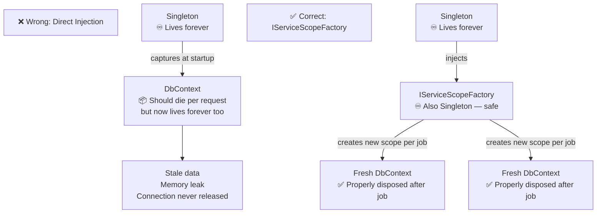

```csharp
// ❌ WRONG — captive dependency
public class ReportingService : BackgroundService
{
    private readonly AppDbContext _db; // captured forever!

    public ReportingService(AppDbContext db) { _db = db; }
}

// ✅ CORRECT — IServiceScopeFactory pattern
public class ReportingService : BackgroundService
{
    private readonly IServiceScopeFactory _scopeFactory;

    public ReportingService(IServiceScopeFactory scopeFactory)
    {
        _scopeFactory = scopeFactory; // Singleton → Singleton (safe)
    }

    protected override async Task ExecuteAsync(CancellationToken stoppingToken)
    {
        while (!stoppingToken.IsCancellationRequested)
        {
            using var scope = _scopeFactory.CreateScope(); // new scope per job
            var db = scope.ServiceProvider.GetRequiredService<AppDbContext>(); // fresh DbContext
            // do work with db...
        } // ← scope disposed here → DbContext disposed ✅
    }
}
```

### Interview Answer
> *"ASP.NET Core has three DI lifetimes. Transient creates a new instance every time any class requests the service — good for stateless utilities. Scoped creates one instance per HTTP request, shared among all classes in that request — this is the correct lifetime for DbContext because EF Core's change tracker is designed for one logical operation. Singleton creates one instance for the entire app lifetime — good for caches and channels, but dangerous if the class has mutable state. The classic trap is a 'captive dependency' — injecting a Scoped service like DbContext directly into a Singleton. The DbContext never gets disposed, its change tracker grows infinitely, and you get stale data. The fix is injecting IServiceScopeFactory into the Singleton and creating a fresh scope per operation."*

---

---

## 8. ToListAsync, FindAsync, HttpClient.GetAsync — Why They Exist

### The Analogy: A Waiter Who Stands Still

Imagine a restaurant with **10 waiters**. Each time a waiter takes an order to the kitchen, they **stand at the kitchen window staring at it, waiting for the food, doing absolutely nothing**.

100 tables of customers arrive. The first 10 tables get their orders taken. Waiters all go stand at the kitchen window. 90 tables of customers are sitting with no waiter to take their order. The restaurant is "full of staff" but completely dysfunctional.

**This is what synchronous database calls do to your thread pool.**

---

### What Actually Happens Without Async

```
Step 1: 1000 users send requests simultaneously
Step 2: .NET assigns Thread #1 to Request #1
Step 3: Thread #1 calls: db.Tasks.ToList()  ← synchronous
Step 4: .NET sends the SQL query to the database server
Step 5: Thread #1 SITS AND WAITS (doing absolutely nothing)
        for the database to respond (50 milliseconds)
Step 6: 999 other requests arrive. 999 more threads are pulled from the pool.
Step 7: All 999 threads are now sitting idle, waiting for database responses
Step 8: Thread pool EXHAUSTED — no threads left
Step 9: Request #1001 arrives → no thread available → waits in queue
Step 10: New threads spin up slowly (expensive)
Step 11: Latency spikes, timeouts, 503 Service Unavailable
```

---

### What Happens With Async

```
Step 1: 1000 users send requests simultaneously
Step 2: .NET assigns Thread #1 to Request #1
Step 3: Thread #1 calls: await db.Tasks.ToListAsync()
Step 4: .NET sends the SQL query to the database server
Step 5: Thread #1 IS RETURNED TO THE POOL ← this is the key difference
        It's FREE to handle other requests while waiting
Step 6: Request #2 arrives → Thread #1 (now free!) handles it
Step 7: Database responds to Query #1 → .NET signals: "result is ready"
Step 8: Any available thread picks up the result and continues
Step 9: All 1000 requests handled with far fewer threads
```

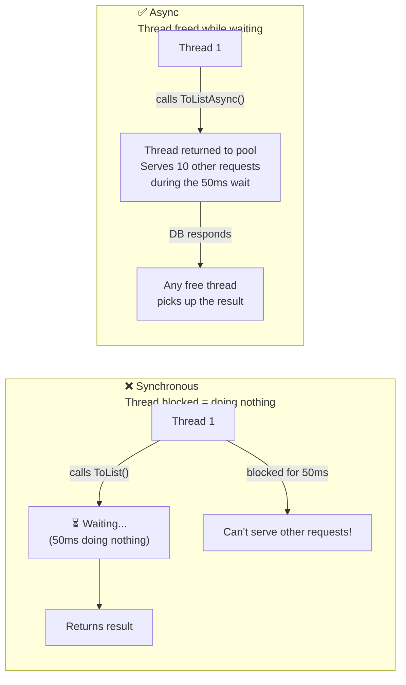

---

### Each Method Explained

```csharp
// ToListAsync() — Execute query, get all results as a List
var tasks = await db.Tasks
    .Where(t => t.UserId == userId)
    .ToListAsync();
// SQL executes HERE. Thread is freed while waiting. Returns List<Task>.
// Use when: you need a collection to loop through or return

// FindAsync(id) — Get one entity by PRIMARY KEY (fastest)
var task = await db.Tasks.FindAsync(taskId);
// Special: checks EF Core's CHANGE TRACKER first (no DB call if already loaded)
// Use when: you have a PK value and need exactly one record

// FirstOrDefaultAsync — Get first match or null
var task = await db.Tasks.FirstOrDefaultAsync(t => t.Title == "Budget Report");
// Returns: first matching record, or NULL if none found
// Use when: searching by non-PK columns, might not exist

// SingleOrDefaultAsync — Exactly one match expected
var user = await db.Users.SingleOrDefaultAsync(u => u.Email == email);
// Returns: the one matching record, or NULL
// THROWS: if MORE than one record matches (strict — use when uniqueness is guaranteed)
// Use when: unique constraints (email, username) where you expect at most one result

// HttpClient.GetAsync — Make HTTP call to another service
var response = await _httpClient.GetAsync("https://api.weatherservice.com/today");
var json = await response.Content.ReadAsStringAsync();
// Thread is freed during the network call (can take hundreds of milliseconds)
// Use when: calling external APIs, microservices, payment gateways
```

---

### The Golden Rule

```
Any operation that involves WAITING must be:
├── Called with the Async version (ToListAsync, not ToList)
├── Awaited (await keyword in front)
└── The calling method must be marked async

void → async Task
IActionResult → async Task<IActionResult>

If you break this chain ANYWHERE → you lose the benefit → thread is blocked
```

### Interview Answer
> *"The Async suffix versions — ToListAsync, FindAsync, HttpClient.GetAsync — exist because database and network calls involve waiting. The synchronous versions block the calling thread for the entire wait period. Under load, this exhausts the thread pool. With async/await, the thread is returned to the pool as soon as the I/O is initiated. When the database responds, any available thread picks up the result. This allows one thread to effectively handle many concurrent requests. The pattern is 'async all the way down' — from controller to service to repository — breaking the chain anywhere re-introduces blocking."*

---

---

## 9. Heavy Data & Async Reporting — The Post Office Analogy

### The Wrong Approach — What Actually Happens

```
Step 1: User clicks "Generate 500-page PDF report"
Step 2: Browser sends: POST /api/reports/generate
Step 3: API server's thread starts generating the PDF
Step 4: Generating takes 4 minutes...
Step 5: After 30 seconds → Load balancer says "no response received"
        → Sends 504 Gateway Timeout to the user
Step 6: User sees an error. The report is LOST.
Step 7: The server thread was held hostage for 30 seconds, doing work
        that was thrown away the moment the timeout hit
Step 8: User tries again → same thing happens
```

**The root problem**: You're trying to do 4 minutes of work inside a 30-second HTTP request timeout window.

---

### The Correct Approach — The Post Office Ticket System

When you go to a post office to send a large package:
1. You walk up to the counter (POST request)
2. They give you a **ticket number** and say "come back later" (202 Accepted + jobId)
3. You go sit down (client is free)
4. The back office prepares your package (background worker)
5. Your number is called / you check the board / you poll the status endpoint
6. You collect your package (GET /api/jobs/{id} returns downloadUrl)

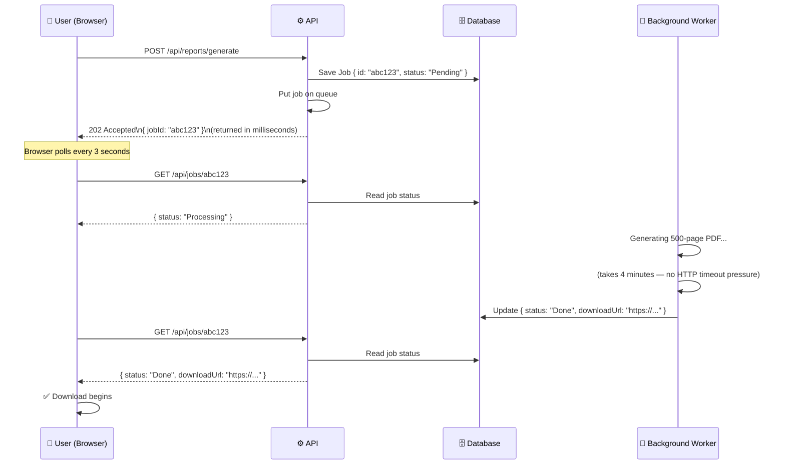

---

### The Three Escalation Options

```
Option 1: Polling (simplest)
Client: every 3 seconds, asks "is it done yet?"
Good:   works everywhere, no extra infrastructure
Bad:    slight delay between completion and user knowing

Option 2: SignalR (push notification)
Server: pushes a notification the INSTANT the job completes
Client: receives it in real-time, no polling needed
Good:   instant feedback
Bad:    requires WebSocket infrastructure

Option 3: Webhook (server-to-server)
When done, API calls back to the CLIENT'S endpoint
Good:   no persistent connection needed
Bad:    only works when the client is also a server
```

### Interview Answer
> *"For long-running operations like report generation, the synchronous approach fails because HTTP request timeouts — typically 30 seconds from load balancers — are shorter than the work itself. The pattern is Async Request-Reply: the API immediately returns 202 Accepted with a job ID, a background worker processes the task asynchronously, and the client polls a status endpoint. This decouples accepting work from doing work. The polling can be upgraded to SignalR push notifications for real-time feedback. For durability and scale-out, the in-memory Channel<T> can be replaced with Azure Service Bus, allowing multiple worker instances to compete on the same queue."*

---

---

## 10. OAuth 2.0 & JWT — The Hotel Analogy

### The Problem OAuth Solves

Before OAuth, if you wanted App X to access your Google Drive:
- You'd give App X your Google password
- App X could read your emails, delete your files, access everything
- To revoke access, you'd have to change your Google password (which also locks out ALL other apps)

**OAuth 2.0 solves this**: App X never sees your password. You control exactly what access it gets. You can revoke it without changing your password.

---

### OAuth 2.0 — Step by Step (Hotel Analogy)

```
Step 1: You (User) visit the app (Hotel lobby)
        You want to access your data (check into your room)

Step 2: App says "I'll take you to check-in" (Redirects to Google/Azure AD login page)
        YOUR PASSWORD IS NEVER TYPED INTO THE APP

Step 3: You type your credentials at Reception (Google/Azure AD's login page)
        Reception verifies your identity

Step 4: Reception gives you a KEYCARD (Access Token — a JWT)
        The keycard says: "Allowed in Room 201, expires at midnight"
        (Token contains: your user ID, your roles, expiry time)

Step 5: You go to your room door with the keycard
        Door reader checks the keycard WITHOUT calling Reception
        (Your .NET API validates the JWT without calling Azure AD)

Step 6: Door opens (API returns your protected data)

Step 7: Midnight arrives → keycard stops working (access token expires)

Step 8: You go back to Reception with a "renewal slip" (Refresh Token)
        Reception gives you a new keycard WITHOUT re-proving your identity
        (You don't have to type your password again)
```

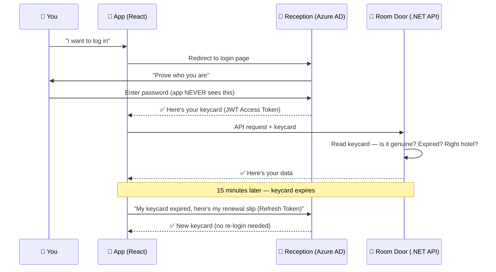

---

### JWT — What's Inside the Keycard

A JWT has **three parts** separated by dots: `HEADER.PAYLOAD.SIGNATURE`

```
eyJhbGciOiJSUzI1NiJ9  .  eyJzdWIiOiJ1c2VyLTEyMyIsInJvbGVzIjpbIk1hbmFnZXIiXX0  .  abc123signature
        HEADER                                   PAYLOAD                                SIGNATURE
```

| Part | Contains | Can Anyone Read It? |
|:---|:---|:---|
| Header | "This was signed with RS256 algorithm" | ✅ Yes — anyone |
| Payload | User ID, roles, expiry, issuer | ✅ Yes — anyone |
| Signature | Cryptographic proof it's genuine | ✅ Can READ, but ❌ cannot FAKE without private key |

---

### ⚠️ The Most Important Security Fact About JWTs

**JWTs are encoded, NOT encrypted.**

Paste any JWT into `jwt.io` → you can read the entire payload immediately, no key needed.

```
Think of it like a letter in a TRANSPARENT ENVELOPE with a wax seal:
- Anyone who holds the envelope can read the letter (payload is visible)
- The wax seal proves the letter hasn't been opened and tampered with
- You CANNOT forge the seal without the original stamp (private key)
```

```
✅ Safe to put in JWT:   userId, roles, permissions, tenantId, email address
❌ Never put in JWT:     passwords, credit card numbers, SSN, sensitive business data
```

---

### JWT Validation — What Your .NET API Checks, Step by Step

```
Step 1: Request arrives: "Authorization: Bearer eyJ..."
Step 2: .NET middleware splits the token into HEADER, PAYLOAD, SIGNATURE

Step 3: Verify SIGNATURE using the IdP's PUBLIC KEY
        (Public key downloaded once at startup from IdP's JWKS endpoint)
        If signature doesn't match → someone tampered with the token → 401

Step 4: Check ISSUER (iss claim)
        "Is this token from https://login.microsoftonline.com/our-tenant?"
        If wrong → this token was issued by a different system → 401

Step 5: Check AUDIENCE (aud claim)
        "Was this token meant for OUR API, not someone else's?"
        If wrong → token was issued for a different API → 401

Step 6: Check EXPIRY (exp claim)
        "Has the token expired?"
        exp > current time? If not → 401

Step 7: All checks pass → extract user claims (userId, roles)
        Request proceeds. No database lookup needed.
```

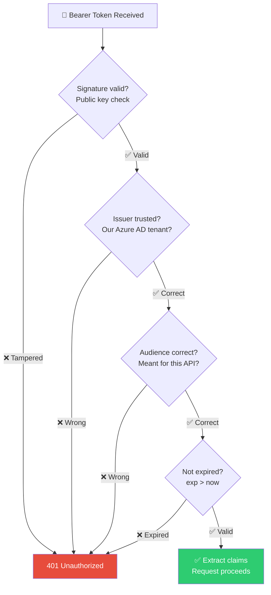

---

### Refresh Token Rotation — How Theft Is Detected

```
Normal flow:
User presents Refresh Token RT-1
Server invalidates RT-1, issues new RT-2
User now has RT-2

Attacker steals RT-1:
Attacker presents RT-1 to server
Server checks: RT-1 was already used (rotated to RT-2)
SERVER: "This is a stolen token! A legitimate refresh wouldn't present a used token!"
Server immediately revokes ALL tokens for this user
Both the user and attacker must log in again
```

### Interview Answer
> *"OAuth 2.0 is an authorisation framework that lets users grant limited access to their resources without sharing their password. The app redirects to the Identity Provider — Azure AD or Auth0 — the user authenticates there, and the app receives a JWT access token. The JWT contains claims like user ID and roles in plain-text base64 — it's encoded, not encrypted. The signature is a cryptographic hash using the IdP's private key. The .NET API validates the JWT offline using the IdP's public key, checking the signature, issuer, audience, and expiry — no database call needed. Access tokens are short-lived (15 minutes). Refresh tokens are long-lived, opaque strings stored in the database. Refresh token rotation means each use invalidates the old token and issues a new one — if a used token is presented again, it signals theft and all tokens are revoked."*

---

---

## 11. OOP — 4 Pillars with Real-World Examples

### What OOP Is

Object-Oriented Programming models the real world in code. You create **classes** (blueprints) and **objects** (actual things built from blueprints).

```
Class = a blueprint for a house
Object = an actual house built from that blueprint

new House() → builds a house using the House blueprint
new House() again → builds a SECOND, completely separate house
```

---

### Pillar 1: Encapsulation — "The ATM Machine"

**The Rule**: Hide internal details. Only expose what's needed.

**The Analogy**: An ATM machine. You interact via buttons and screen (public interface). The cash mechanism, computer, and network cables are hidden inside (private). The bank can upgrade the internals without changing how you use it.

**What goes wrong without it**:

```csharp
// ❌ Balance is public — anyone can set it to anything
public class BankAccount
{
    public decimal Balance = 1000;
}

var account = new BankAccount();
account.Balance = 999999; // Hack! No rules enforced.
account.Balance = -50;    // Negative balance? No check. Just allowed.
```

```csharp
// ✅ With encapsulation — balance is protected, rules are enforced
public class BankAccount
{
    private decimal _balance; // private — hidden from outside

    public decimal Balance => _balance; // readable, but not settable directly

    public void Deposit(decimal amount)
    {
        if (amount <= 0) throw new ArgumentException("Amount must be positive");
        _balance += amount; // only THIS class can modify _balance
    }

    public void Withdraw(decimal amount)
    {
        if (amount <= 0) throw new ArgumentException("Amount must be positive");
        if (amount > _balance) throw new InvalidOperationException("Insufficient funds");
        _balance -= amount;
    }
}

var account = new BankAccount();
account.Deposit(500);
// account._balance = 999999; ← COMPILE ERROR — private is protected
// account.Balance = 999999;  ← COMPILE ERROR — read-only property
```

**SOLID connection**: Encapsulation enables SRP — the class controls its own data and exposes only the operations that make sense.

---

### Pillar 2: Inheritance — "Vehicle Types"

**The Rule**: A child class inherits all behaviour from the parent, then adds its own.

**The Analogy**: A general "Vehicle" concept exists — has wheels, has an engine, can move. A Car IS-A Vehicle plus: 4 doors, a boot. A Truck IS-A Vehicle plus: cargo bed, high load capacity.

```csharp
// BASE CLASS — shared by everyone
public class Vehicle
{
    public string Make { get; set; }
    public int Year { get; set; }

    public void Start() => Console.WriteLine($"{Make} engine starts");
    public void Stop()  => Console.WriteLine($"{Make} engine stops");
}

// CHILD CLASS — inherits everything, adds its own
public class Car : Vehicle
{
    public int NumberOfDoors { get; set; }

    public void OpenBoot() => Console.WriteLine("Boot opened");
}

public class Truck : Vehicle
{
    public decimal CargoCapacityTons { get; set; }

    public void LoadCargo() => Console.WriteLine("Cargo loaded");
}

// Usage:
var car = new Car { Make = "Toyota", Year = 2022, NumberOfDoors = 4 };
car.Start();    // ← inherited from Vehicle
car.OpenBoot(); // ← Car's own method

var truck = new Truck { Make = "Volvo", CargoCapacityTons = 20 };
truck.Start();     // ← inherited from Vehicle
truck.LoadCargo(); // ← Truck's own method
```

**When to use**: "IS-A" relationship. Car IS-A Vehicle. Manager IS-AN Employee.

**When NOT to use**: "HAS-A" relationship. A Car HAS-AN Engine (use a field, not inheritance).

**SOLID connection**: Liskov Substitution — any Car or Truck should be usable wherever a Vehicle is expected, without breaking anything.

---

### Pillar 3: Polymorphism — "The Play Button"

**The Rule**: The same method call behaves differently depending on which class is behind it.

**The Analogy**: A TV remote's "Play" button. On a Blu-ray player → plays the disc. On a streaming box → plays the stream. On a music system → plays the CD. Same button name, completely different behaviour depending on the device.

```csharp
// BASE — defines the contract ("every media item must be playable")
public abstract class MediaItem
{
    public string Title { get; set; }
    public abstract void Play(); // abstract = no body here, MUST be implemented by subclasses
}

public class Song : MediaItem
{
    public override void Play() => Console.WriteLine($"🎵 Now playing song: {Title}");
}

public class Podcast : MediaItem
{
    public override void Play() => Console.WriteLine($"🎙️ Now playing podcast: {Title}");
}

public class Video : MediaItem
{
    public override void Play() => Console.WriteLine($"🎬 Now playing video: {Title}");
}

// THE POWER — one loop handles all types
var playlist = new List<MediaItem>
{
    new Song    { Title = "Bohemian Rhapsody" },
    new Podcast { Title = "Tech Talk Ep. 42" },
    new Video   { Title = "C# Tutorial" }
};

foreach (var item in playlist)
{
    item.Play(); // Each object knows HOW to play itself — you don't need to check the type
}

// Output:
// 🎵 Now playing song: Bohemian Rhapsody
// 🎙️ Now playing podcast: Tech Talk Ep. 42
// 🎬 Now playing video: C# Tutorial
```

**Why this is powerful**: You never write `if (item is Song) { ... } else if (item is Podcast) { ... }`. You just call `.Play()` and the right behaviour happens automatically.

**SOLID connection**: Open/Closed — you add a new media type (Audiobook) by creating a new class, not by adding another if/else to existing code.

---

### Pillar 4: Abstraction — "The Car's Steering Wheel"

**The Rule**: Show only what the user needs to interact with. Hide the complex implementation.

**The Analogy**: Driving a car. You know: turn wheel left → car goes left. You do NOT know: rack-and-pinion mechanism, hydraulic pressure, wheel alignment geometry, tyre physics. You don't NEED to know. The steering wheel is the abstraction — a simple interface over enormous complexity.

```csharp
// INTERFACE — the steering wheel (what callers interact with)
public interface IPaymentProcessor
{
    Task<bool> ProcessPaymentAsync(decimal amount, string cardToken);
}

// IMPLEMENTATION — the engine beneath (hidden complexity)
public class StripePaymentProcessor : IPaymentProcessor
{
    public async Task<bool> ProcessPaymentAsync(decimal amount, string cardToken)
    {
        // Connects to Stripe's API over HTTPS
        // Handles retry logic for transient failures
        // Tokenises the card data
        // Checks for fraud signals
        // Handles currency conversion
        // Manages idempotency keys
        // 300 lines of complex code that the caller never needs to see
        return true;
    }
}

// CALLER — only sees the simple interface
public class CheckoutService
{
    private readonly IPaymentProcessor _payment;

    public CheckoutService(IPaymentProcessor payment) { _payment = payment; }

    public async Task CompleteOrder(Order order)
    {
        bool paid = await _payment.ProcessPaymentAsync(order.Total, order.CardToken);
        if (paid) order.Status = "Confirmed"; // simple, clean, focused
    }
}
```

**Abstract class vs Interface:**

| | `abstract class` | `interface` |
|:---|:---|:---|
| Can have fields? | ✅ Yes | ❌ No |
| Can have method bodies? | ✅ Yes | ✅ Yes (default, C# 8+) |
| Multiple inheritance? | ❌ One only | ✅ Many interfaces allowed |
| Use when | Sharing code + state between subclasses | Defining a contract with no shared state |

### Interview Answer
> *"OOP has four pillars. Encapsulation hides internal state — a BankAccount's balance is private, only modified through validated Deposit and Withdraw methods. Inheritance lets child classes reuse parent behaviour — Car and Truck both inherit Vehicle.Start() and add their own specialised methods. Polymorphism allows one method call to behave differently based on the actual object type — calling Play() on a list of MediaItem objects dispatches to the correct Song, Podcast, or Video implementation. Abstraction hides complexity behind a simple interface — CheckoutService calls IPaymentProcessor.ProcessPayment without knowing anything about Stripe's retry logic or tokenisation. These four work together with SOLID principles to create systems that are testable, maintainable, and extensible."*

---

---

## 12. Array Sorting in JavaScript

### Why Interviewers Ask About This

They want to know:
1. Do you understand **trade-offs** (speed vs memory vs simplicity)?
2. Do you know **Big O notation**?
3. Do you know the JS `.sort()` gotcha?

---

### Big O — The Speed Yardstick

**Think of it as: "How does the work grow as the array gets bigger?"**

| Notation | Plain English | Example |
|:---|:---|:---|
| `O(1)` | Instant — doesn't matter how big | `arr[5]` — index lookup |
| `O(n)` | Look at each element once | Finding a value by scanning |
| `O(n log n)` | Efficient — splits the problem in half each level | Merge Sort, Quick Sort |
| `O(n²)` | Loop inside a loop — gets slow fast | Bubble Sort, Selection Sort |

With 1,000 elements:
- `O(n log n)` → ~10,000 operations
- `O(n²)` → 1,000,000 operations

**For 1,000,000 elements:** `O(n log n)` = 20 million. `O(n²)` = 1 trillion. That's why algorithm choice matters.

---

### 1. Bubble Sort — "The Heaviest Bubble Rises"

**Concept**: Walk through the array. If two neighbours are in the wrong order, swap them. Repeat. The largest value "bubbles" to the end each pass.

```
Array: [5, 3, 8, 1]

Pass 1:
[5, 3, 8, 1] → compare 5,3 → swap → [3, 5, 8, 1]
[3, 5, 8, 1] → compare 5,8 → ok   → [3, 5, 8, 1]
[3, 5, 8, 1] → compare 8,1 → swap → [3, 5, 1, 8] ← 8 bubbled to end

Pass 2:
[3, 5, 1, 8] → compare 3,5 → ok   → [3, 5, 1, 8]
[3, 5, 1, 8] → compare 5,1 → swap → [3, 1, 5, 8]

Pass 3:
[3, 1, 5, 8] → compare 3,1 → swap → [1, 3, 5, 8] ✅ Done!
```

```javascript
function bubbleSort(arr) {
  const n = arr.length;

  for (let i = 0; i < n - 1; i++) {         // passes
    for (let j = 0; j < n - 1 - i; j++) {   // comparisons (shrinks each pass)
      if (arr[j] > arr[j + 1]) {
        // Swap neighbours
        [arr[j], arr[j + 1]] = [arr[j + 1], arr[j]]; // ES6 destructuring swap
      }
    }
  }
  return arr;
}

bubbleSort([5, 3, 8, 1]); // [1, 3, 5, 8]
```

| | |
|:---|:---|
| Time | O(n²) |
| Space | O(1) — sorts in place |
| When to use | Never in production. Interviews and learning only. |

---

### 2. Selection Sort — "Find the Smallest, Put it First"

**Concept**: Find the minimum element in the unsorted part. Swap it to the front. Repeat.

```
Array: [5, 3, 8, 1]

Round 1: Scan all → minimum is 1 (index 3) → swap with position 0
         [1, 3, 8, 5]

Round 2: Scan from index 1 → minimum is 3 (index 1) → already in place
         [1, 3, 8, 5]

Round 3: Scan from index 2 → minimum is 5 (index 3) → swap with position 2
         [1, 3, 5, 8] ✅
```

```javascript
function selectionSort(arr) {
  const n = arr.length;

  for (let i = 0; i < n - 1; i++) {
    let minIndex = i;

    // Find the smallest element in the remaining unsorted portion
    for (let j = i + 1; j < n; j++) {
      if (arr[j] < arr[minIndex]) {
        minIndex = j;
      }
    }

    // Swap smallest found with current position
    if (minIndex !== i) {
      [arr[i], arr[minIndex]] = [arr[minIndex], arr[i]];
    }
  }
  return arr;
}

selectionSort([5, 3, 8, 1]); // [1, 3, 5, 8]
```

| | |
|:---|:---|
| Time | O(n²) always |
| Space | O(1) |
| Advantage over Bubble | Fewer swaps (at most n swaps) — good when writes are expensive |

---

### 3. Merge Sort — "Divide, Conquer, Merge"

**Concept**: Split the array in half repeatedly until you have single elements (a single element is always sorted). Then merge the sorted halves back together in the correct order.

```
[5, 3, 8, 1]
↓ Split
[5, 3]         [8, 1]
↓ Split        ↓ Split
[5]  [3]       [8]  [1]
↓ Merge        ↓ Merge
[3, 5]         [1, 8]
↓ Merge both
[1, 3, 5, 8] ✅
```

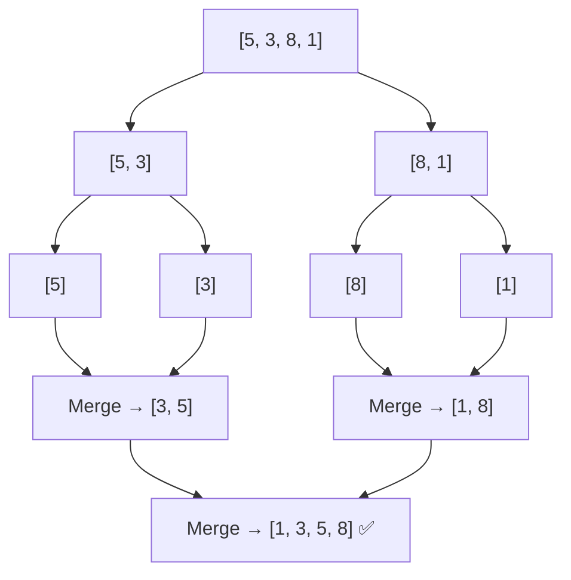

```javascript
function mergeSort(arr) {
  if (arr.length <= 1) return arr; // base case: single element = sorted

  const mid = Math.floor(arr.length / 2);
  const left  = mergeSort(arr.slice(0, mid)); // sort left half
  const right = mergeSort(arr.slice(mid));    // sort right half

  return merge(left, right);
}

function merge(left, right) {
  const result = [];
  let i = 0, j = 0;

  // Compare front elements of each half, take the smaller
  while (i < left.length && j < right.length) {
    if (left[i] <= right[j]) {
      result.push(left[i++]);
    } else {
      result.push(right[j++]);
    }
  }

  // One side ran out — append whatever's left in the other
  return [...result, ...left.slice(i), ...right.slice(j)];
}

mergeSort([5, 3, 8, 1]); // [1, 3, 5, 8]
```

| | |
|:---|:---|
| Time | O(n log n) — always, even worst case |
| Space | O(n) — needs extra array for merging |
| Best for | Large datasets, when stability matters, linked lists |

---

### 4. Quick Sort — "Pick a Pivot, Partition Around It"

**Concept**: Pick a pivot element. Move everything smaller to the left, larger to the right. The pivot is now in its final correct position. Recursively repeat on left and right halves.

```
Array: [5, 3, 8, 1], pivot = 5 (last element)

Partition:
3 < 5 → goes LEFT
8 > 5 → goes RIGHT
1 < 5 → goes LEFT

Result: [3, 1]  [5]  [8]
              ↑ pivot is now in its FINAL position

Recurse on [3, 1]:
pivot = 1
1 is already smallest → [1, 3]

Final: [1, 3, 5, 8] ✅
```

```javascript
function quickSort(arr) {
  if (arr.length <= 1) return arr; // base case

  const pivot = arr[arr.length - 1]; // pick last element as pivot
  const left  = [];
  const right = [];

  for (let i = 0; i < arr.length - 1; i++) {
    if (arr[i] < pivot) {
      left.push(arr[i]);  // smaller than pivot → left side
    } else {
      right.push(arr[i]); // larger than pivot → right side
    }
  }

  // Pivot slot in the middle, recurse on both sides
  return [...quickSort(left), pivot, ...quickSort(right)];
}

quickSort([5, 3, 8, 1]); // [1, 3, 5, 8]
```

| | |
|:---|:---|
| Time | O(n log n) average, O(n²) worst case (bad pivot) |
| Space | O(log n) — recursive call stack |
| Best for | General purpose in-memory sorting — fastest in practice |

---

### 5. JavaScript's Built-in `.sort()` — The Gotcha Every Interviewer Tests

```javascript
// ⚠️ THE CLASSIC TRAP — this catches everyone
const numbers = [1, 10, 2, 21, 3];
console.log(numbers.sort());
// Output: [1, 10, 2, 21, 3] — WRONG!
// Expected: [1, 2, 3, 10, 21]

// WHY? .sort() converts elements to STRINGS by default
// In string comparison: "10" < "2" because "1" < "2" at the first character
// Alphabetically: "10", "2", "21", "3" → 1, 10, 2, 21, 3

// ✅ THE FIX — always provide a comparator for numbers
const numbers = [1, 10, 2, 21, 3];
numbers.sort((a, b) => a - b); // ascending:  [1, 2, 3, 10, 21]
numbers.sort((a, b) => b - a); // descending: [21, 10, 3, 2, 1]
```

**How the comparator works:**
```
(a, b) => a - b

If result is NEGATIVE → a comes first
If result is ZERO     → order unchanged
If result is POSITIVE → b comes first

Example: comparing 10 and 2
a=10, b=2 → 10-2 = 8 (positive) → b (which is 2) comes first → [2, 10]
```

**Sorting objects:**
```javascript
const tasks = [
  { title: 'Budget',   priority: 3 },
  { title: 'Planning', priority: 1 },
  { title: 'Review',   priority: 2 },
];

// Sort by priority (number)
tasks.sort((a, b) => a.priority - b.priority);
// [Planning(1), Review(2), Budget(3)]

// Sort by title (string — alphabetical)
tasks.sort((a, b) => a.title.localeCompare(b.title));
// [Budget, Planning, Review]

// Sort by multiple fields — priority first, title as tiebreaker
tasks.sort((a, b) => {
  if (a.priority !== b.priority) return a.priority - b.priority;
  return a.title.localeCompare(b.title);
});
```

---

### Comparison Table — All Algorithms

| Algorithm | Time (average) | Time (worst) | Space | Stable? | Use in Production? |
|:---|:---:|:---:|:---:|:---:|:---:|
| Bubble Sort | O(n²) | O(n²) | O(1) | ✅ | ❌ Never |
| Selection Sort | O(n²) | O(n²) | O(1) | ❌ | ❌ Rarely |
| Merge Sort | O(n log n) | O(n log n) | O(n) | ✅ | ✅ Yes |
| Quick Sort | O(n log n) | O(n²) | O(log n) | ❌ | ✅ Yes |
| JS `.sort()` | O(n log n) | O(n log n) | O(n) | ✅ | ✅ Yes (use it!) |

> **Stable**: Equal elements maintain their original order. Matters when sorting objects by one property when they may be equal on another.

### Interview Answer
> *"JavaScript's built-in sort uses TimSort — a hybrid of Merge Sort and Insertion Sort — giving O(n log n) guaranteed. The critical gotcha is that without a comparator, it converts elements to strings. This means [1, 10, 2] sorts as [1, 10, 2] not [1, 2, 10] because '10' comes before '2' alphabetically. Always provide (a, b) => a - b for numbers. Bubble and Selection Sort are O(n²) and never used in production. Merge Sort is O(n log n) and stable — guarantees equal elements maintain order. Quick Sort is O(n log n) average but O(n²) worst case with a bad pivot. For interviews, the main talking points are Big O trade-offs and the string comparison gotcha."*
