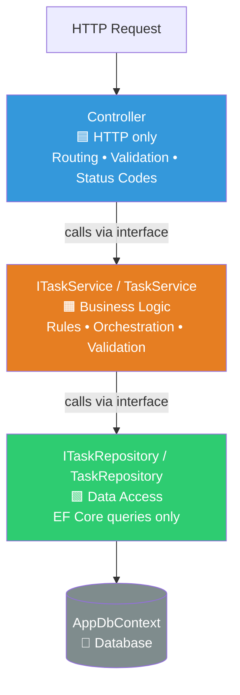
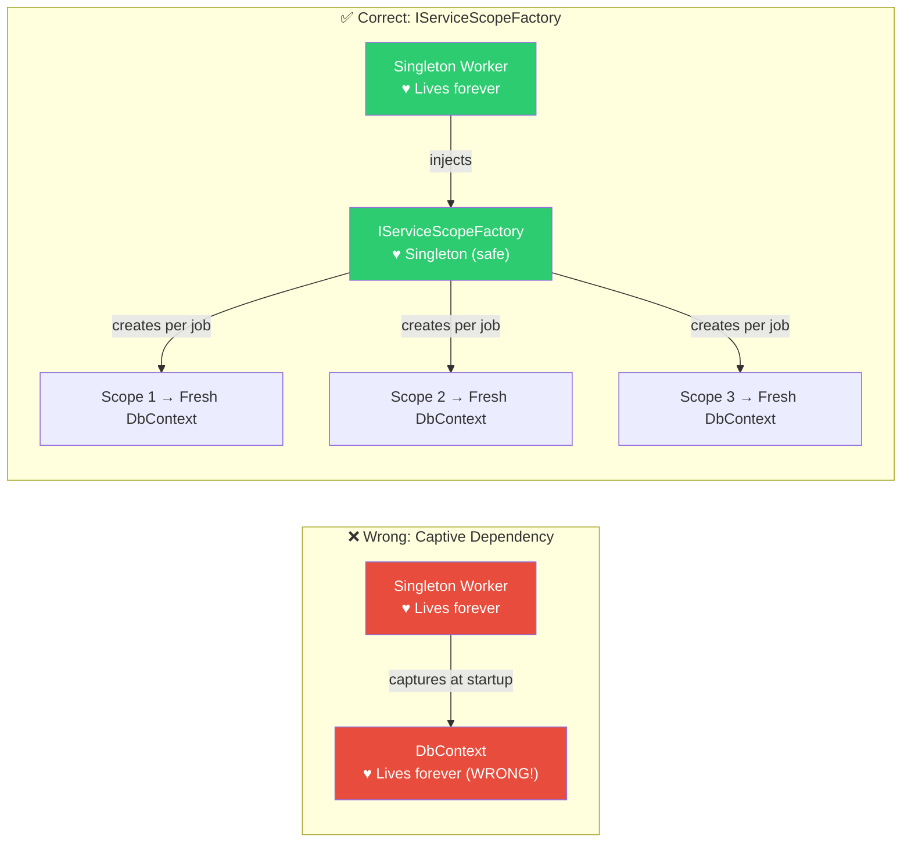
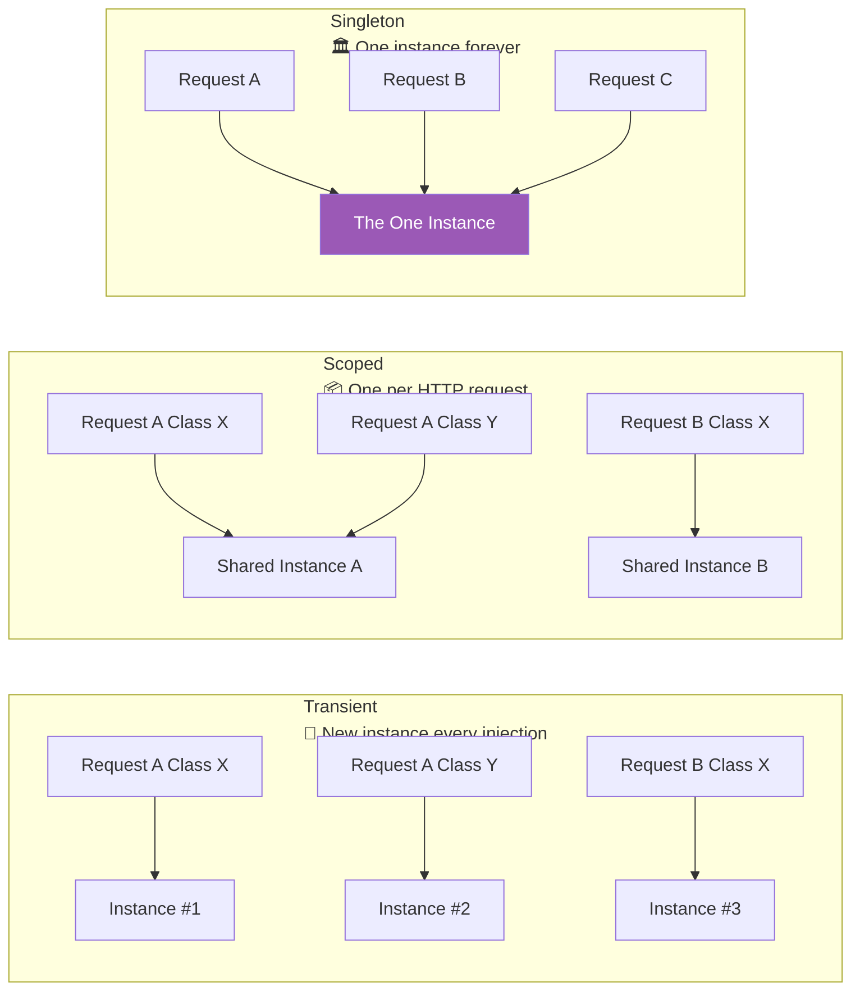

# File 2: REST APIs & Software Design Principles

> **Architectural framing**: REST is not a protocol — it is a set of constraints on how a distributed system communicates. Mastering REST means understanding *why* each constraint exists, not just memorising the rules.

---

## 1. RESTful API Design — Engineering Standards

### Resource Naming: Nouns, Not Verbs

Resources are **things** (nouns). The HTTP method is the **verb**. Never put the action in the URL.

| ❌ Anti-Pattern (RPC-style) | ✅ RESTful Standard |
|:---|:---|
| `POST /api/getUsers` | `GET /api/users` |
| `POST /api/createTask` | `POST /api/tasks` |
| `GET /api/deleteUser?id=5` | `DELETE /api/users/5` |
| `POST /api/updateUserStatus` | `PATCH /api/users/5/status` |

**Hierarchy expresses relationships:**
```
/api/users                    → All users
/api/users/123                → A specific user
/api/users/123/orders         → All orders belonging to user 123
/api/users/123/orders/456     → A specific order belonging to user 123
```

**Use plural nouns consistently**: `/api/tasks`, `/api/users`, `/api/products`. Don't mix `/api/task` and `/api/users`.

**Versioning**: Always version your APIs to avoid breaking consumers.
- **URL versioning**: `/api/v1/users` — most common, immediately obvious.
- **Header versioning**: `Accept: application/vnd.myapp.v2+json` — cleaner URLs, harder to test in browser.

---

### HTTP Methods — Semantics Matter

| Method | Idempotent? | Safe? | Use Case | Success Code |
|:---|:---:|:---:|:---|:---|
| `GET` | ✅ Yes | ✅ Yes | Retrieve a resource. No side effects. | `200 OK` |
| `POST` | ❌ No | ❌ No | Create a new resource. Calling twice creates two. | `201 Created` |
| `PUT` | ✅ Yes | ❌ No | **Full replacement** of a resource. Omitted fields become null. | `200 OK` |
| `PATCH` | ❌ No* | ❌ No | **Partial update**. Only send fields you want to change. | `200 OK` |
| `DELETE` | ✅ Yes | ❌ No | Remove a resource. Calling twice has same result as once. | `204 No Content` |

> **Idempotent**: Multiple identical requests produce the same outcome as a single request. Critical for designing retry-safe APIs.

**`PUT` vs `PATCH` — the practical difference**: If you have a `User` with `name`, `email`, and `role`:
- `PUT /api/users/5` with `{ "name": "Gimhana" }` → `email` and `role` become **null**.
- `PATCH /api/users/5` with `{ "name": "Gimhana" }` → Only `name` changes. `email` and `role` untouched.

For your task tracker's status update, `PATCH /api/tasks/{id}/status` is architecturally correct — you're doing a partial update of one field.

---

### HTTP Status Codes — Communicating Intent Precisely

**2xx — Success**
| Code | Meaning | When to Use |
|:---|:---|:---|
| `200 OK` | Request succeeded | Standard success for GET, PUT, PATCH |
| `201 Created` | Resource was created | Always after a POST that creates. Include `Location: /api/tasks/42` header |
| `202 Accepted` | Work accepted but not yet done | Fire-and-forget, async job queuing |
| `204 No Content` | Success, nothing to return | After DELETE, or PATCH with no response body |

**4xx — Client Error** (The client did something wrong)
| Code | Meaning | When to Use |
|:---|:---|:---|
| `400 Bad Request` | Invalid input | Validation failures, malformed JSON, missing required fields |
| `401 Unauthorized` | Not authenticated | No token, expired token, invalid token signature |
| `403 Forbidden` | Authenticated but unauthorised | Token is valid, but user lacks permission for this resource |
| `404 Not Found` | Resource doesn't exist | Invalid ID. Also used to hide existence of private resources |
| `409 Conflict` | State conflict | Optimistic concurrency failure, duplicate unique key |
| `422 Unprocessable` | Semantically invalid | JSON is valid, but business rules are violated |

**5xx — Server Error** (Your fault, never expose internals)
| Code | Meaning | When to Use |
|:---|:---|:---|
| `500 Internal Server Error` | Unhandled exception | Use global exception middleware to catch and return this |
| `502 Bad Gateway` | Upstream service failed | Your API calls another API and it failed |
| `503 Service Unavailable` | Service temporarily down | Maintenance, overload |

> ⚠️ **Interview rule**: Never return `500` with a stack trace in production. Use global exception handling middleware to log the full error server-side and return only a generic message to the client.

---

### Pagination, Filtering, and Sorting

**Always paginate large collections.** Returning all 100,000 records in one response is a denial-of-service vector.

**Standard query string patterns:**
```
GET /api/tasks?status=in-progress        → Filter
GET /api/tasks?sort=createdAt&order=desc → Sort
GET /api/tasks?page=2&pageSize=20        → Offset pagination
GET /api/tasks?cursor=eyJpZCI6MTAwfQ    → Cursor pagination (better for real-time data)
GET /api/tasks?q=budget+report           → Search
```

**Response envelope pattern** — return metadata alongside data:
```json
{
  "data": [...],
  "pagination": {
    "page": 2,
    "pageSize": 20,
    "totalItems": 453,
    "totalPages": 23
  }
}
```

**Cursor vs. Offset pagination**: Offset (`SKIP 40 TAKE 20`) is simple but breaks when new data is inserted — page 2 might show a record already seen on page 1. Cursor-based pagination uses the last record's ID as a marker, which is stable even when new data arrives. Preferred for feeds, dashboards, and real-time data.

---

## 2. SOLID Principles in ASP.NET Core

SOLID is an acronym for five design principles that make object-oriented software maintainable and testable.

### S — Single Responsibility Principle (SRP)

**"A class should have one, and only one, reason to change."**

The most frequently violated principle in ASP.NET Core applications.

**Anti-pattern — Fat Controller:**
```
TasksController
  ├── Handles HTTP routing ✅ (its job)
  ├── Validates input ⚠️
  ├── Queries the database directly ❌
  ├── Sends emails ❌
  └── Generates PDF reports ❌
```

**Correct layered architecture:**



Each layer has exactly one reason to change. If business rules change, you edit `TaskService`. If you switch from SQLite to PostgreSQL, you edit only `TaskRepository`. The controller never changes.

### O — Open/Closed Principle
**"Open for extension, closed for modification."**
Add new features by creating new classes (or implementing new interfaces), not by editing existing tested code. Strategy pattern is a common implementation.

### L — Liskov Substitution Principle
**"Subtypes must be substitutable for their base types."**
If you inject `ITaskService`, any implementation of that interface should work correctly without the consumer needing to know which implementation it got. This is why DI interfaces work.

### I — Interface Segregation Principle
**"Clients should not depend on interfaces they don't use."**
Don't create one giant `IUserService` with 20 methods. Create focused `IUserAuthService`, `IUserProfileService`, etc. Components inject only what they need.

### D — Dependency Inversion Principle
**"Depend on abstractions, not concretions."**
This is the philosophical foundation of Dependency Injection. `TasksController` should depend on `ITaskService`, not on `TaskService` directly. This makes unit testing possible — inject a mock `ITaskService` in tests.

---

## 3. Dependency Injection Lifetimes — The Enterprise Interview Topic

ASP.NET Core's built-in DI container (IoC container) manages object creation and lifetime. Choosing the wrong lifetime is one of the most common sources of production bugs in .NET applications.

### Transient — `services.AddTransient<IService, Service>()`

**Lifetime**: A brand new instance is created **every time** any class requests it from the container.

**Use for**: Lightweight, stateless services where shared state would be dangerous. Helper utilities, formatters, validators.

**Risk**: If multiple classes in the same request each need a Transient service, multiple instances are created, increasing memory pressure and GC overhead.

---

### Scoped — `services.AddScoped<IService, Service>()`

**Lifetime**: One instance per **HTTP request**. Every class that requests the service during a single request shares the **same instance**. The instance is disposed when the request ends.

**Use for**: Entity Framework `DbContext`, repositories, business services. This is the default and correct choice for the majority of your application services.

**Why DbContext must be Scoped**: EF Core's `DbContext` maintains a change tracker — an in-memory cache of all entities it has read. It is designed for the Unit of Work pattern: one context instance per logical operation (one HTTP request). Sharing it across requests causes data corruption. Making it Transient causes the change tracker to be created and destroyed per class, losing tracked changes.

**The Captive Dependency Trap — Critical Interview Concept:**
> A longer-lived service "captures" a shorter-lived dependency.

**Example of the bug**: You register a `ReportingBackgroundService` as **Singleton** and inject `AppDbContext` (Scoped) directly into its constructor.

**What goes wrong**: The Singleton is created once at startup. It captures the Scoped `DbContext` at construction time. That DbContext now lives for the entire application lifetime — it's never disposed, its change tracker grows infinitely, it holds open database connections, and it serves stale cached data to every background job forever.

**The Fix**: Inject `IServiceScopeFactory` into the Singleton instead. Inside each operation, create a new scope manually and resolve the Scoped service fresh:



This is exactly the pattern used in your `FlowForge` project's background workers.

---

### Singleton — `services.AddSingleton<IService, Service>()`

**Lifetime**: Created **once** when the application starts. The exact same instance is shared by every HTTP request, every background thread, for the entire application lifetime.

**Use for**: Configuration objects (read once at startup), in-memory caches (`IMemoryCache`), application-wide message channels (`Channel<T>` — as used in FlowForge), HTTP clients (`IHttpClientFactory`).

**The Thread Safety Trap — Critical Interview Concept:**
A Singleton is accessed simultaneously from multiple threads (one per concurrent HTTP request). If your Singleton has mutable state, you **will** get race conditions.

- ❌ `List<T>` — not thread-safe. Concurrent Add/Remove corrupts internal state.
- ✅ `ConcurrentQueue<T>`, `ConcurrentDictionary<TK,TV>` — designed for concurrent access.
- ✅ `Channel<T>` — purpose-built for thread-safe producer/consumer.
- ✅ `IMemoryCache` — thread-safe by design.

**Validation**: ASP.NET Core validates your DI registrations at startup by default (in Development mode). Injecting a Scoped service into a Singleton throws an `InvalidOperationException` immediately, failing fast rather than silently corrupting data.

---

### Quick Reference



| Lifetime | Created | Disposed | Risk if Misused |
|:---|:---|:---|:---|
| **Transient** | Every injection | After each use | Memory bloat from excessive allocations |
| **Scoped** | Per HTTP request | End of request | Captive dependency if held by Singleton |
| **Singleton** | App startup | App shutdown | Race conditions if state is mutable |
