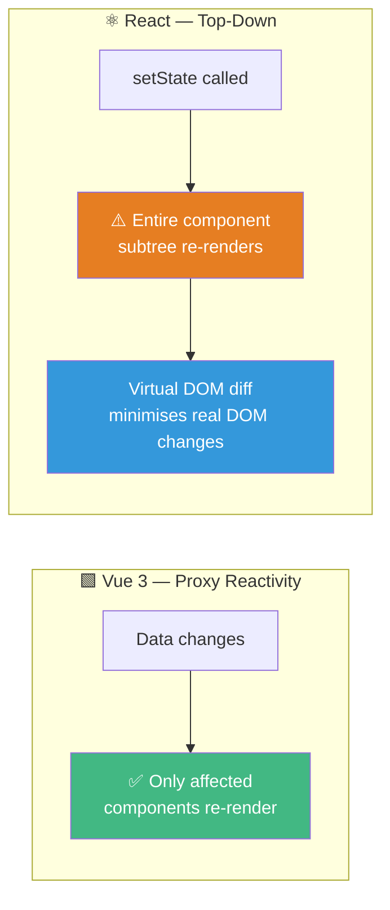
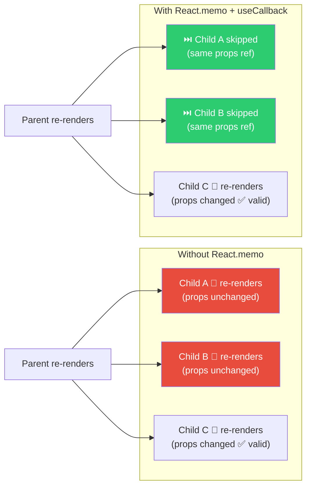
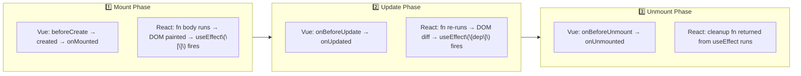

# File 1: React Bridge Guide — Vue 3 → React

> **Your edge:** You already think in Composition API. React Hooks are the same mental model — functions that encapsulate reactive state and side effects. The difference is *how* reactivity is triggered, not *what* it achieves.

---

## 1. The Reactivity Matrix

| Vue 3 Concept | Vue 3 API | React Equivalent | Critical Architectural Difference |
|:---|:---|:---|:---|
| Primitive reactive value | `const count = ref(0)` | `const [count, setCount] = useState(0)` | React requires explicit setter calls. Direct mutation (`count.value = 1`) has no equivalent — you must call `setCount(1)`. |
| Object reactive state | `const state = reactive({...})` | `const [state, setState] = useState({...})` | React state is immutable. You cannot do `state.name = 'x'`. You must spread: `setState({ ...state, name: 'x' })`. |
| Derived/computed value | `const full = computed(() => a.value + b.value)` | `const full = useMemo(() => a + b, [a, b])` | Vue auto-tracks dependencies via Proxy. React is **blind** — you must manually declare every variable the computation depends on in the array. |
| Side effect on mount | `onMounted(() => fetch(...))` | `useEffect(() => { fetch(...) }, [])` | The `[]` is the dependency array. **Empty = run once after first render** (equivalent to `onMounted`). |
| Watcher | `watch(source, callback)` | `useEffect(() => { ... }, [source])` | Effect re-runs whenever any value in `[source]` changes by reference. |
| Immediate watcher | `watchEffect(() => { ... })` | `useEffect(() => { ... })` *(no array)* | No array = re-runs on **every single render**. Almost always a mistake for data fetching. |
| Cleanup / unmount | `onUnmounted(() => cleanup())` | `return () => cleanup()` inside `useEffect` | The function returned from `useEffect` is the cleanup. It runs before the component unmounts **or** before the effect re-runs. |
| Template refs | `const el = ref(null)` + `ref="el"` | `const el = useRef(null)` + `ref={el}` | `useRef` does NOT trigger re-renders when `.current` changes. It's a mutable box that survives renders. |

---

### The Dependency Array — The Most Critical Concept

In Vue, reactivity is automatic because Proxy intercepts all property reads during execution and builds a dependency graph invisibly.

In React, **there is no Proxy**. React is a pure function renderer. A component is just a function that React calls repeatedly. `useEffect` is not magic — React simply calls your callback after painting the DOM. The dependency array is your **explicit contract** with React: "only re-run this effect when these values change."

**Three configurations and what they mean:**

```
useEffect(() => { ... }, [])       // Run once after initial render — onMounted equivalent
useEffect(() => { ... }, [userId]) // Re-run every time userId changes — watch(userId) equivalent  
useEffect(() => { ... })           // Re-run after EVERY render — almost never what you want
```

**The Stale Closure Trap (Your Most Dangerous Enemy):**
A closure in JavaScript captures the *variables in scope at the time it was created*. If you omit a variable from the dependency array, the effect will use the stale, old version of that variable forever — even as state updates.

```javascript
// BUG: count is always 0 inside the timer because it was captured when count = 0
useEffect(() => {
  const interval = setInterval(() => {
    console.log(count); // Always logs 0 — stale closure!
  }, 1000);
  return () => clearInterval(interval);
}, []); // count is missing from deps

// FIX 1: Add count to deps (but interval restarts on every change)
}, [count]);

// FIX 2 (Preferred): Use functional state update — no closure needed
setCount(prev => prev + 1); // prev is always current
```

---

## 2. State Management: Pinia vs. The React Ecosystem

### Pinia Architecture (Your Reference Point)

Pinia organises global state into **stores** with:
- **State**: reactive data (like `ref`/`reactive`)
- **Getters**: computed/derived values
- **Actions**: async functions that modify state

### React Context API (Built-in — Limited)

**Architecture**: A `Provider` component wraps a subtree and broadcasts a value. Any descendant can consume it via `useContext`.

**The Fatal Flaw**: Context has no granular subscriptions. When the context value changes, **every component that calls `useContext` re-renders** — regardless of whether the part of the data they care about actually changed.

**Use it for**: Low-frequency, broadly consumed values — Auth state, Theme, Locale. Never for frequently changing application state.

### Zustand (Your Closest Pinia Equivalent)

Zustand is architecturally the closest library to Pinia you'll encounter in React. The mental model is near-identical:

| Pinia Concept | Pinia Syntax | Zustand Equivalent |
|:---|:---|:---|
| State | `state: () => ({ count: 0 })` | `count: 0` inside `create()` |
| Action | `increment() { this.count++ }` | `increment: () => set(state => ({ count: state.count + 1 }))` |
| Getter | `computed: { double: () => count * 2 }` | `const double = useStore(s => s.count * 2)` |
| Use in component | `const store = useCounterStore()` | `const count = useStore(state => state.count)` |

**Zustand's Critical Advantage over Context**: Selector-based subscriptions. When you do `useStore(state => state.count)`, the component **only re-renders if `count` changes** — not if other parts of the store change. This is exactly how Pinia's storeToRefs works.

### Redux (Enterprise Standard — Know the Architecture)

Redux enforces strict unidirectional data flow:

```
User Action → dispatch(action) → Reducer (pure function) → New State → Re-render
```

**Key principles**:
- **Single Store**: One global state tree (unlike Pinia's multiple stores).
- **Immutable Reducers**: Reducers must return new state objects, never mutate existing ones.
- **Redux Toolkit (RTK)**: The modern standard. `createSlice` generates actions and reducers together, eliminating the verbosity. RTK Query handles data fetching with built-in caching — comparable to TanStack Query but Redux-integrated.

**When to reach for Redux**: Very large teams where enforced patterns prevent chaos, or when you need time-travel debugging (Redux DevTools). For most applications, Zustand or TanStack Query + Context is simpler and equally effective.

---

## 3. Rendering Models: Vue Proxy vs. React Top-Down



**Vue**: wraps state in a JavaScript `Proxy` that auto-tracks dependencies. When data changes, only components that read that data re-render — surgical and automatic.

**React**: has no Proxy. Calling `setState()` re-renders that component **and every child below it**. React then runs a Virtual DOM diff to minimise actual DOM writes. You must actively prevent unnecessary re-renders using `React.memo`, `useMemo`, and `useCallback`.

### Performance Optimization Toolkit



**`React.memo(Component)`**: A Higher-Order Component that wraps a child and memoizes its rendered output. The child will only re-render if its props change by reference.

**The `useCallback` Problem**: Suppose you pass a function as a prop to a `React.memo` child. In JavaScript, `() => {}` creates a **new function reference on every call**. So the parent re-renders, creates a new function reference, the child sees a "new" prop, and `React.memo` is defeated.

**`useCallback(fn, [deps])`** memoizes the function itself. React returns the same function reference on every render until the dependencies change. This makes `React.memo` on children effective.

**`useMemo(fn, [deps])`** memoizes the *return value* of a function. Use it for expensive calculations (filtering large arrays, complex transformations) that you don't want to re-run on every render.

**Rule of Thumb**:
- `useMemo` = cache a **value**
- `useCallback` = cache a **function**

---

## 4. Component Lifecycle Mapping



**Key Vue → React lifecycle translations:**

| Vue Hook | React Equivalent | Notes |
|:---|:---|:---|
| `onMounted` | `useEffect(() => {}, [])` | Fires once after first DOM paint |
| `onUnmounted` | `return () => cleanup()` inside any `useEffect` | Runs on unmount |
| `onUpdated` | `useEffect(() => {}, [specificDep])` | Fires when dep changes |
| `onBeforeMount` | No direct equivalent | Body of component runs before DOM exists |
| `watchEffect` | `useEffect(() => {})` with no array | Runs after every render — use with caution |

**The most important pattern — the full lifecycle hook with cleanup:**

```javascript
useEffect(() => {
  // onMounted: subscribe, fetch, start timer
  const subscription = api.subscribe(userId, onDataReceived);

  // onUnmounted: always clean up — prevents memory leaks
  return () => {
    subscription.unsubscribe();
  };
}, [userId]); // also re-runs (and re-cleans) when userId changes — like watch()
```

This single `useEffect` pattern handles `onMounted`, `watch(userId)`, AND `onUnmounted` simultaneously. This is why React Hooks are considered more composable than Vue's individual lifecycle hooks.
