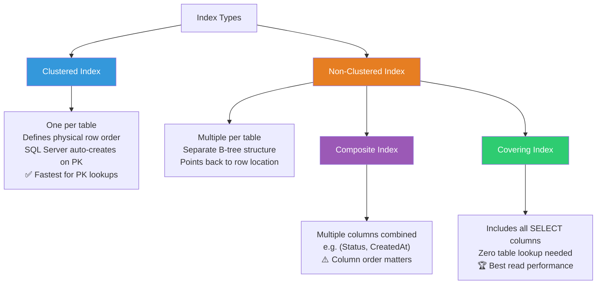
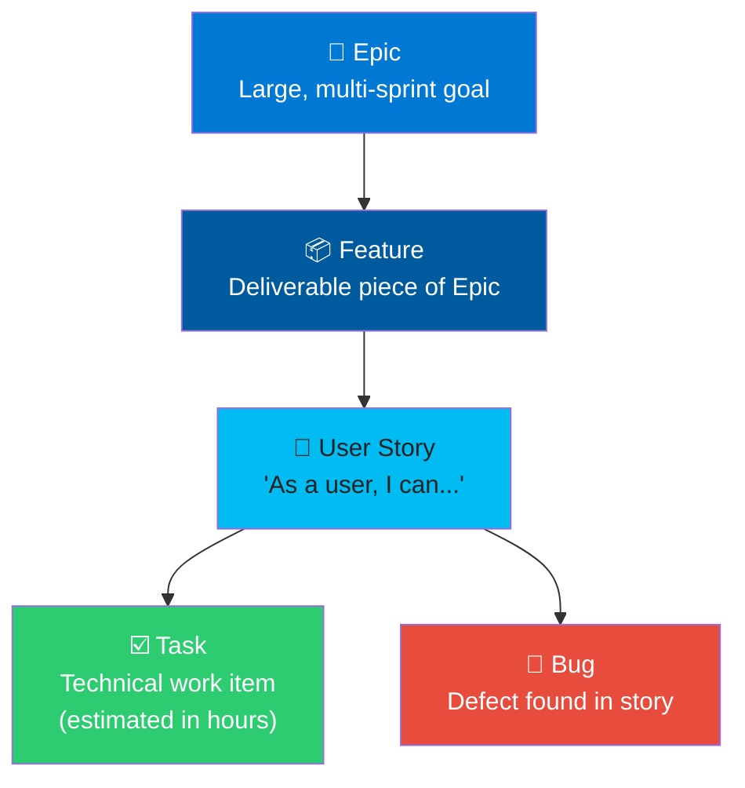
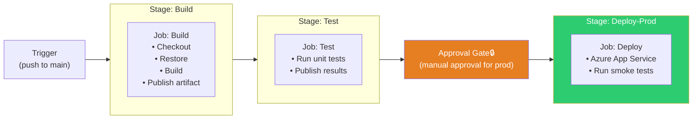
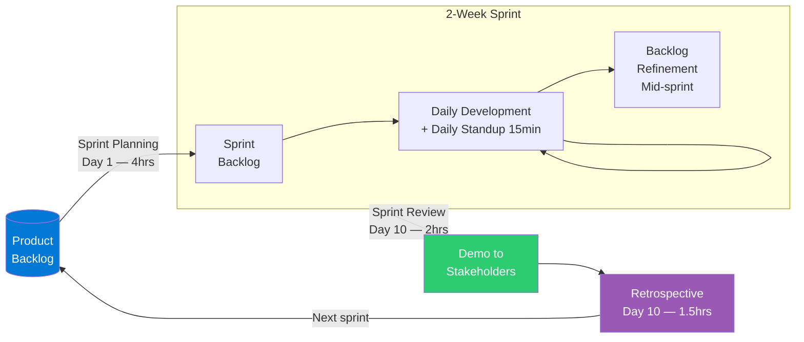
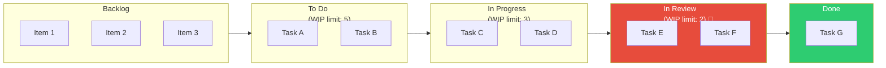

# File 5: SQL, Azure DevOps, IaC & Agile

> **Why this file exists:** The Verdentra JD explicitly calls out SQL optimization, ADO/CI/CD, IaC, and Agile. These are not obscure topics — they are table-stakes for any enterprise full-stack role. Interviewers test these to filter candidates who have only worked on solo or toy projects.

---

## 1. SQL — Queries, Optimization & Performance

### The Mental Model: How a SQL Query Executes

Understanding *how* SQL executes helps you write and optimize queries intuitively.


> **Key rule**: You cannot use a `SELECT` alias in `WHERE` because `WHERE` runs before `SELECT`. Always use the original expression in WHERE.

This matters because you cannot reference a `SELECT` alias in a `WHERE` clause — `WHERE` executes before `SELECT` even runs.

---

### Core Query Patterns — Know These Cold

**INNER JOIN vs. LEFT JOIN:**
```sql
-- INNER JOIN: only rows with a match in BOTH tables
SELECT u.Name, o.OrderTotal
FROM Users u
INNER JOIN Orders o ON o.UserId = u.Id

-- LEFT JOIN: all rows from Users, NULL for Orders columns where no match exists
-- Use when you want users regardless of whether they have orders
SELECT u.Name, COALESCE(o.OrderTotal, 0) AS OrderTotal
FROM Users u
LEFT JOIN Orders o ON o.UserId = u.Id
```

**Aggregation — GROUP BY, HAVING:**
```sql
-- Get users and their order count, only where count > 3
SELECT u.Name, COUNT(o.Id) AS OrderCount
FROM Users u
LEFT JOIN Orders o ON o.UserId = u.Id
GROUP BY u.Id, u.Name
HAVING COUNT(o.Id) > 3
ORDER BY OrderCount DESC;
```

**Rule**: Every non-aggregated column in `SELECT` must appear in `GROUP BY`.
**Rule**: `WHERE` filters individual rows. `HAVING` filters the aggregated result — use it after `GROUP BY`.

**Common Table Expressions (CTEs) — Readability + Reusability:**
```sql
-- Instead of nested subqueries, use a CTE to name intermediate results
WITH RecentOrders AS (
    SELECT UserId, COUNT(*) AS OrderCount
    FROM Orders
    WHERE CreatedAt >= DATEADD(day, -30, GETDATE())
    GROUP BY UserId
)
SELECT u.Name, ro.OrderCount
FROM Users u
INNER JOIN RecentOrders ro ON ro.UserId = u.Id
WHERE ro.OrderCount >= 5;
```

**Subqueries vs. CTEs:** Both produce the same result. CTEs are named, reusable within the query, and far more readable. Use CTEs for anything beyond a simple subquery.

**Window Functions — The SQL Power Tool:**
```sql
-- Rank users by order total within each region — without collapsing rows
SELECT
    u.Name,
    u.Region,
    o.OrderTotal,
    RANK() OVER (PARTITION BY u.Region ORDER BY o.OrderTotal DESC) AS RankInRegion
FROM Users u
INNER JOIN Orders o ON o.UserId = u.Id;
```

`ROW_NUMBER()`, `RANK()`, `DENSE_RANK()`, `SUM() OVER(...)`, `LAG()`, `LEAD()` — window functions operate across a "window" of rows related to the current row, without collapsing the result set.

---

### SQL Query Optimization — Interview-Critical

**The core principle**: Every slow query is either missing an index or doing more work than it needs to.

**1. Indexes — The Most Important Topic**

An index is a separate data structure the database maintains to speed up lookups on a column. Without an index, the engine does a **Full Table Scan** — reading every row.



| Index Type | Description | When to Use |
|:---|:---|:---|
| **Clustered Index** | The table's physical sort order. Only one per table. | Primary key (SQL Server creates automatically) |
| **Non-Clustered Index** | A separate B-tree pointing to row locations. Multiple allowed. | Columns frequently used in `WHERE`, `JOIN ON`, `ORDER BY` |
| **Composite Index** | Index on multiple columns. | Multi-column `WHERE` clauses — order of columns matters |
| **Covering Index** | Index that includes all columns a query needs (no table lookup required) | High-frequency read-heavy queries |

**Index trade-off**: Indexes make reads faster, writes slower. Each `INSERT`, `UPDATE`, `DELETE` must update every index on that table. Don't index everything — index the columns that appear in hot `WHERE` and `JOIN` clauses.

**2. Execution Plans — The Diagnostic Tool**

In SQL Server Management Studio (SSMS), prefix any query with `EXPLAIN` (SQL Server: `SET STATISTICS IO ON` or use "Include Actual Execution Plan"). The plan shows:
- **Table Scan** → bad: full table read. Add an index.
- **Index Seek** → ideal: jumping directly to matching rows.
- **Index Scan** → partial: reads entire index. May need a more specific index.
- **Key Lookup** → index exists but must go back to the table for more columns. Consider a covering index.
- **Hash Join / Nested Loops** → join strategy. Nested loops are fine for small row counts; hash joins used for larger datasets.

**3. Common Performance Anti-Patterns:**
```sql
-- ❌ Function on indexed column — defeats the index
WHERE YEAR(CreatedAt) = 2024
-- ✅ Range query uses the index
WHERE CreatedAt >= '2024-01-01' AND CreatedAt < '2025-01-01'

-- ❌ SELECT * — fetches unnecessary columns, bloats network/memory
SELECT * FROM Orders WHERE UserId = 5
-- ✅ Project only what you need
SELECT Id, Total, Status FROM Orders WHERE UserId = 5

-- ❌ Leading wildcard — cannot use index
WHERE Name LIKE '%Gimhana%'
-- ✅ Trailing wildcard can use index
WHERE Name LIKE 'Gimh%'

-- ❌ OR on different columns — often prevents index use
WHERE FirstName = 'X' OR LastName = 'X'
-- ✅ UNION approach can use separate indexes
SELECT ... WHERE FirstName = 'X'
UNION
SELECT ... WHERE LastName = 'X'
```

**4. The N+1 Problem in SQL Context:**
Always join rather than loop. If your application code fetches a list then queries inside a loop, that's N+1 — replace with a JOIN or `WHERE Id IN (...)`.

---

### SQL in EF Core — Key Performance Patterns

**Projection over full entity loading:**
For read-only data, project to a DTO or anonymous type:
```
.Select(t => new TaskDto { Id = t.Id, Title = t.Title })
```
This generates a `SELECT Id, Title FROM Tasks` instead of `SELECT *`. The change tracker is never engaged. Significantly faster for large datasets.

**`.AsNoTracking()` for read-only queries:**
Every entity EF Core returns is normally tracked in memory for change detection. For endpoints that only read (GET requests), `.AsNoTracking()` skips the change tracker entirely — less memory, faster queries.

**Avoid `.ToList()` before filtering:**
```csharp
// ❌ Loads ALL tasks into memory, THEN filters in C#
var done = db.Tasks.ToList().Where(t => t.Status == "Done");

// ✅ Translates WHERE to SQL, filtering happens in the database
var done = db.Tasks.Where(t => t.Status == "Done").ToList();
```

---

## 2. Azure DevOps (ADO) — Bridging from GitHub

### What Azure DevOps Is

Azure DevOps is Microsoft's all-in-one DevOps platform — the enterprise equivalent of combining GitHub, Jira, and a CI/CD pipeline runner into one product. It has five main services:

| ADO Service | GitHub/Other Equivalent | Purpose |
|:---|:---|:---|
| **Boards** | Jira / GitHub Projects | Work item tracking (Epics, Stories, Tasks, Bugs) |
| **Repos** | GitHub Repositories | Git repositories, PRs, branch policies |
| **Pipelines** | GitHub Actions | CI/CD pipeline automation |
| **Test Plans** | No direct equivalent | Manual and automated test management |
| **Artifacts** | npm/NuGet registries | Package management for NuGet, npm, etc. |

---

### ADO Boards — Work Item Hierarchy

Boards use a hierarchical structure to represent work from strategy to task:



**In Scrum**, work items are pulled from the **Product Backlog** into the **Sprint Backlog** during Sprint Planning. The Sprint Board shows the sprint's stories and tasks across columns.

**In Kanban**, there are no sprints. The board has a continuous flow with WIP limits per column. New work items are pulled when capacity is available.

---

### ADO Pipelines — YAML Structure

Your GitHub Actions experience transfers directly — the concepts are identical, the syntax is similar. ADO YAML pipelines use the same `trigger → job → step` structure:

```yaml
# GitHub Actions                    # Azure DevOps equivalent
on:                                  trigger:
  push:                                branches:
    branches: [main]                     include: [main]

jobs:                                jobs:
  build:                             - job: Build
    runs-on: ubuntu-latest             pool:
    steps:                               vmImage: ubuntu-latest
      - uses: actions/checkout@v4      steps:
      - run: dotnet build              - task: DotNetCoreCLI@2
                                         inputs:
                                           command: build
```

**Key ADO Pipeline Concepts:**



- **Stages**: High-level phases (`Build`, `Test`, `Deploy-Dev`, `Deploy-Prod`). Stages can have approval gates before proceeding.
- **Jobs**: Run on an agent. Multiple jobs in a stage run in parallel by default.
- **Steps**: Individual `task` or `script` commands within a job.
- **Agent Pools**: `ubuntu-latest`, `windows-latest` (hosted by Microsoft) or your own self-hosted agents.
- **Variable Groups**: Shared secrets/config accessible across pipelines (equivalent to GitHub Secrets but more organized — linked to Azure Key Vault in enterprise setups).
- **Environments**: Named deployment targets (Dev, Staging, Prod) with approval checks and deployment history.

**How to answer the ADO gap in an interview:**
> *"My CI/CD experience has been primarily with GitHub Actions — I set up separate frontend and backend pipelines for my task tracker project, with path-based triggers and Azure deployment integration. The pipeline concepts translate directly to ADO: triggers, stages, jobs, and steps are the same mental model. I'm confident I'd get productive in ADO quickly, particularly since I understand the underlying Git and Azure integrations."*

---

## 3. Infrastructure as Code (IaC) — Bicep & Concepts

### Why IaC Matters

**The problem without IaC**: Manually creating Azure resources through the Portal is not reproducible. If your environment is accidentally deleted, or you need a staging copy, you have to remember every click. There's no version history, no review process, no audit trail.

**IaC**: Your infrastructure is defined in code, stored in Git, reviewed in PRs, deployed automatically. Environments become reproducible, consistent, and auditable.

### The IaC Landscape

| Tool | Scope | Maintained by | Style |
|:---|:---|:---|:---|
| **Bicep** | Azure only | Microsoft | Declarative DSL (cleaner ARM) |
| **ARM Templates** | Azure only | Microsoft | JSON — verbose, error-prone |
| **Terraform** | Multi-cloud (Azure, AWS, GCP) | HashiCorp | Declarative HCL |
| **Pulumi** | Multi-cloud | Pulumi | Imperative (TypeScript, Python) |

**Bicep** is Microsoft's recommended path for pure Azure workloads. It compiles down to ARM templates, so it has full Azure resource coverage.

### Core Bicep Concepts (From Your Task Tracker)

```bicep
// Parameters — make templates reusable across environments
param environment string = 'prod'
param location string = resourceGroup().location

// Resources — each block is a resource Azure will create/manage
resource appServicePlan 'Microsoft.Web/serverfarms@2022-03-01' = {
  name: 'asp-${environment}'
  location: location
  sku: { name: 'F1', tier: 'Free' }
}

// Outputs — expose values needed by other pipelines (e.g., App URL)
output apiUrl string = 'https://${webApp.properties.defaultHostName}'
```

**In your interview:** You can speak to this confidently from your task tracker project. The key talking points:
- *"I provisioned an App Service Plan, App Service, and Static Web App using Bicep — the infrastructure is version-controlled in the same repo as the code."*
- *"Parameters made the template environment-agnostic — deploying to a new environment is a single `az deployment group create` command with different parameter values."*
- *"The pipeline outputs the App Service URL and Static Web App token, which the CI/CD pipelines consume for subsequent deployment steps."*

### Modules Pattern (Enterprise Bicep)
In larger projects, Bicep files are split into modules — one file per resource type or concern — and a `main.bicep` orchestrates them. This mirrors the SRP in software: each module has one responsibility.

---

## 4. Agile Methodologies — Scrum & Kanban

### Scrum — The Structured Iterative Framework

Scrum organises work into **Sprints** (fixed-length, typically 2 weeks). Everything is time-boxed and ceremonial.



**The Three Roles:**
- **Product Owner (PO)**: Owns and prioritises the Product Backlog. Represents the business/customer. Decides *what* is built and *in what order*.
- **Scrum Master (SM)**: Facilitates ceremonies, removes blockers, protects the team from scope creep. Not a manager.
- **Development Team**: Self-organising, cross-functional. Decides *how* the work is done.

**The Five Ceremonies:**

| Ceremony | When | Purpose | Time-box |
|:---|:---|:---|:---|
| **Sprint Planning** | Start of sprint | PO presents top backlog items; team estimates and commits to a Sprint Goal | 4 hours (2-week sprint) |
| **Daily Standup** | Every day | 3 questions: What did I do yesterday? What will I do today? Any blockers? | 15 minutes |
| **Sprint Review** | End of sprint | Team demos completed work to stakeholders. PO accepts/rejects stories | 2 hours |
| **Sprint Retrospective** | After review | What went well? What to improve? Action items for next sprint | 1.5 hours |
| **Backlog Refinement** | Mid-sprint | PO and team break down and estimate upcoming stories | Ongoing |

**Estimation**: Story Points (relative complexity, not hours). Teams use Fibonacci sequence (1, 2, 3, 5, 8, 13) to estimate. **Velocity** = average story points completed per sprint — used to forecast future sprints.

**Definition of Done (DoD)**: A shared agreement on what "complete" means — e.g., code written, unit tests passing, code reviewed, deployed to staging, PO-accepted.

### Kanban — The Continuous Flow System

No sprints. Work flows continuously through a board. The key mechanism is **WIP (Work In Progress) limits** — a maximum number of items allowed in each column.



> 🛑 When "In Review" hits its WIP limit, no new items can enter. This forces the team to fix the bottleneck (code review) before pulling new work.

**Kanban metrics**: 
- **Lead Time**: Total time from "To Do" to "Done" — what the customer experiences.
- **Cycle Time**: Time from "In Progress" to "Done" — what the team controls.
- **Throughput**: Items completed per week/sprint.

### How to Talk About Agile in an Interview

> *"At Recurved I worked in Scrum sprints — two-week cycles with daily standups, sprint reviews with stakeholders, and retrospectives to continuously improve. In parallel, I managed client-specific urgent requests using a Kanban board to handle the unpredictable flow of change requests without disrupting sprint commitments. The discipline that stuck with me most is the Definition of Done — not marking something complete until it's reviewed, tested, and deployed. It prevents the false velocity of 'mostly done' work accumulating."*

---

## 5. Debugging & Troubleshooting Approach

Interviewers ask this to assess systematic thinking — not whether you know every tool.

### The Systematic Debugging Framework

When asked "how do you debug a bug," use this structure:

**1. Reproduce:** A bug you can't reproduce consistently is a bug you can't fix. Identify exact steps, environment (dev vs. prod), data conditions, and frequency.

**2. Isolate:** Narrow the blast radius. Is it frontend or backend? Which endpoint? Which service? Binary search through layers.

**3. Hypothesise:** Form a specific theory — "I think the join is returning duplicates because of the LEFT JOIN on the OrderItems table." Don't randomly change code hoping it fixes itself.

**4. Validate:** Test your hypothesis with the minimum change. Check logs, add a breakpoint, run a specific SQL query.

**5. Fix & Verify:** Apply the fix, verify the original repro steps pass, check for regressions.

**6. Root Cause & Document:** Understand *why* the bug occurred — not just what fixed it. This prevents recurrence.

### .NET Debugging Toolkit

| Tool | Use Case |
|:---|:---|
| **VS Debugger** (Breakpoints, Watch Window) | Step through code, inspect variable state in real time |
| **Structured Logging** (Serilog, ILogger) | Persistent audit trail. Log at request start, boundaries, exceptions |
| **Application Insights / Azure Monitor** | Production telemetry — distributed traces, exception tracking, performance metrics |
| **EF Core Query Logging** | Log generated SQL — spot N+1, missing indexes, unexpected queries |
| **`dotnet-trace` / `dotnet-counters`** | Low-level performance profiling — thread pool saturation, GC pressure |

### React / Frontend Debugging Toolkit

| Tool | Use Case |
|:---|:---|
| **React DevTools** | Inspect component tree, props, state, and render counts in the Profiler tab |
| **Browser DevTools → Network** | Inspect API requests, response codes, payloads, timing |
| **Browser DevTools → Console** | Errors, warnings, `console.log` output |
| **Browser DevTools → Sources** | Set breakpoints in JavaScript, step through execution |
| **`debugger;` statement** | Programmatic breakpoint — drops into DevTools Sources automatically |

### How to Answer "Tell me about a bug you debugged"

Use the **STAR format** adapted for engineering:
- **Situation**: What was the feature/system?
- **Problem**: What was the symptom? (e.g., "users reported tasks disappearing after a status update")
- **Investigation**: What tools and steps did you use to isolate it?
- **Resolution**: What was the root cause and fix?

---

## 6. New Scenarios for the Interview Simulator

### Scenario S1: SQL — Optimize a Slow Report Query

**The interviewer's setup:**
> "Our monthly reports endpoint runs in 45 seconds and users are complaining. You look at the code and it's doing a query across 3 tables joining Orders, OrderItems, and Users. How do you diagnose and improve it?"

**Expert Answer:**

Start with the **execution plan** in SSMS — immediately shows if the query is doing Table Scans. Then:

1. Check for missing indexes on the join columns (`Orders.UserId`, `OrderItems.OrderId`) and `WHERE` clause columns (`Orders.CreatedAt`).
2. Check for anti-patterns: functions on indexed columns, `SELECT *`, `LIKE '%X%'`.
3. Check if the result set can be reduced: add appropriate `WHERE` filters, use pagination.
4. Consider whether this is a reporting query that should run against a **read replica** or a **materialised view** — avoiding contention with transactional operations.
5. For genuinely expensive reports, consider the **Async Request-Reply pattern** — pre-generate and cache the report, rather than computing on demand.

**Interview vocabulary**: "Execution plan", "Index Seek vs Table Scan", "read replica", "materialised view", "query hints".

---

### Scenario S2: Agile — Handling Mid-Sprint Scope Changes

**The interviewer's setup:**
> "You're halfway through a sprint. The product manager comes to you with an urgent client request that will take 3 days. You have 4 days of committed sprint work remaining. How do you handle this?"

**Expert Answer:**

This is a Scrum process question about protecting sprint commitment while accommodating business reality.

**The professional response has three steps:**

1. **Don't silently absorb it.** Accepting 3 days of new work with 4 days remaining means either the sprint commitment breaks or the team overworks. Both are bad outcomes.

2. **Bring it to the PO.** The PO owns the backlog priority. Present the trade-off: "Adding this work means we drop one of these committed stories. Which do you prefer?" The PO decides — that's their job.

3. **Propose options:** Add the urgent item and remove equivalent scope from the sprint; or defer to next sprint if it's not truly urgent; or, in genuine emergencies, escalate to the Scrum Master who can call a Sprint Cancellation (rare).

**What this answer demonstrates:** You understand that Scrum protects team capacity for predictable delivery, and that the PO — not developers or managers — makes prioritisation decisions.

---

### Scenario S3: ADO Pipelines — Failed Deployment Investigation

**The interviewer's setup:**
> "A deployment pipeline in Azure DevOps failed on the 'Deploy to Production' stage. The 'Build' and 'Test' stages passed. How do you investigate?"

**Expert Answer:**

**Step 1 — Read the logs.** ADO Pipeline logs are step-by-step. Navigate to the failed stage → failed job → failed step. The error message is almost always there.

**Common failure categories for a .NET/React deployment:**
- **Authentication failure**: The service connection (Azure service principal) credentials expired or the managed identity lacks the required RBAC role on the target resource.
- **Configuration mismatch**: An environment variable or app setting is missing in the Production environment that exists in Staging.
- **Resource state**: The target Azure resource doesn't exist yet, or is in a failed/stopped state.
- **Artifact issue**: The build artifact wasn't published correctly in the Build stage, so the Deploy stage has nothing to deploy.

**Step 2 — Check the Azure Activity Log.** If the pipeline reached Azure and the Azure operation failed, the Activity Log shows the exact error from Azure's side.

**Step 3 — Re-run with diagnostics enabled.** ADO lets you enable "System diagnostics" on a re-run, giving verbose agent-level logging.

---

## Quick Reference — Agile & ADO Vocabulary

| Term | Definition |
|:---|:---|
| **Sprint / Iteration** | Fixed time-box (2 weeks) in Scrum where a committed set of work is completed |
| **Product Backlog** | Prioritised list of all work to be done, owned by the Product Owner |
| **Sprint Backlog** | The subset of backlog items committed for the current sprint |
| **Velocity** | Average story points completed per sprint — used for forecasting |
| **WIP Limit** | Maximum items allowed in a Kanban column — prevents overloading |
| **Definition of Done** | Shared checklist: what "complete" means (reviewed, tested, deployed) |
| **Epic** | Large body of work spanning multiple sprints |
| **Story Points** | Relative estimate of complexity — not hours |
| **Service Connection** | ADO's authenticated link to an Azure subscription for deployments |
| **Variable Group** | Shared set of pipeline variables/secrets in ADO, optionally linked to Key Vault |
| **Environment** | Named deployment target in ADO with approval gates and deployment history |
| **Agent Pool** | Set of build/deploy machines (Microsoft-hosted or self-hosted) |
