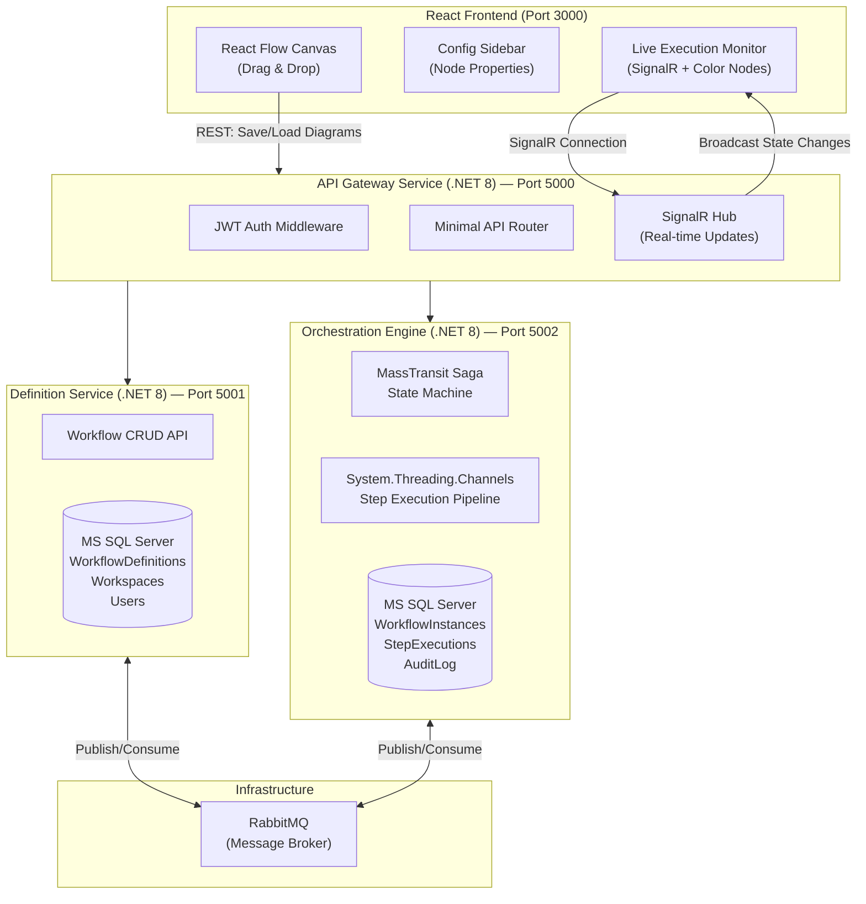
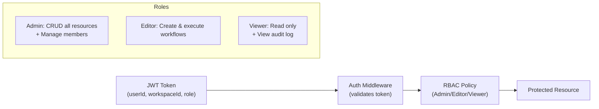

# Collaborative Visual Workflow Orchestrator & State Machine Engine
### Technical Design Document — Interview Edition
> **Purpose:** A deep-dive technical design doc to drive interview conversations, demonstrate architectural thinking, and guide the solo build of a production-quality portfolio project.

---

## 1. Elevator Pitch

> *"I built a distributed workflow orchestration platform where engineers visually design multi-step business processes — think Zapier meets Netflix Conductor — using a drag-and-drop canvas. The backend is a .NET microservice system that executes those workflows concurrently using a saga-based state machine, handles thousands of parallel steps without blocking threads via System.Threading.Channels, and tracks every state transition in an auditable log. It's multi-tenant with JWT-based RBAC, and the entire system ships as Docker containers via GitHub Actions CI/CD."*

---

## 2. Project Overview

| Attribute | Detail |
|---|---|
| **Project Name** | FlowForge — Visual Workflow Orchestrator |
| **Builder** | Solo |
| **Target Audience** | Developers / ops teams who need to model and execute multi-step business processes |
| **Core Value Prop** | Replace hardcoded orchestration logic with a visual, auditable, concurrent execution engine |
| **Primary Stack** | React + TypeScript (frontend) · .NET 8 Core (backend) · MS SQL Server (persistence) |

---

## 3. Why This Project Hits Every JD Bullet

| JD Requirement | How This Project Proves It |
|---|---|
| **.NET Core / C#** | Three microservices built on .NET 8 Minimal APIs |
| **Concurrent programming** | `System.Threading.Channels` producer/consumer pipeline for step execution |
| **State machines** | MassTransit Saga — each workflow instance is a state machine |
| **Orchestration frameworks** | MassTransit with RabbitMQ as the message broker |
| **Canvas/diagram libraries** | React Flow (XYFlow) — drag-and-drop node canvas |
| **Design patterns** | Saga, CQRS, Repository, Circuit Breaker |
| **REST API design** | Versioned Minimal API endpoints (`/api/v1/...`) |
| **Unit & integration testing** | NUnit for state machine logic; integration tests via `WebApplicationFactory` |
| **CI/CD pipelines** | GitHub Actions: test → build → Docker push |
| **Multi-tenant SaaS** | Workspace isolation, JWT auth, RBAC (Admin/Editor/Viewer) |

---

## 4. Tech Stack Recommendations (With Reasoning)

### 4.1 Frontend Canvas Library: **React Flow (XYFlow)**
**Recommended over Konva.js because:**
- Purpose-built for node/edge graphs — zero boilerplate for dragging, connecting, and styling nodes
- TypeScript-first with excellent type definitions
- Built-in minimap, controls, and custom node APIs
- The JD mentions "canvas/diagram libraries" — React Flow is the most recognizable name to drop in an interview
- Active community (25k+ GitHub stars)

### 4.2 Backend Orchestration: **MassTransit + Saga State Machine**
**Recommended over Temporal or Elsa Workflows because:**
- MassTransit is a native .NET library — no polyglot runtime dependencies
- Saga pattern is a recognized design pattern interviewers will immediately understand
- MassTransit integrates directly with RabbitMQ (easily swappable to Azure Service Bus)
- It produces clean, testable state machine code using `MassTransitStateMachine<TState>`
- Elsa is excellent but less battle-tested for interview discussions
- Temporal requires a separate Go-based server — overkill for a solo portfolio build

### 4.3 Database: **MS SQL Server** (via EF Core)
- Aligns directly with the JD mention of MS SQL Server
- EF Core migrations prove professional data modeling habits

### 4.4 Message Broker: **RabbitMQ**
- Lightweight, runs as a Docker container
- Native MassTransit support

---

## 5. Architecture Overview



---

## 6. Microservice Breakdown

### 6.1 API Gateway Service
**Responsibility:** Single entry point. Handles auth, routing, and real-time push.

**Key Components:**
- JWT Bearer authentication middleware
- Reverse proxy / aggregation to Definition and Orchestration services
- SignalR Hub — pushes execution state changes to connected browser clients
- Rate limiting middleware

**Tech:** .NET 8 Minimal APIs, `Microsoft.AspNetCore.SignalR`, `Yarp.ReverseProxy`

---

### 6.2 Definition Service
**Responsibility:** Store and retrieve workflow definitions (the "blueprint").

**Key Entities:**

```csharp
// Workflow definition — stores the visual graph as JSON
public record WorkflowDefinition
{
    public Guid Id { get; init; }
    public Guid WorkspaceId { get; init; }       // Multi-tenant isolation key
    public string Name { get; init; }
    public string Version { get; init; }
    public string GraphJson { get; init; }        // Serialized React Flow nodes/edges
    public DateTimeOffset CreatedAt { get; init; }
    public DateTimeOffset UpdatedAt { get; init; }
}

// Workspace = a tenant
public record Workspace
{
    public Guid Id { get; init; }
    public string Name { get; init; }
    public List<WorkspaceUser> Members { get; init; }
}

public record WorkspaceUser
{
    public Guid UserId { get; init; }
    public WorkspaceRole Role { get; init; }  // Admin | Editor | Viewer
}

public enum WorkspaceRole { Admin, Editor, Viewer }
```

**API Endpoints:**

| Method | Path | Description |
|---|---|---|
| `GET` | `/api/v1/workspaces/{wid}/workflows` | List all workflow definitions |
| `POST` | `/api/v1/workspaces/{wid}/workflows` | Create a new workflow definition |
| `GET` | `/api/v1/workspaces/{wid}/workflows/{id}` | Get a definition (graph JSON) |
| `PUT` | `/api/v1/workspaces/{wid}/workflows/{id}` | Update definition |
| `DELETE` | `/api/v1/workspaces/{wid}/workflows/{id}` | Delete definition |

---

### 6.3 Orchestration Engine Service *(The Core)*
**Responsibility:** Execute workflow instances concurrently, manage state, write audit log.

#### 6.3.1 State Machine Design (MassTransit Saga)

Each workflow **instance** (a running execution of a definition) is modeled as a saga:

```csharp
public class WorkflowInstance : SagaStateMachineInstance
{
    public Guid CorrelationId { get; set; }
    public string CurrentState { get; set; }
    public Guid WorkflowDefinitionId { get; set; }
    public Guid WorkspaceId { get; set; }
    public List<StepResult> CompletedSteps { get; set; }
    public string? FailureReason { get; set; }
    public DateTimeOffset StartedAt { get; set; }
    public DateTimeOffset? CompletedAt { get; set; }
}

public class WorkflowStateMachine : MassTransitStateMachine<WorkflowInstance>
{
    // States
    public State Pending { get; private set; }
    public State Running { get; private set; }
    public State Paused { get; private set; }
    public State Completed { get; private set; }
    public State Failed { get; private set; }

    // Events (Messages)
    public Event<StartWorkflowCommand> StartWorkflow { get; private set; }
    public Event<StepCompletedEvent> StepCompleted { get; private set; }
    public Event<StepFailedEvent> StepFailed { get; private set; }
    public Event<PauseWorkflowCommand> PauseWorkflow { get; private set; }
    public Event<ResumeWorkflowCommand> ResumeWorkflow { get; private set; }

    public WorkflowStateMachine()
    {
        InstanceState(x => x.CurrentState);

        Initially(
            When(StartWorkflow)
                .TransitionTo(Running)
                .Then(ctx => ctx.Saga.StartedAt = DateTimeOffset.UtcNow)
                .Publish(ctx => new ExecuteNextStepCommand(ctx.Saga.CorrelationId))
        );

        During(Running,
            When(StepCompleted)
                .Then(ctx => ctx.Saga.CompletedSteps.Add(ctx.Message.Result))
                .IfElse(ctx => ctx.Saga.IsLastStep(),
                    completed => completed.TransitionTo(Completed)
                                          .Then(ctx => ctx.Saga.CompletedAt = DateTimeOffset.UtcNow),
                    next => next.Publish(ctx => new ExecuteNextStepCommand(ctx.Saga.CorrelationId))
                ),
            When(StepFailed)
                .TransitionTo(Failed)
                .Then(ctx => ctx.Saga.FailureReason = ctx.Message.Error),
            When(PauseWorkflow)
                .TransitionTo(Paused)
        );

        During(Paused,
            When(ResumeWorkflow)
                .TransitionTo(Running)
                .Publish(ctx => new ExecuteNextStepCommand(ctx.Saga.CorrelationId))
        );
    }
}
```

#### 6.3.2 Concurrent Step Execution (System.Threading.Channels)

```csharp
// Bounded channel prevents memory exhaustion under high load
public class StepExecutionPipeline : BackgroundService
{
    private readonly Channel<ExecuteNextStepCommand> _channel =
        Channel.CreateBounded<ExecuteNextStepCommand>(new BoundedChannelOptions(1000)
        {
            FullMode = BoundedChannelFullMode.Wait,
            SingleWriter = false,
            SingleReader = false
        });

    // Multiple concurrent readers — configurable based on CPU cores
    protected override async Task ExecuteAsync(CancellationToken stoppingToken)
    {
        var workers = Enumerable.Range(0, Environment.ProcessorCount)
            .Select(_ => ProcessStepsAsync(stoppingToken));

        await Task.WhenAll(workers);
    }

    private async Task ProcessStepsAsync(CancellationToken ct)
    {
        await foreach (var command in _channel.Reader.ReadAllAsync(ct))
        {
            await ExecuteStepWithCircuitBreaker(command, ct);
        }
    }
}
```

**Interview talking point:** *"I use a bounded channel so the system applies backpressure instead of crashing when load spikes. The number of worker tasks scales with CPU core count."*

#### 6.3.3 Audit Log

Every state transition writes an immutable audit record:

```csharp
public record AuditEntry
{
    public Guid Id { get; init; }
    public Guid WorkflowInstanceId { get; init; }
    public Guid WorkspaceId { get; init; }
    public string FromState { get; init; }
    public string ToState { get; init; }
    public string Event { get; init; }
    public Guid ActorUserId { get; init; }
    public DateTimeOffset Timestamp { get; init; }
    public string? Metadata { get; init; }  // JSON payload snapshot
}
```

**API Endpoints:**

| Method | Path | Description |
|---|---|---|
| `POST` | `/api/v1/workflows/{id}/execute` | Start a workflow instance |
| `GET` | `/api/v1/instances/{instanceId}` | Get current state & step results |
| `POST` | `/api/v1/instances/{instanceId}/pause` | Pause a running instance |
| `POST` | `/api/v1/instances/{instanceId}/resume` | Resume a paused instance |
| `GET` | `/api/v1/instances/{instanceId}/audit` | Full audit trail |

---

## 7. Multi-Tenancy & RBAC Design



**Workspace isolation:** Every EF Core query filters by `WorkspaceId` from the JWT claim. This is enforced at the repository layer, not just the API layer.

```csharp
// Example: automatic tenant filtering in EF Core
protected override void OnModelCreating(ModelBuilder modelBuilder)
{
    modelBuilder.Entity<WorkflowDefinition>()
        .HasQueryFilter(w => w.WorkspaceId == _currentWorkspaceId);
}
```

---

## 8. Frontend — React Flow Canvas

### 8.1 Node Types

| Node Type | Color | Description |
|---|---|---|
| **Trigger** | Purple | Entry point — starts the workflow |
| **Action** | Blue | HTTP call, DB write, email send |
| **Decision** | Orange | Conditional branch (if/else) |
| **Delay** | Yellow | Wait N seconds/minutes |
| **End** | Gray | Terminal node |

### 8.2 Live Execution Coloring (SignalR)

When the backend transitions a state, it broadcasts via SignalR:

```typescript
// React component receives real-time state updates
useEffect(() => {
  const connection = new HubConnectionBuilder()
    .withUrl('/hubs/execution')
    .withAutomaticReconnect()
    .build();

  connection.on('StepStateChanged', (stepId: string, state: StepState) => {
    setNodes(nodes => nodes.map(node =>
      node.id === stepId
        ? { ...node, data: { ...node.data, executionState: state } }
        : node
    ));
  });

  connection.start();
  return () => { connection.stop(); };
}, [instanceId]);

// Node color mapping
const stateColors: Record<StepState, string> = {
  Pending:   '#6b7280',  // gray
  Running:   '#3b82f6',  // blue (pulsing animation)
  Completed: '#22c55e',  // green
  Failed:    '#ef4444',  // red
  Skipped:   '#a855f7',  // purple
};
```

### 8.3 Key UI Screens

1. **Dashboard** — List of workspaces and their workflow definitions
2. **Canvas Editor** — Drag-and-drop node builder with config sidebar
3. **Execution Monitor** — Live view of a running instance (color-coded nodes)
4. **Audit Log** — Tabular view of all state transitions for an instance

---

## 9. Testing Strategy

### 9.1 Unit Tests (NUnit — State Machine Logic)

```csharp
[TestFixture]
public class WorkflowStateMachineTests
{
    private ITestHarness _harness;

    [SetUp]
    public async Task SetUp()
    {
        _harness = new InMemoryTestHarness();
        await _harness.Start();
    }

    [Test]
    public async Task StartWorkflow_ShouldTransitionTo_Running()
    {
        // Arrange
        var sagaId = Guid.NewGuid();
        var command = new StartWorkflowCommand(sagaId, definitionId: Guid.NewGuid());

        // Act
        await _harness.InputQueueSendEndpoint.Send(command);
        await _harness.Consumed.Any<StartWorkflowCommand>();

        // Assert
        var saga = _harness.GetSagaStateMachineHarness<WorkflowStateMachine, WorkflowInstance>();
        var instance = await saga.Exists(sagaId, x => x.Running, timeout: TimeSpan.FromSeconds(5));
        Assert.That(instance, Is.Not.Null);
    }

    [Test]
    public async Task StepFailed_ShouldTransitionTo_Failed_WithReason()
    {
        // ... test that a failure event correctly transitions to Failed state
    }
}
```

### 9.2 Integration Tests (WebApplicationFactory)

```csharp
[TestFixture]
public class WorkflowApiIntegrationTests
{
    private WebApplicationFactory<Program> _factory;
    private HttpClient _client;

    [SetUp]
    public void SetUp()
    {
        _factory = new WebApplicationFactory<Program>()
            .WithWebHostBuilder(builder =>
                builder.ConfigureServices(services =>
                    services.AddSingleton<IWorkflowRepository, InMemoryWorkflowRepository>()));

        _client = _factory.CreateClient();
    }

    [Test]
    public async Task PostExecute_ValidWorkflow_Returns202Accepted()
    {
        var response = await _client.PostAsJsonAsync(
            "/api/v1/workflows/test-id/execute", new { });

        Assert.That(response.StatusCode, Is.EqualTo(HttpStatusCode.Accepted));
    }
}
```

**Test coverage targets:**
- State machine transitions: **100%** (critical path)
- API endpoint contracts: **>80%**
- Repository layer: **>70%** (using in-memory EF Core provider)

---

## 10. CI/CD Pipeline (GitHub Actions)

```yaml
# .github/workflows/ci.yml
name: CI Pipeline

on:
  push:
    branches: [main]
  pull_request:
    branches: [main]

jobs:
  test:
    name: Run NUnit Tests
    runs-on: ubuntu-latest
    steps:
      - uses: actions/checkout@v4
      - name: Setup .NET 8
        uses: actions/setup-dotnet@v4
        with:
          dotnet-version: '8.0.x'
      - name: Restore dependencies
        run: dotnet restore
      - name: Run unit tests
        run: dotnet test --no-restore --verbosity normal --collect:"XPlat Code Coverage"
      - name: Upload coverage report
        uses: codecov/codecov-action@v4

  build-and-push:
    name: Build Docker Images
    runs-on: ubuntu-latest
    needs: test
    if: github.ref == 'refs/heads/main'
    steps:
      - uses: actions/checkout@v4
      - name: Build Gateway image
        run: docker build -t flowforge-gateway ./src/Gateway
      - name: Build Definition Service image
        run: docker build -t flowforge-definition ./src/DefinitionService
      - name: Build Orchestration Engine image
        run: docker build -t flowforge-orchestration ./src/OrchestrationEngine
      - name: Push to registry
        run: |
          docker push ${{ secrets.REGISTRY_URL }}/flowforge-gateway
          docker push ${{ secrets.REGISTRY_URL }}/flowforge-definition
          docker push ${{ secrets.REGISTRY_URL }}/flowforge-orchestration
```

---

## 11. Deployment

### 11.1 Docker Compose (Local Demo)

```yaml
# docker-compose.yml
version: '3.8'
services:
  gateway:
    build: ./src/Gateway
    ports: ["5000:8080"]
    environment:
      - JWT_SECRET=${JWT_SECRET}
      - DEFINITION_SERVICE_URL=http://definition:8080
      - ORCHESTRATION_SERVICE_URL=http://orchestration:8080
    depends_on: [definition, orchestration]

  definition:
    build: ./src/DefinitionService
    ports: ["5001:8080"]
    environment:
      - ConnectionStrings__Default=Server=sqlserver;Database=FlowForge_Definitions;...

  orchestration:
    build: ./src/OrchestrationEngine
    ports: ["5002:8080"]
    environment:
      - RabbitMQ__Host=rabbitmq
      - ConnectionStrings__Default=Server=sqlserver;Database=FlowForge_Orchestration;...

  sqlserver:
    image: mcr.microsoft.com/mssql/server:2022-latest
    environment:
      - SA_PASSWORD=${SA_PASSWORD}
      - ACCEPT_EULA=Y
    ports: ["1433:1433"]

  rabbitmq:
    image: rabbitmq:3-management
    ports: ["5672:5672", "15672:15672"]

  frontend:
    build: ./src/frontend
    ports: ["3000:80"]
```

### 11.2 Hostinger VPS Deployment
- SSH into VPS, clone repo, run `docker compose up -d`
- Configure Nginx reverse proxy to expose port 80/443
- Use Let's Encrypt (Certbot) for HTTPS
- Set environment secrets via `.env` file (not committed to git)

---

## 12. Folder Structure

```
flowforge/
├── src/
│   ├── Gateway/                        # API Gateway Service (.NET 8)
│   │   ├── Program.cs
│   │   ├── Hubs/ExecutionHub.cs        # SignalR hub
│   │   ├── Middleware/AuthMiddleware.cs
│   │   └── Gateway.csproj
│   │
│   ├── DefinitionService/              # Workflow Definition Service (.NET 8)
│   │   ├── Program.cs
│   │   ├── Endpoints/WorkflowEndpoints.cs
│   │   ├── Data/DefinitionDbContext.cs
│   │   ├── Models/WorkflowDefinition.cs
│   │   └── DefinitionService.csproj
│   │
│   ├── OrchestrationEngine/            # Core Engine (.NET 8)
│   │   ├── Program.cs
│   │   ├── StateMachines/WorkflowStateMachine.cs
│   │   ├── Pipelines/StepExecutionPipeline.cs
│   │   ├── Endpoints/ExecutionEndpoints.cs
│   │   ├── Data/OrchestrationDbContext.cs
│   │   └── OrchestrationEngine.csproj
│   │
│   └── frontend/                       # React + TypeScript
│       ├── src/
│       │   ├── components/
│       │   │   ├── Canvas/FlowCanvas.tsx
│       │   │   ├── Nodes/ActionNode.tsx
│       │   │   ├── Nodes/DecisionNode.tsx
│       │   │   └── Sidebar/NodeConfig.tsx
│       │   ├── pages/
│       │   │   ├── Dashboard.tsx
│       │   │   ├── CanvasEditor.tsx
│       │   │   └── ExecutionMonitor.tsx
│       │   ├── hooks/useSignalR.ts
│       │   └── services/api.ts
│       └── package.json
│
├── tests/
│   ├── UnitTests/StateMachineTests.cs
│   └── IntegrationTests/ApiTests.cs
│
├── .github/workflows/ci.yml
├── docker-compose.yml
└── README.md
```

---

## 13. Key Design Patterns (Interview Cheat Sheet)

| Pattern | Where Used | What to Say |
|---|---|---|
| **Saga** | WorkflowStateMachine | *"Each workflow instance is a long-running saga. State is persisted, so it survives service restarts."* |
| **CQRS** | Definition Service | *"Writes go through a command handler, reads use optimized query projections."* |
| **Repository** | EF Core data access | *"Abstracts the data layer — I can swap SQL Server for PostgreSQL without touching business logic."* |
| **Circuit Breaker** | Step execution | *"If a downstream HTTP call fails repeatedly, the circuit opens to prevent cascade failures."* |
| **Backpressure** | Channels pipeline | *"Bounded channel size limits in-flight work, applying natural backpressure instead of unbounded queue growth."* |
| **Global Query Filter** | EF Core multi-tenancy | *"Tenant isolation is enforced at the ORM layer, not just the API layer — defence in depth."* |

---

## 14. Phase-by-Phase Build Roadmap

### Phase 1 — Foundation (Week 1–2)
- [ ] Scaffold three .NET 8 microservice projects
- [ ] Set up Docker Compose with SQL Server and RabbitMQ
- [ ] Create EF Core models and initial migrations
- [ ] Implement JWT auth in Gateway
- [ ] Scaffold React + Vite + TypeScript frontend with React Flow installed

### Phase 2 — Core Logic (Week 3–4)
- [ ] Implement `WorkflowStateMachine` with MassTransit Saga
- [ ] Implement `StepExecutionPipeline` using `System.Threading.Channels`
- [ ] Build Definition Service CRUD endpoints
- [ ] Build Orchestration Engine execution endpoints
- [ ] Write NUnit tests for state machine transitions

### Phase 3 — Frontend Canvas (Week 5–6)
- [ ] Build custom React Flow node types (Action, Decision, Trigger, End)
- [ ] Implement drag-and-drop canvas with save/load to backend
- [ ] Build config sidebar for node parameters
- [ ] Build Execution Monitor with SignalR real-time node coloring

### Phase 4 — Multi-Tenancy & RBAC (Week 7)
- [ ] Implement workspace creation and membership management
- [ ] Add RBAC policy middleware (Admin/Editor/Viewer)
- [ ] Add EF Core global query filters for tenant isolation
- [ ] Implement audit log writes on every state transition

### Phase 5 — Polish & Deploy (Week 8)
- [ ] Set up GitHub Actions CI/CD pipeline
- [ ] Write integration tests with `WebApplicationFactory`
- [ ] Deploy to Hostinger VPS via Docker Compose
- [ ] Configure Nginx + HTTPS (Let's Encrypt)
- [ ] Record a 3-minute demo video for portfolio/LinkedIn

---

## 15. Open Questions / Design Decisions to Revisit

> [!NOTE]
> These are intentional design trade-offs to keep in mind (and discuss in interviews):

1. **Saga persistence:** MassTransit can persist saga state to SQL Server using `EntityFrameworkSagaRepository`. This is preferred over in-memory for production correctness.
2. **Parallel vs sequential steps:** v1 will execute steps sequentially. v2 could fan-out parallel branches using `Task.WhenAll` with channel merging.
3. **Step types in v1:** Start with HTTP Action and Delay nodes only. Add DB write and email nodes in v2.
4. **Frontend auth:** Use a refresh token stored in an `httpOnly` cookie. Access token in memory (not localStorage) to prevent XSS.
5. **Scaling:** For a single-VPS demo, one instance of each service is fine. The architecture is horizontally scalable — add a load balancer and run N instances of the Orchestration Engine; MassTransit handles message deduplication.
